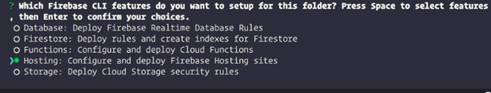
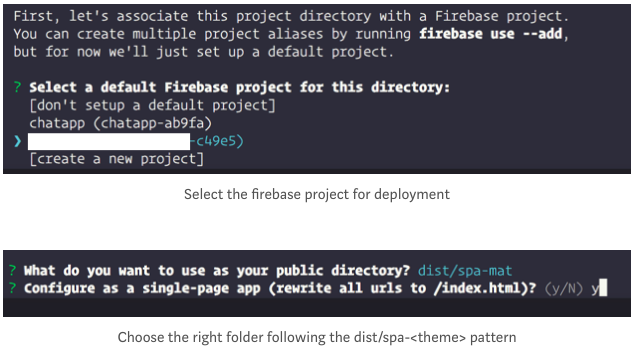

# Firebase Docs

## Credits

The link of this course is [on here](https://firebase.google.com).

## Content

[[toc]]

## Develop

### Authentication

### Database

#### Firestore

#### Realtime Database

### Storage

### Hosting

#### Deploy a Quasar App

The original tutorial is on [this link](https://medium.com/@venkyvb/deploy-a-quasar-app-to-firebase-hosting-cf7b26fdc31d).

Quasar Framework (https://quasar-framework.org/) is an awesome UI framework that is powered by Vue.js (https://vuejs.org/) which enables development of Progressive Web Apps (PWA), Mobile and Electron apps.

Outlined here are the steps to deploy a Quasar app to Firebase hosting.

* Install firebase tools 

```bash
npm install -g firebase-tools
```
* Go to the root directory of your Quasar App and then run:

```bash
quasar build
```

This will generate the `/dist/spa-<theme>`folder (see — https://quasar-framework.org/guide/app-deploying-spa.html) which contains the artifacts that needs to be deployed for productive use.

To enable Firebase hosting run `firebase init` at the root directory (note that if this is the first time you are using the Firebase CLI then you would have to login to firebase using firebase login). This will take you through a command line wizard (as shown below)



If you already have project(s) existing in Firebase account those will be displayed and you can select one of these otherwise please create the project and perform the steps again (note even though there is an option [create new project] this still requires you to create a project in the Firebase account. Firebase client version 3.18.4).



This will generate the `.firebasesrc` folder and `firebase.json` file. The `firebase.json` file will have the following content.

```json
{
  "hosting": {
    "public": "dist/spa-mat",
    "ignore": [
      "firebase.json",
      "**/.*",
      "**/node_modules/**"
    ],
    "rewrites": [
      {
        "source": "**",
        "destination": "/index.html"
      }
    ]
  }
}
```

Now the last step execute `firebase deploy`. This should take care of deploying the application to the Firebase account.


### Functions

### ML Kit