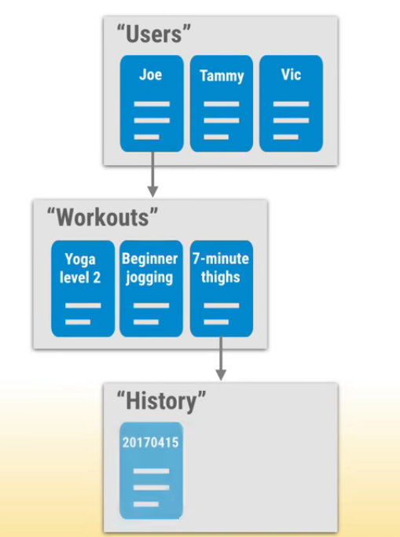
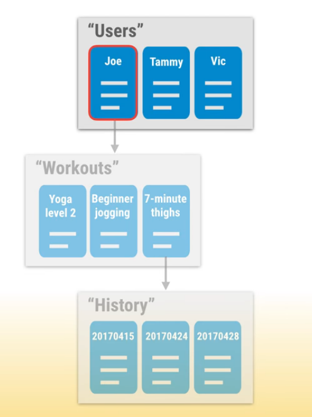
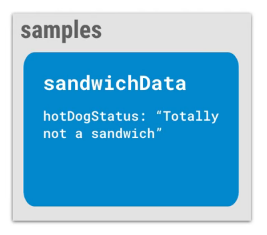
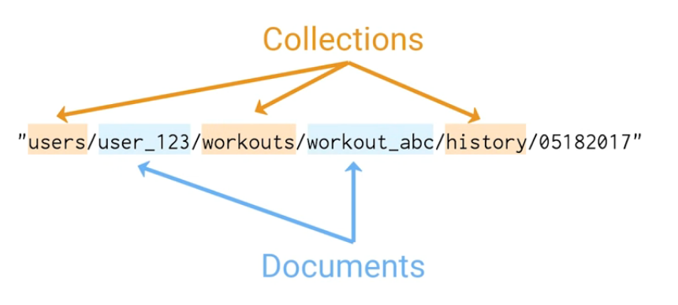
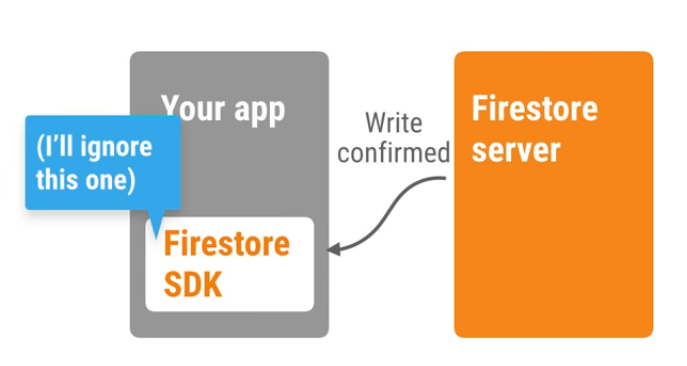
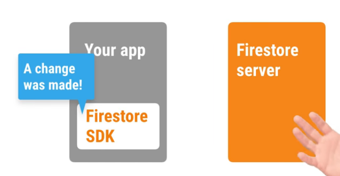

# Cloud Firestore

Flexible, scaleble cloud database to store and sync data for client- and server-side development.

[Firebase official docs](https://firebase.google.com/docs/firestore/quickstart?authuser=0).

## Credits

The link of this course is [on here](https://firebase.google.com).

## Content

[[toc]]

## Getting Started

## What is Firestore and how does it work?

Firestore is a **NoSQL** database.

It has a tree like structure consists of, so called, `collection`s and `document`s. The root must start with `collection` and a `collection` can only contain `document`s. `document`s can't contain other `document`s but they can point to **sub** `collection`s.


An example of this structure: 



#### Shallow Queries

It uses **shallowed quieres** which means when you make query to a document it only gets requested document content, NOT the entire **node**.




### Install Firebase SDK

Add the Firebase and Cloud Firestore libraries to your app: 

```html
<script src="https://www.gstatic.com/firebasejs/5.0.1/firebase-app.js"></script>
<script src="https://www.gstatic.com/firebasejs/5.0.1/firebase-firestore.js"></script>
```

The Cloud Firestore SDK is also available as an npm package. 

```bash
npm install firebase@5.0.1 --save
```

### Install Firebase Tools

Install **Firebase Tools** via `npm`.

```bash
npm install firebase-tools -g
```

### Add Firebase to Your Project

To add Firebase to your app, you'll need a Firebase project and a short snippet of initialization code that has a few details about your project.

<ol>
    <li>Create a Firebase project in the <a href="https://console.firebase.google.com/?authuser=0">Firebase Console</a>.</li>
    <li>click Add Firebase to your web app.</li>
    <li>Copy and paste your project's customized code snippet in the `head` tag of your page, before other script tags.</li>
</ol>

Below is an example initialization code snippet:

#### For Node.js

::: warning
These instructions are for using the Firebase SDK as a client for end-user access (for example, in a Node.js desktop or IoT application). If you are instead interested in having admin access from a privileged environment (like a server), you should instead follow the instructions for setting up the [Admin Node.js SDK](https://firebase.google.com/docs/admin/setup/?authuser=0).
:::

```javascript
// Initialize Firebase
// TODO: Replace with your project's customized code snippet
var config = {
  apiKey: "<API_KEY>",
  authDomain: "<PROJECT_ID>.firebaseapp.com",
  databaseURL: "https://<DATABASE_NAME>.firebaseio.com",
  storageBucket: "<BUCKET>.appspot.com",
};
firebase.initializeApp(config);
```

To use the module in your application, require it from any JavaScript file:

```javascript
var firebase = require("firebase");
```
If you are using ES2015, you can import the module instead:

```javascript
import firebase from "firebase";
```

The Firebase SDK is also available on npm. If you don't already have a `package.json` file, create one via npm init. Next, install the firebase npm package and save it to your `package.json`:

```bash
npm init
```
install firebase package via npm.

```bash
npm install firebase@5.0.1 --save
```

### Initialize Firebase Project

These tools come with some command line utils like `init` command. This creates `firebase.json`, `.firebaserc` files and a folder `public` with `index.html` file.

```bash
firebase init
```

To run a server in local development environment run `serve` command.

```bash
firebase serve
```
It will run a server in your local machine on `http://localhost:5000`.

```
(node:26833) ExperimentalWarning: The fs.promises API is experimental

=== Serving from '/home/jony/Documents/gcloud-projects/firebase-projects/firestore-first-project'...

i  hosting: Serving hosting files from: public
✔  hosting: Local server: http://localhost:5000
```

### Deploying

You can deploy your app quickly for trying and testing by using `deploy` command.

```bash
firebase deploy
```

### Simple Demo

Add the Firebase and Cloud Firestore libraries to your app: 

```html
<script src="https://www.gstatic.com/firebasejs/5.0.1/firebase-app.js"></script>
<script src="https://www.gstatic.com/firebasejs/5.0.1/firebase-firestore.js"></script>
```

You'll need to manually require both Firebase and Cloud Firestore.
Then in a seperate file called `app.js` add the credentials you get from **Firebase Console**. 

```javascript
firebase.initializeApp({
  apiKey: '### FIREBASE API KEY ###',
  authDomain: '### FIREBASE AUTH DOMAIN ###',
  projectId: '### CLOUD FIRESTORE PROJECT ID ###'
});

// Initialize Cloud Firestore through Firebase
var db = firebase.firestore();
```

We will create a structure like this:



Inside the HTML file, we will create a simple app. It will take an input and when the `save`button hit it will save the value into the firestore.

```html
<h1 id="hotDogOutput">Hot Dog Status: </h1>
<input type="textfield" id="latestHotDogStatus" />
<button id="saveButton">Save</button>
<script src="./app.js"></script>
```

Next, we will create variables to hold references to these elements.

```javascript
const outputHeader = document.querySelector('#hotDogOuput');
const inputTextField = document.querySelector('#latestHotDogStatus');
const saveButton = document.querySelector('#saveButton');
```

Next up, add an **event listener** to the `saveButton`. This button will take the value inside the `input` element. 

```javascript
saveButton.addEventListener('click', function() {
    const textToSave = inputTextField.value;
    console.log("Im gonna save " + textToSave + "to firestore.");
})
```

Then, I will specify in which **document** put this data. We do that by using something called `Document Reference`. First, grep a reference to `firestore` and then store your **Document Reference** in a variable.

```javascript
var firestore = firebase.firestore();

const docRef = firestore.collection('samples').doc('sandwichData');
const outputHeader = document.querySelector('#hotDogOuput');
const inputTextField = document.querySelector('#latestHotDogStatus');
const saveButton = document.querySelector('#saveButton');
```

we can make a query to **collections** and **documents** by using `collection()` and `doc()` functions respectively. But when making complex queries this chain can get very messy, so we can directly point the doc by passing the whole PATH into `doc()` function just like so:

```javascript 
const docRef = firestore.doc('samples/sandwichData');
```



We will use `set()` function to put data to firestore. This will replace the value of `hotDogStatus` key to whatever user pass into `textToSave` object.

```javascript
saveButton.addEventListener('click', function() {
    const textToSave = inputTextField.value;
    console.log("text to be saved: " + textToSave)
    docRef.set({
        hotDogStatus: textToSave
    })
})
```
::: tip
We don't need to create the `PATH` that data will be kept. We can create `PATH` just by giving the full `PATH` starting from the **root**.
:::

### SET 

Since this returns a **Promise** which it's pretty easy to note when the call completes, then we can chain it with `then()` and `catch()` methods.

```javascript
saveButton.addEventListener('click', function() {
    const textToSave = inputTextField.value;
    console.log("text to be saved: " + textToSave);
    docRef.set({
        hotDogStatus: textToSave;
    }).then(function() {
        console.log("message is saved!")
    }).catch(function(err) {
        console.error('Got an error: ', error);
    });
});
```

Now, try to change the value of `input` element and then hit `add` button. And look at the console.

### GET

Now, implement a `Load` button to get the data from the database(firestore).

```html
<button id="loadButton">Load</button>
```

```javascript
loadButton.addEventListener('click', function() {
    docRef.get().then(function(doc) {
        if (doc && doc.exists) {
            const myData = doc.data();
            // console.log(typeof(myData.hotDogStatus));
            outputHeader.innerText = "Hot Dog Status: " + myData.hotDogStatus;
        }
    }).catch(function(error) { console.error(error) });
})
```

## Getting real time data

### onSnapshot method

Instead of using `get` we will use `onSnapshot` event listener. This will listen to changes 

```javascript
getRealTimeUpdates = function() {
    docRef.onSnapshot(function(doc) {
        if (doc && doc.exists) {
            const myData = doc.data();
            outputHeader.innerText = "Hot Dog Status: " + myData.hotDogStatus;
        }
    })
}

getRealTimeUpdates();
```

Open up the browser and try to save something. You will see that the data is updated after saving. We didn't need to make a **request**. But, it was too fast. The data is updated almost instantly. How did this happen?





## What's next

