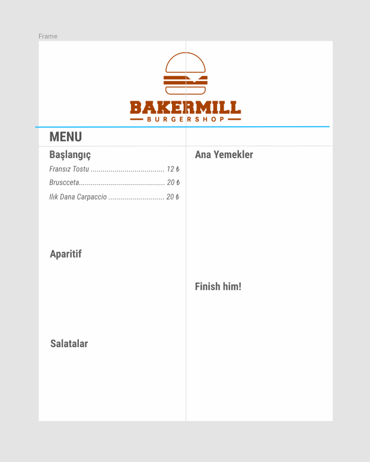

# BakerMill Menu Design

Bu proje, BakerMill için tasarlanacak olan menü kartının tasarım hikayesi adı altlında gerçekleşecek. projede ele alının yaklaşımlar tartışılacak. Farklı versiyonların karşılaştırması yapılacak. Bir yandan projenin *version control* repolarına referans gösterilecek. O halde, başlayalım.

## Başlıklar

<ul>
	<li>Menu
		<ul>
			<li>Başlangıç
				<ul>
					<li>Fransız Tostu ..... { id: 0, name: 'french-toast', price: '11.00' }</li>
					<li>Omlet ..... { id: 1, name: 'omlet', price: '14.00' }</li>
					<li>Kavurma ..... { id: 0, name: 'kavurma', price: '19.00' }</li>
				</ul>
			</li>
			<li>Aparitif
				<ul>
					<li>Brussceta</li>
					<li>Fıstıklık Tavuk parçaları</li>
					<li>İsminizin yazdığı pide</li>
				</ul>
			</li>
			<li>Salatalar</li>
			<li>Ana Yemek</li>
		</ul>
	</li>
</ul>

I've just started to make a prototype. This is the result:

