# Firebase + Vue2 Authentication System

This tutorial contains resources from
[this tutorial](https://medium.com/@anas.mammeri/vue-2-firebase-how-to-build-a-vue-app-with-firebase-authentication-system-in-15-minutes-fdce6f289c3c) on [medium](https://medium.com).

In this tutorial, we will see how to quickly build a
web application with an authentication system using Vue 2, vue-router and Firebase.

You can find the github repo of this project on [this link](https://github.com/progayk/firebase-vue-authentication). Additionally, you can find the project documentation on [this link](https://github.com/progayk/vuepress-project/blob/master/guides/firebase-vue-authentication.md)


::: danger WARNING!
There are **inconsistincies** on code style. You should check them before publishing this tutorial!
:::

## Contents

[[toc]]

::: tip `[[toc]]`

**Table of Contents**. Adamlar bunu dusunmus ya la!
:::


##  Initial Setup

Be sure that the Vue CLI is installed. If not run:

```bash
npm install -g vue-cli
```

Create a new project

```bash
vue init <template-name> <project-name>
```

For this project I will use webpack template.

```bash
vue init webpack firebase-vue-authentication
```

Make sure that **vue-router** is installed.

```bash
cd firebase-vue-authentication
npm install
npm run dev
```

Now, open your browser and go to `http://localhost:8080`. You should see a page like:


## The App Structure

The app will consist of three views, two *(Login view and Sign up view)* that we can accses only without authentication, and one *(Hello* view) that we can acces only with authentication.

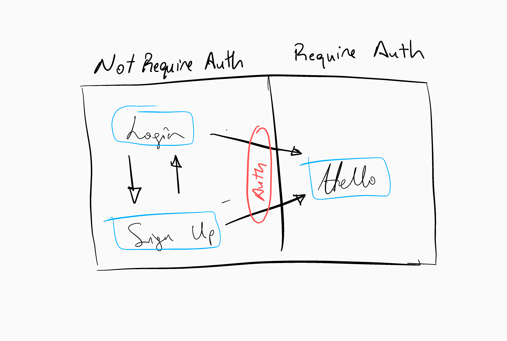

**Here should be an image with app architecture**

After login successfully or after a new account creation, we will be redirected to the authenticated part of the app, the Hello view.

## Login Page

Create a new Vue component called **AppLogin** under `src/components`

For the moment, the component will simply consist of a title, two input fields, a button and a small sentence in the html.

```html
<template>
  <div class="login">
    <h3>Sign In</h3>
    <!--<label for="email"></label>-->
    <input type="email" name="email" placeholder="Email"><br>
    <input type="password" placeholder="Password"><br>
    <button>Connection</button>
    <p>You don't have an account? You can create one.</p>
  </div>
</template>
<!-- omitted for brevity -->
```

Now we have the component, but how we gonna display it?

We will use **vue-router** that we have installed when we creating the vue app. 

### What is vue-router?

::: tip vue-router
vue-router is the official router for Vue.js. It deeply integrates with Vue.js core to make building Single Page Applications with Vue.js a breeze. 
Creating a Single-page Application with Vue.js + vue-router is dead simple. With Vue.js, we are already composing our application with components. When adding vue-router to the mix, all we need to do is map our components to the routes and let vue-router know where to render them.

from [vue-router documentation](https://github.com/vuejs/vue-route)
:::

Now, all we gonna do is to import **vue-router** and add **AppLogin** component to the route. We will do it 
inside `src/router/index.js` file.

```javascript{2,4,5,6,7,8}
// omitted for brevity
import AppLogin from '@/components/AppLogin'
// omitted for brevity
    {
      path: '/login',
      name: 'AppLogin',
      component: AppLogin
    }
  ]
})
```

We have that Vue logo but no problem, let's keep it there. The **App** component is the main componrnt of the app
and will be the first to be rendered. It contains an image and a html component called **router-view**

**router-view** is a component of **vue-router**:

::: tip router-view
The `<router-view>` component is a functional component that renders the matched component for the given path. Components rendered in `<router-view>` can also contain its own `<router-view>`, which will render components for nested paths.

[from vue-router documentation](https://router.vuejs.org/en/api/router-view.html)
:::

When we open `http://localhost:8080/#/login` **vue-router** will render the attached component of the path `/login`
that we defiend in `router/index.js`, inside the `<router-view>` component. 

## Add some style

In this part I will experiment with some CSS frameworks. So, if you're coding along you might want to see the
results first and then try the one you like.

### Add bulma CSS framework

In this project I will use [**bulma**](https://bulma.io/) which is an open source CSS framework.

Back in directory as the package.json file install and save **bulma** to the project like this:

```bash
npm install --save bulma
```

In addition, I will need to install some dev tools to properly load the styles for the application so the components know how to work with them. To do this, npm install these additional packages.

```bash
npm install --save-dev vue-style-loader
npm install --save-dev css-loader
npm install --save-dev sass-loader
npm install --save-dev node-sass
```

Now, open up App.vue file and add inside the style element this:

```html
<style lang="scss">  
@import '~bulma/bulma'
</style>  
```

Then, create a signup form in `AppLogin` component.

```html
<template>
  <div>
    <div class="container has-text-centered">
      <h2 class="title is-large">Sign In</h2>
    </div>
    <section class="section">
      <div class="container">
        <div class="columns field">
          <div class="control is-one-third column is-one-third is-offset-one-third">
            <input type="email" class="input is-rounded" id="email" placeholder="email" autofocus>
          </div>
      </div>
        <div class="field columns">
          <div class="control is-one-third column is-one-third is-offset-one-third">
            <input type="password" class="input is-rounded" id="password" placeholder="password">
          </div>
        </div>
      </div>
    </section>
  </div>
</template>
```

When we go to browser `http://localhost:8080/#/login` we should see smthg like:

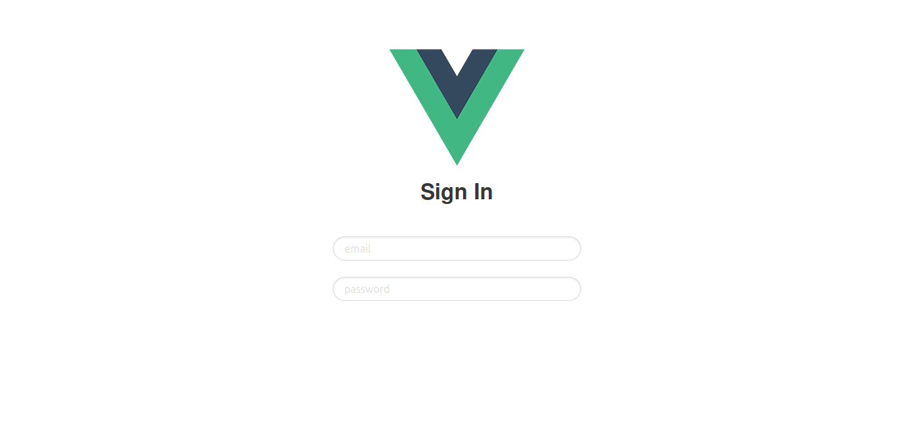

After diving into bulma's now very welled designed documentation I've changed a little bit the `AppLogin` component. The above one is simpler. But
the below one has some charisma.

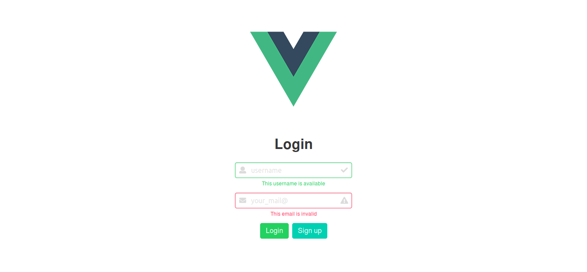

Here is the code to create above login page.

```html
<template>
  <div>
    <section class="section">
      <div class="container is-fluid columns is-centered">
        <div class="column is-one-quarter">
          <h1 class="title">Login</h1>
          <div class="field">
            <div class="control has-icons-left has-icons-right">
              <input class="input is-success" type="text" placeholder="username">
              <span class="icon is-small is-left">
      <i class="fas fa-user"></i>
    </span>
              <span class="icon is-small is-right">
      <i class="fas fa-check"></i>
    </span>
            </div>
            <p class="help is-success">This username is available</p>
          </div>

          <div class="field">
            <div class="control has-icons-left has-icons-right">
              <input class="input is-danger" type="email" placeholder="your_mail@">
              <span class="icon is-small is-left">
      <i class="fas fa-envelope"></i>
    </span>
              <span class="icon is-small is-right">
      <i class="fas fa-exclamation-triangle"></i>
    </span>
            </div>
            <p class="help is-danger">This email is invalid</p>
          </div>
        </div>
      </div>
    </section>
  </div>
</template>
```

Sanırım **bulma** yerine **semantic ui** kullanacağım.

### Add semantic ui

Install [semantic ui]() for vue:

```bash
npm install semantic-ui-vue --save
```

Once Semantic UI Vue has been installed, you will need to import it in your main file (usually `index.js` or `main.js`) and tell Vue to use it:

```javascript
import Vue from 'vue';
import SuiVue from 'semantic-ui-vue';

/* ... */

Vue.use(SuiVue);
```

**Add semantic vue css package**

The Semantic UI CSS package is automatically synced with the main Semantic UI repository to provide a lightweight CSS only version of Semantic UI. Semantic UI CSS can be installed as a package in your project using NPM. You won't be able to use custom themes with this method.

```bash
npm install semantic-ui-css --save
```

After install, you'll need to include the minified CSS file in your `index.js` file:

```javascript
import 'semantic-ui-css/semantic.min.css'
```

I didn't like it either, I think I am gonna continue with **bulma**. By the way this is what I had
after some experiment. I couldn't place it at the center.

```html
<template>
  <div>
    <sui-card>
      <sui-card-content>
        <sui-form>
          <sui-form-field>
            <label>First Name</label>
            <input placeholder="First Name" >
          </sui-form-field>
          <sui-form-field>
            <label>Last Name</label>
            <input placeholder="Last Name" >
          </sui-form-field>
          <sui-form-field>
            <sui-checkbox label="I agree to the Terms and Conditions" />
          </sui-form-field>
          <sui-button type="submit">Submit</sui-button>
        </sui-form>
      </sui-card-content>
    </sui-card>
  </div>
</template>
```

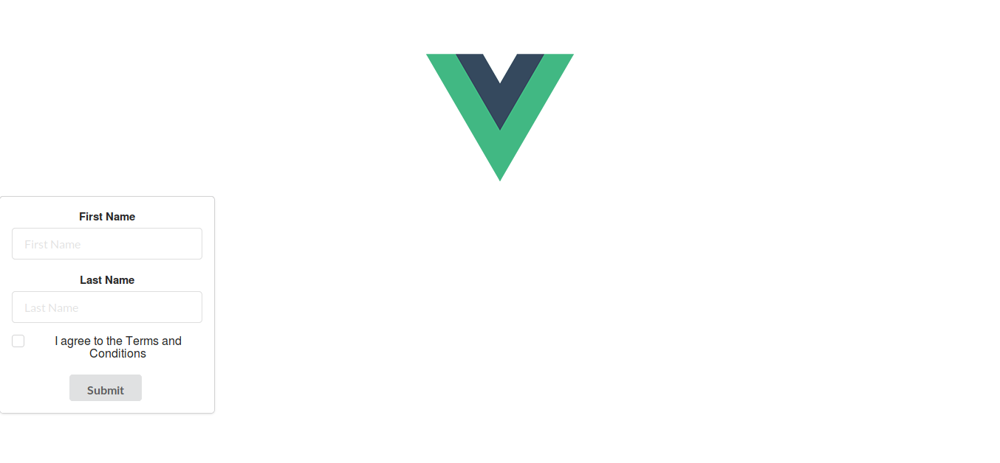

By the way, this will be the design that we will continue with:

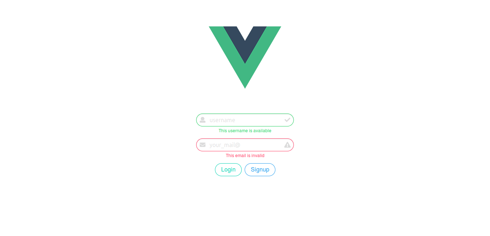

## Sign up Page

Create a new view `AppSignup.vue` under `src/components` directory and create a form for sign up:

```html
<template>
  <div>
    <section class="section">
      <div class="container is-fluid columns is-centered">
        <div class="column is-one-quarter">
          <!--<h3 class="title">Sign up</h3>-->
          <div class="field">
            <div class="control has-icons-left has-icons-right">
              <input class="input is-success is-rounded" type="text" placeholder="username" autofocus>
              <span class="icon is-small is-left">
      <i class="fas fa-user"></i>
    </span>
              <span class="icon is-small is-right">
      <i class="fas fa-check"></i>
    </span>
            </div>
            <!--<p class="help is-success">This username is available</p>-->
          </div>

          <div class="field">
            <div class="control has-icons-left has-icons-right">
              <input class="input is-info is-rounded" type="password" placeholder="password" autofocus>
              <span class="icon is-small is-left">
      <i class="fas fa-lock"></i>
    </span>
              <span class="icon is-small is-right">
      <i class="fas fa-check"></i>
    </span>
            </div>
          </div>

          <div class="field">
            <div class="control has-icons-left has-icons-right">
              <input class="input is-danger is-rounded" type="email" placeholder="your_mail@">
              <span class="icon is-small is-left">
      <i class="fas fa-envelope"></i>
    </span>
              <span class="icon is-small is-right">
      <i class="fas fa-exclamation-triangle"></i>
    </span>
            </div>
            <!--<p class="help is-danger">This email is invalid</p>-->
            <label class="checkbox">
              <input type="checkbox">
              I agree to the <a href="#">terms and conditions</a>
            </label>
          </div>
          <div class="buttons is-centered">
            <a class="button is-outlined is-primary is-rounded">Submit</a>
            <router-link to="/login"><a class="button is-outlined is-info is-rounded">Login</a></router-link>
          </div>
        </div>
      </div>
    </section>
  </div>
</template>

<script>
export default {
  name: 'AppSignup',
  data () {
    return {}
  },
  methods: {}
}
</script>

<style lang="scss">
  @import '~bulma/bulma';
  label {
    margin-top: 20px;
  }
</style>
```

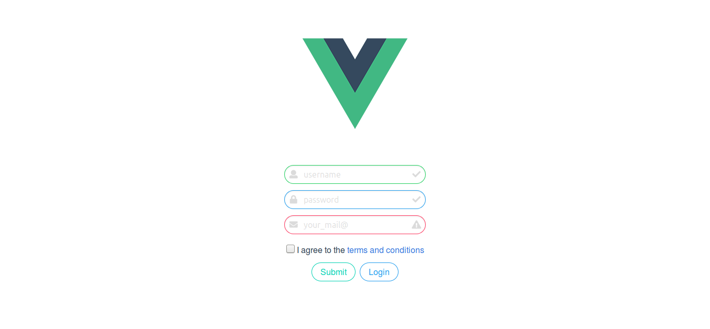

## Navigation between views

If we look back to the schema of the app architecture we defined, we can navigate from the Login view to the SignUp view, and from those two views to the Hello view. How to do so?

Well, we will use another component of **vue-router** called `router-link`.

::: tip router-link
`<router-link>` is the component for enabling user navigation in a router-enabled app. The target location is specified with the to prop. It renders as an `<a>` tag with correct href by default, but can be configured with the tag prop. In addition, the link automatically gets an active CSS class when the target route is active.

from [vue-router documentation](https://router.vuejs.org/en/api/router-link.html): 
:::

So, in the **AppLogin** and **AppSignup** component, let’s implement `router-link` so we can navigate between 
those two views.

Inside `src/router/index.js` file import `vue-router` and tell Vue to use it:

```javascript{2,5,10,11,12,13,14}
import Vue from 'vue'
import Router from 'vue-router'
// omitted for brevity

Vue.use(Router)

export default new Router({
  routes: [
// omitted for brevity
    {
      path: '/signup',
      name: 'AppSignup',
      component: AppSignup
    }
  ]
})
```

Inside **AppSignup** component add this:

```html{4}
<!-- omitted for brevity -->
<div class="buttons is-centered">
	<a class="button is-outlined is-primary is-rounded">Submit</a>
	<router-link to="/login"><a class="button is-outlined is-info is-rounded">Login</a></router-link>
</div>
<!-- omitted for brevity -->
```

The last part of navigation will consist to go from `AppLogin/AppSignup` views to the `HelloWorld` view. For now, since we don’t have any code implemented, we will do a simple redirection to the Hello view when clicking on the Submit/Login button, without any authentication checking.

With `router-link`, the navigation take places in the html part of the component, but now, we want to navigate between routes programmatically. To do so, we need to attach an event when clicking on the **Submit/Login** button, and with Vue 2, we can do that with the `v-on` directive.

::: tip Listining to Events
We can use the v-on directive to listen to DOM events and run some JavaScript when they’re triggered.
from [Vue 2 doc](https://vuejs.org/v2/guide/events.html#Listening-to-Events)
:::

The event we want to listen to is click. So, on the click event of the `Login` button, we want to navigate to the Hello view.

To navigate programmatically between views, `vue-router` has a set of function we can use in our app. To know more about those functions, you take a look in [their documentation](https://router.vuejs.org/en/essentials/navigation.html).

In our example, we are going to use the `replace` function, because once the user is logged in, we want the `HelloWorld` view as our starting route.

Let’s change our `AppLogin` component to put this in place.

```html{3,15,16,17,18,19}
<!-- omitted for brevity -->
<div class="buttons is-centered">
    <a class="button is-outlined is-primary is-rounded" v-on:click="login">Login</a>
    <router-link to="/signup"><a class="button is-outlined is-info is-rounded">Signup</a></router-link>
</div>			

<!-- omitted for brevity -->

<script>
export default {
  name: 'AppLogin',
  data () {
    return {}
  },
  methods: {
    login: function () {
      this.$router.replace('hello')
    }
  }
}
</script>
```

You can see inside the `login` function that we have `this.$router.replace('hello')`

Why do we access the router with `this`? If you take a look into the `main.js` file, you’ll see that the router object is injected to the Vue app. That way, we can easily access it in every components of the app.

```javascript{3,10}
import Vue from 'vue'
import App from './App'
import router from './router'

Vue.config.productionTip = false

/* eslint-disable no-new */
new Vue({
  el: '#app',
  router,
  components: { App },
  template: '<App/>'
})
```

Also, we change the navigation to `hello`, but we don’t have any hello path yet.

The default path of the `HelloWorld` component was `/` on the app initialization, but now that we know that the HelloWorld view will be only accessible when user is authenticated, let’s change the route so that the HelloWorld view is accessible when reaching `/hello` path.

```javascript{5}
// omitted for brevity
export default new Router({
  routes: [
    {
      path: '/hello',
      name: 'HelloWorld',
      component: HelloWorld
    },
    // omitted for brevity
```

Now, back to our `AppLogin` view, if you click on the `Login` button, you’ll be redirect to the `HelloWorld` view !

## Firebase Integration

Now that we have our front-end app ready, let’s implement Firebase so we can use it’s authentication system.

### Create a new project on Firebase

To use Firebase, you first need to create a new project on the firebase console. If you don’t have any account created, create one, then go to [Firebase console](https://console.firebase.google.com).

Click on `Add project` . Them you should have a popup to create a new project. Choose the name you want. I choose to call it `firebase-vue-authentication`.

Then, you should arrive on your project home page.

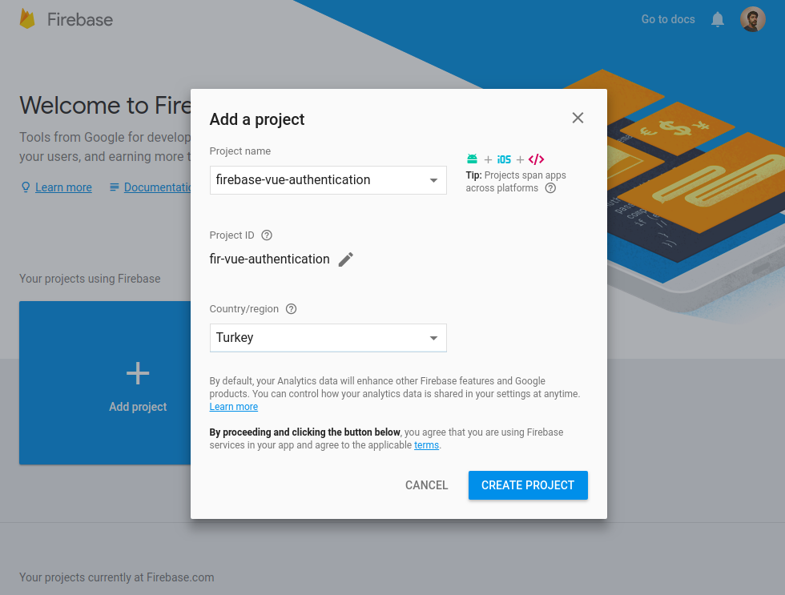

Congrats! Your Firebase project is created. Now, to integrate it in our app, click on `Add Firebase to your web app`.

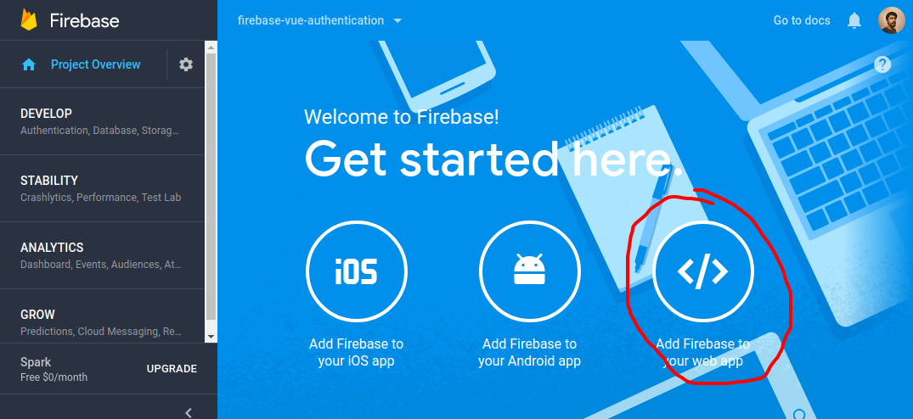


A popup with a code snippet should appear. Copy the code inside the second script balise. It should look like:

```javascript
// Initialize Firebase

let config = {
  apiKey: "YOUR_API_KEY",
  authDomain: "YOUR_PROJECT_ID.firebaseapp.com",
  databaseURL: "https://YOUR_PROJECT_ID.firebaseio.com",
  projectId: "YOUR_PROJECT_ID",
  storageBucket: "YOUR_PROJECT_ID.appspot.com",
  messagingSenderId: "YOUR_MESSAGING_SEND_ID"
}
firebase.initializeApp(config)
```

Now, let’s back to our vue project. We need to add the Firebase module to our project. To do so:

```bash
npm install ——save firebase
```

Once the installation is done, let’s import Firebase module to our app. I created a new file
inside `config/` directory called `firebase-config.js`, and inside it I put the configuration that I copied from firebase console. 

::: danger WARNING!
On production environment you should put the configuration code in to specific config directory to avoid security vulnaribilities.
:::

```javascript
module.exports = {
  FIREBASE_CONFIG: {
	  apiKey: "YOUR_API_KEY",
	  authDomain: "YOUR_PROJECT_ID.firebaseapp.com",
	  databaseURL: "https://YOUR_PROJECT_ID.firebaseio.com",
	  projectId: "YOUR_PROJECT_ID",
	  storageBucket: "YOUR_PROJECT_ID.appspot.com",
	  messagingSenderId: "YOUR_MESSAGING_SEND_ID"
  }
}
```

Then, open the `main.js` file, and initialize Firebase and import the configuration from
`config/firebase-config.js`. Initialize the firebase.

```javascript{2,3,7}
// omitted for brevity
import * as firebase from 'firebase'
import * as firebaseConfig from '../config/firebase-config'

Vue.config.productionTip = false

firebase.initializeApp(firebaseConfig.FIREBASE_CONFIG)
// omitted for brevity
```

Now, everything is ready to create new users on Firebase.

### Create users on Firebase with the AppSignup component

Go to `AppSignup` component and implement what we need to create users on Firebase.

To create a new user, we will need to get back the `email` and the `password` typed in our form inside our component controller. To do so, we are going to use the `v-model` directive of Vue 2.

::: tip
You can use the `v-model` directive to create two-way data bindings on form input and textarea elements. It automatically picks the correct way to update the element based on the input type. Although a bit magical, v-model is essentially syntax sugar for updating data on user input events, plus special care for some edge cases.

from [Vue 2 documentation](https://vuejs.org/v2/guide/forms.html)
:::

Once we retrieved the email and the password of the new user we want to create, we are going to use the Firebase function called `createUserWithEmailAndPassword`.

This Firebase function does exactly what the name says, it creates a new user with an email and a password. Get more information about this function in the official [Firebase documentation](https://firebase.google.com/docs/reference/js/firebase.auth.Auth#createUserWithEmailAndPassword).

Add these to `AppSignup` component:

```html

<script>
import firebase from 'firebase'
export default {
  name: 'AppSignup',
  data () {
    return {
      email: '',
      password: ''
    }
  },
  methods: {
    signUp: function () {
      firebase.auth(createUserWithEmailAndPassword(this.email, this.password).then(
        function (user) {
          alert('Tour account has been created!')
        },
        function (err) {
          alert('Oops, ' + err.message)
        }
      ))
    }
  }
}
</script>

```

The `createUserWithEmailAndPassword` function return a Firebase promise, with an `onResolve` and `onReject` callback. You can know more about the different type of Firebase promises [here](https://firebase.google.com/docs/reference/js/firebase.Promise).

For the moment, we just display an alert to see the result of the function.

Let’s try to create a new user in the interface.


When I fill the email and password area and hit enter I got an error that says **Oops, The given sign-in provider is disabled for this Firebase project. Enable it in the Firebase console, under the sign-in method tab of the Auth section.** Now, let's figure it out why.

To have the possibility to create new user, we should enable the sign-in provider of Firebase. Let’s go back to the Firebase console, on the project we created.

On the `Authentication` part, we have a tab named `SET UP SIGN-IN METHOD`

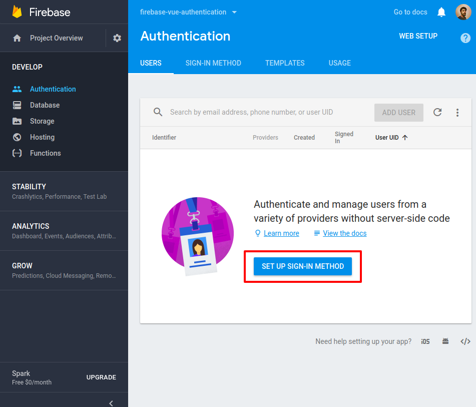

Enable only the `Email/Password` provider.

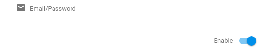

Then you will see:

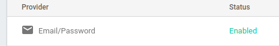

Then, let’s try again to create a new user in our Vue app.

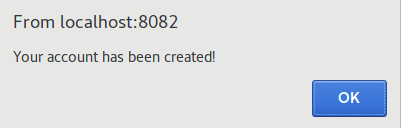

Hurraay! we get an alert that says: **Your account has been created!** It’s working now ! Congrats, you just created an new user in your Firebase project!

If I try to sign up with same email it will throw an error like:

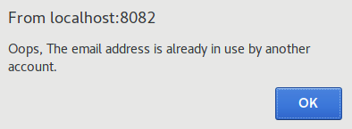

To be sure that everything was correct, we can take a look in the firebase console, under Authentication part and see the list of users. You should have the user you just created in the list !

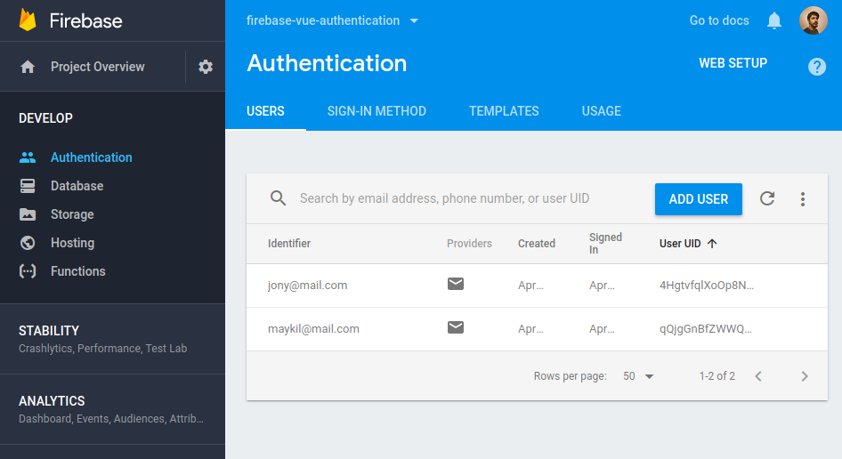

### Login with the new user

Now, we have a new user created, let’s try to login with this user! (When you successfully create a new user on Firebase, it automatically sign in the user in to the application, but for this example, we are going to sign in again from the `AppLogin` view)

Let’s go back to our `AppLogin` component. We need to get back the email and the password of the user who try to login, and sign in this user into Firebase. This component will look like the `AppSignup` component, but the change will be the function we will call. To sign in a user in Firebase, we are going to use the `signInWithEmailAndPassword` function provided by Firebase. It takes the email and password as parameters and return a Firebase promise.

```html
<!-- omitted for brevity -->

              <input class="input is-danger is-rounded" type="email" v-model="email" placeholder="your_mail@">

              <!-- omitted for brevity -->

              <input class="input is-info is-rounded" v-model="password" type="password" placeholder="password" autofocus>

             <!-- omitted for brevity -->

<script>
import firebase from 'firebase'
export default {
  name: 'AppLogin',
  data () {
    return {
      email: '',
      password: ''
    }
  },
  methods: {
    signIn () {
      firebase.auth().signInWithEmailAndPassword(this.email, this.password)
        .then((user) => {
          alert('Well done! You are now connected.')
        })
        .catch((err) => {
          alert('Oops, ' + err.message)
        })
    }
  }
}
</script>
<!-- omitted for brevity -->
```

Then, let's go to `http://localhost:8082/#/login` and try to login with credentials that we used for creating our account.

**TADAAA!**

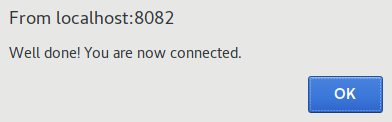

## Access the app only with authentication

### Add meta fields to routes

We are now authenticated! But nothing happens, right? Well, we need to redirect the user to the part of the application that can be accessed only if the user is authenticated. We already defined in our (beautiful) schema that the authenticated view of our app will be the `HelloWorld` view.

To implement that in our Vue application, we can use **meta** field of **vue-router**. A meta field is an additional information you can set to your route.

To know more about meta, you can check the vue-router documentation [here](https://router.vuejs.org/en/advanced/meta.html)

Let’s add a **meta** field to the `HelloWorld` view. This meta will be called `requiresAuth` and will inform us that this view requires authentication.

Also, we should define a default route for the app, since we changed the `HelloWorld`component that was before the default landing page.

```javascript
// omitted for brevity

Vue.use(Router)

export default new Router({
  routes: [
    {
      path: '*',
      redirect: '/login'
    },
    {
      path: '/login',
      name: 'AppLogin',
      component: AppLogin
    },
    {
      path: '/hello',
      name: 'HelloWorld',
      component: HelloWorld
    },
    {
      path: '/signup',
      name: 'AppSignup',
      component: AppSignup
    }
  ]
})
```

With path: `'*'`, we redirect every paths that does not exist to the `AppLogin` view. If the user is authenticated, since the login page won’t be accessible when user is logged in, it will automatically redirect the view to the `HelloWorld` view.

You can now try to enter a bad url, and you’ll see that it will redirect to the `AppLogin` view.

###  Redirect the routes if user is authenticated

Now that we have everything ready, we need to know if the user is authenticated in Firebase. To do so, Firebase provides a function to get back the current user: `firebase.auth().currentUser`.

This function send back the currently signed-in user by using the `currentUser` property. If a user isn't signed in, `currentUser` is **`null`**.

In the previous part, we set **meta** fields to our routes, so that we could know which view need authentication to be accessible.

Now, we need to check before accessing each views if the user is authenticated and if the view we want to access need authentication or not.

To do so, we are going to use **navigation guards** of **vue-router**.

::: tip Navigation Guards

As the name suggests, the navigation guards provided by vue-router are primarily used to guard navigations either by redirecting it or canceling it. There are a number of ways to hook into the route navigation process: globally, per-route, or in-component.

from [vue-router documentation](https://router.vuejs.org/en/advanced/navigation-guards.html)
:::

In our example, we are going to use the global navigation guard `beforeEach`.

Let’s implement it in our `src/router/index.js` file.

```javascript{2,4,8,15,16,17,23,24,25,26,27,28,29,30,32}
import Vue from 'vue'
import Router from 'vue-router'
// omitted for brevity
import firebase from 'firebase'

Vue.use(Router)

let router = new Router({
  routes: [
	// omitted for brevity
    {
      path: '/hello',
      name: 'HelloWorld',
      component: HelloWorld,
      meta: {
        requireAuth: true
      }
    },
    // omitted for brevity
  ]
})

router.beforeEach((to, from, next) => {
  let currentUser = firebase.auth().currentUser
  let requiresAuth = to.matched.some(record => record.meta.requireAuth)

  if (requiresAuth && !currentUser) next('login')
  else if (!requiresAuth && currentUser) next('hello')
  else next()
})

export default router
```

The `beforeEach` function take three parameters, `to`, `from`, and `next` and will be called whenever a navigation is triggered.

* `to` parameter is the target Route Object being navigated to.
* `from` parameter is the current route being navigated away from.
* `next` parameter is a function that must be called to resolve the hook, and can take argument to redirect or abort the navigation (see more on the [documentation](https://router.vuejs.org/en/advanced/navigation-guards.html))

In the `beforeEach` function, we get back the `currentUser` form Firebase, and 
we chceck if the route we want to navigate requires Authentication by checking if the route object has the `requiresAuth` **meta**.

To understand the way we get back the `requiresAuth` **meta**, we need to know that each route object in the routes configuration is called a route **`record`**. In our tutorial, we don’t have nested routes, but a route records may be nested. Therefore when a route is matched, it can potentially match more than one route record.

All route records matched by a route are exposed on the `$route` object (and also route objects in navigation guards) as the `$route.matched` Array. Therefore, we need to iterate over `$route.matched` to check for meta fields in route records.

So, in our navigation guard global function, inside the to route object, we search if the `matched` Array has some records (in our case a single one) with `requiresAuth` **meta**.

Then, we define our rules for navigation.

If the route that we navigate to requires authentication and there is no current user logged in, we redirect to the `AppLogin` view.

If the route we navigate to does not require authentication and there is a user logged in, we redirect to the `HelloWorld` view.

Else, we proceed navigation.


We should now be able to access the app only when the user is authenticated.

Since we already logged-in in the previous step, if you reload the page, based on our navigation guard implementation, you should be redirect to the `HelloWorld` view.

Let’s try to reload the page.

Nothing is happening ! We still are in the Login view.

Why?

Well, it’s simply because in the lifecycle of our app, the execution of our navigation guard `beforeEach` take place before Firebase initialization end. So, when we first load the app, since Firebase module has not finish his initialization, `firebase.auth().currentUser` return **`null`**!

After the first load, if you try to go to the /signup path, you’ll see that the redirection take place and you ends up in the `HelloWorld` view.

How can we avoid this scenario and make sure that the redirection take place directly on the first load of the app?

Well, Firebase let’s us the possibility to set an observer on the Auth object, so we can ensure that the Auth object isn’t in an intermediate state — such as initialization — when you get the current user.

This observer is called `onAuthStateChanged`. (you can see more about the observer in the [Firebase documentation](https://firebase.google.com/docs/auth/web/manage-users#get_a_users_profile)

So, by setting a callback on the `onAuthStateChanged` observer, we can initialize the Vue app only when we are sure Firebase is initialized.

Let’s change our `src/main.js` file like that:

```javascript
// omitted for brevity
Vue.config.productionTip = false

let app;
firebase.initializeApp(firebaseConfig.FIREBASE_CONFIG)
firebase.auth().onAuthStateChanged(function (user) {
  if (!app) {
    /* eslint-disable no-new */
    app = new Vue({
      el: '#app',
      components: { App },
      template: '<App/>',
      router
    })
  }
})
```

We now initialize the app only when we are sure Firebase Auth object is ready to use.

Now if you refresh the page, or try to access the `AppLogin` or `AppSignup` view from url, you’ll see the redirection in action.

### Redirection after Login/SignUp and logout from the app

Now that we have our authentication system, we still need to redirect the user after the gogin or when a new user is created. Also, we want to be able to logout from Firebase.

To logout, let’s just add a button in our `HelloWorld` component and attached an event to logout from Firebase.

Like `signInWithEmailAndPassword` and `createUserWithEmailAndPassword`, Firebase provide a function to logout called `signOut` that return a promise. Once the `SignOut` function is done, we will be redirected to the `AppLogin` view.

```html{8,13,22,23,24,25,26,27,28}
<template>
  <div class="hello">
    <h1>{{ msg }}</h1>
    <h2>Essential Links</h2>
    <ul>
      <!-- omitted for brevity -->
    </ul>
    <button v-on:click="logout"></button>
  </div>
</template>

<script>
import firebase from 'firebase'

export default {
  name: 'HelloWorld',
  data() {
    return {
      msg: 'Welcome to Your Vue.js App'
    }
  },
  methods: {
    logout: function () {
      firebase.auth().signOut().then(() => {
        this.$router.replace('login')
      })
    }
  }
}
</script>
<!-- omitted for brevity -->
```

Now, when we click on the **Logout** button, we logout from Firebase and go back on the Login view.

To be sure that you are now logged out from Firebase, you can refresh the page or try to access the `HelloWorld` view.

Now, let’s **sign in** again, but before that, let’s change the code so that we can be redirect to the authenticate part of the app after login.

```javascript
<!-- omitted for brevity -->
  methods: {
    signIn: function () {
      firebase.auth().signInWithEmailAndPassword(this.email, this.password)
        .then(
          (user) => {
            this.$router.replace('hello')
          },
          (err) => {
            alert('Oops, ' + err.message)
          }
        )
    }
  }
<!-- omitted for brevity -->
```

Now, try to login, and you should be redirect to the `HelloWorld` view.

Let’s implement the same thing for the `AppSignup` component.

```html
<!-- omitted for brevity -->
  methods: {
    signUp: function () {
      firebase.auth().createUserWithEmailAndPassword(this.email, this.password)
        .then(
          (user) => {
            this.$router.replace('hello')
          },
          (err) => {
            alert('Oops, ' + err.message)
          }
        )
    }
  }
<!-- omitted for brevity -->
```

::: tip BIR HIGHLY IMPORTANT
Now, after a new account creation, the user will also be redirected to the `HelloWorld` view !

You may noticed that i turned the callback functions in `signInWithEmailAndPassword`, `createUserWithEmailAndPassword`, and `signOut` in **ES6 arrow functions**. Why?

Simply because method definition `(function name() {})`, have their own `this` context. If we were using method definition, we wouldn’t be able to access `this.$router` inside our callbacks. We should have encapsulate the `this` object of the parent method inside a variable to access it.

With ES6 arrow function, this is lexical, meaning that it does not create its own this context. Instead, this has the original meaning from the enclosing context.

By using ES6 arrow function, we can access `this.$router` and let the redirection take place.
:::

We now have a small Vue app using Firebase authentication system !

All the sources are available on Github: [github.com/CaptainYouz/vue-firebase-tutorial](https://github.com/CaptainYouz/vue-firebase-tutorial).