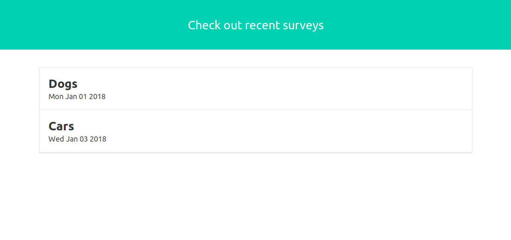
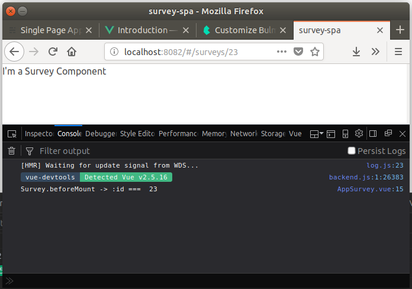
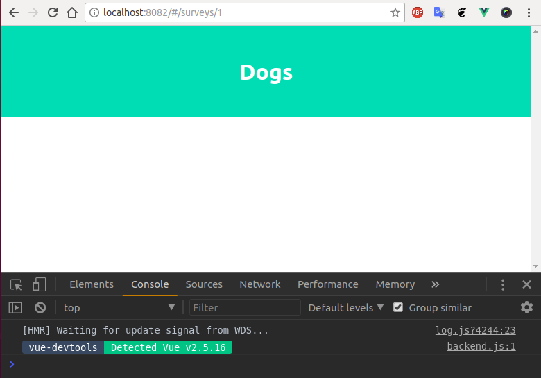
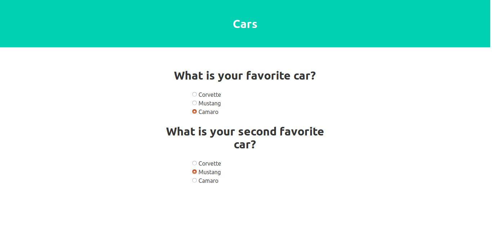
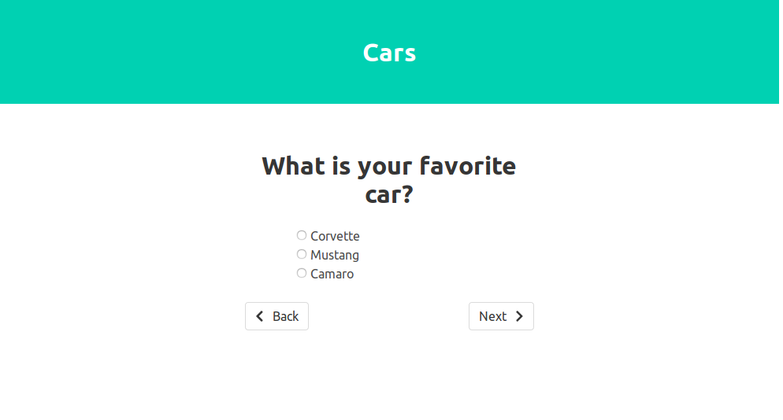
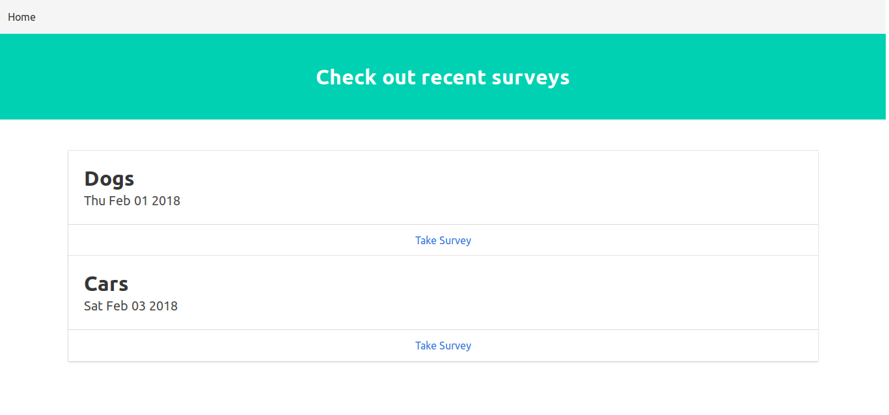

# Vue2 + Flask Survey App REST API

In this docs I will create a Survey App  *Single Page Application* (SPA) by using [Vue.js](https://vuejs.org/) javascript framework for the front-end 
and [Flask](http://flask.pocoo.org/) web framework for a backend REST API.

The github repo for this project is on [here](https://github.com/progayk/vuepress-project)

## Credits

This docs contains a lot of contents from:

* [Single Page Apps with Vue.js and Flask](http://stackabuse.com/single-page-apps-with-vue-js-and-flask-setting-up-vue-js/) by [Adam McQuistan](https://twitter.com/adamjmcquistan)

## Contents

[[toc]]

## Setup and Getting to Know Vue.js

## Front-end setup with vue-cli and webpack

I will be using two very important tools for a Vue.js project, which are the official [Vue.js command line interface (CLI)](https://vuejs.org/v2/guide/installation.html#CLI) and the very powerful module bundler and build tool webpack. Both of these tools rely on the Node.js runtime and its package manager, npm. If you have not already installed node then please consult the Node.js installation docs for your system, which will also include an installation of npm.

Install the Vue.js CLI (vue-cli):

```bash
npm install vue-cli -g
```

Now with the CLI installed I will use it to initialize a Vue.js SPA application. The CLI does the following:

1. Install and configure webpack to bundle my code
2. Install a development server with hot-reload (server auto-restarts when a file is changed)
3. Add a dependency for vue-router
4. Scaffold out a basic Vue.js SPA file structure

I first create a high-level folder which will contain all the code for this tutorial named "survey". Next I make two more directories called "frontend" (for the Vue.js SPA) and "backend" (for developing the REST API) then change my working directory to the frontend directory.

```bash
mkdir survey
cd survey
mkdir frontend
mkdir backend
cd frontend
```

Now for the real magic. The Vue CLI initialization command is entered, which then prompts me to answer a series of questions.

```bash
$ vue init webpack survey-spa

? Project name survey-spa
? Project description A Vue.js project with Flask
? Author Adam McQuistan <drum.ayk@gmail.com>
? Vue build standalone
? Install vue-router? Yes
? Set up unit tests No
? Setup e2e tests with Nightwatch? No
? Should we run `npm install` for you after the project has been created? (recommended) npm

   vue-cli · Generated "survey-spa".


# Installing project dependencies ...
...
```
There should now be a new directory called "survey-spa". Change directories into this directory and issue an npm command to compile the project and launch the dev server.

```bash
cd survey-spa
npm run dev
```

Now I can enter [http://localhost:8080](http://localhost:8080) into my browser window and I should see the boilerplate Vue.js template page.

```
survey-spa/  
├── README.md
├── build
│   ├── build.js
│   ├── check-versions.js
│   ├── logo.png
│   ├── utils.js
│   ├── vue-loader.conf.js
│   ├── webpack.base.conf.js
│   ├── webpack.dev.conf.js
│   └── webpack.prod.conf.js
├── config
│   ├── dev.env.js
│   ├── index.js
│   └── prod.env.js
├── index.html
├── package-lock.json
├── package.json
├── src
│   ├── App.vue
│   ├── assets
│   │   └── logo.png
│   ├── components
│   │   └── HelloWorld.vue
│   ├── main.js
│   └── router
│       └── index.js
└── static
```

This likely seems a bit overwhelming the first few times you look at it, but fear not we only really need to concern ourselves with the files under the **src/** directory, plus the index.html file. Of course the other files are important and perhaps some day I will get into what they are used for, but for now just ignore them.

Files under the **src/** directory are where I will be writing the code to drive the functionality of the application. Let us open these files up and get an idea for what is going on.

index.html

```html
<!DOCTYPE html>  
<html>  
  <head>
    <meta charset="utf-8">
    <meta name="viewport" content="width=device-width,initial-scale=1.0">
    <title>survey-spa</title>
  </head>
  <body>
    <div id="app"></div>
    <!-- built files will be auto injected -->
  </body>
</html>  
```

This is the only HTML file that a Vue SPA utilizes and it rarely contains much more than what is shown above with the exception that sometimes you will link to CSS frameworks and other JavaScript libraries within this file. The lone `div` element that is produced with a default `id` of "app" is what the main Vue instance will attach to. That Vue object injects the HTML and CSS that are in the components, to be discussed later, into the `div` to produce the UI.

main.js

```javascript
// The Vue build version to load with the `import` command
// (runtime-only or standalone) has been set in webpack.base.conf with an alias.

import Vue from 'vue'  
import App from './App'  
import router from './router'

Vue.config.productionTip = false

/* eslint-disable no-new */
new Vue({  
  el: '#app',
  router,
  components: { App },
  template: '<App/>'
})
```

The main.js file is the primary entry point for the application and is where you will register the Vue instance and extensions such as vue-router and [vuex](https://github.com/vuejs/vuex). As you can see this is where the Vue instance resides. The instance is registered to the app `div` discussed previously, plus it is fed the `router` object and the high-level `App` component.

App.vue

```html
<template>  
  <div id="app">
    
    <router-view/>
  </div>
</template>

<script>  
export default {  
  name: 'App'
}
</script>

<style>  
#app {
  font-family: 'Avenir', Helvetica, Arial, sans-serif;
  -webkit-font-smoothing: antialiased;
  -moz-osx-font-smoothing: grayscale;
  text-align: center;
  color: #2c3e50;
  margin-top: 60px;
}
</style>  
```

The App.vue file serves as the top level application components and often contains the general layout of the application. Vue components have a specific structure containing a `<template>` section for component-specific HTML, a `<script>` section to define the **Vue** object and that component's behaviors implemented in JavaScript, and a `<styles>` section for CSS / SCSS rules. That last bit can be a bit confusing though because by default the style rules you define in a component do not just pertain to that component. They actually affect all the elements in the entire project unless you add a `scoped` attribute to the `<style>` element.

router/index.js

```javascript
import Vue from 'vue'  
import Router from 'vue-router'  
import HelloWorld from '@/components/HelloWorld'

Vue.use(Router)

export default new Router({  
  routes: [
    {
      path: '/',
      name: 'HelloWorld',
      component: HelloWorld
    }
  ]
})
```

The index.js script in the router directory is where the URLs for the application are defined and mapped to components. The first two lines import the `Vue` and `Router` objects, which are then linked by the `use` method on the `Vue` object.

The default route that is provided from the vue-cli webpack template is simply the root or index route for the application, which servers up the `HelloWorld` component. To map a route path to a component it first has to be imported, then you need to define a route object in the `routes` array giving it a path, a name, and the component to be displayed.

components/HelloWorld.vue

```html
<template>
  <div class="hello">
    <h1>{{ msg }}</h1>
    <h2>Essential Links</h2>
    <!-- omitted for brevity -->
  </div>
</template>

<script>
export default {
  name: 'HelloWorld',
  data () {
    return {
      msg: 'Welcome to Your Vue.js App'
    }
  }
}
</script>

<!-- Add "scoped" attribute to limit CSS to this component only -->
<style scoped>
h1, h2 {
  font-weight: normal;
}
ul {
  list-style-type: none;
  padding: 0;
}
li {
  display: inline-block;
  margin: 0 10px;
}
a {
  color: #42b983;
}
</style>
```
The "components" directory is where UI components reside. The `HelloWorld` component above again contains the three basic sections template, script, and style.

Take a look at the contents of the script section. Here you will see that an object is being exported. This object will get injected into the `Vue` instance that was initialized in the main.js file. Inside this JavaScript object is a `data` method which returns an object. This object is where you can place component-level state (data) and in this example it's a single property called `msg`.

You can access and display your component state by its property name within the HTML in the template section. In the example provided you see this as `{{ msg }}`. The double curly brackets are the default template syntax for doing text interpolation and is inspired by the [Mustache](https://mustache.github.io/) template system. Any time you want to display data in the HTML of your component wrap it in double curly brackets.

### Add Some Style

To make things more appealing I will use [Bulma](https://bulma.io/) CSS framework. 

Back in the terminal in the same directory as the package.json file install and save bulma to the project with the following command:

```bash
npm install --save bulma
```

In addition, I will need to install some dev tools to properly load the styles for the application so the components know how to work with them. To do this, npm install these additional packages.

```bash
npm install --save-dev vue-style-loader
npm install --save-dev css-loader
npm install --save-dev sass-loader
npm install --save-dev node-sass
```

Now open up App.vue and replace the style section with what is below, which will import the bulma framework using scss import syntax.

```html
<style lang="scss">  
@import '~bulma/bulma'
</style>  
```

### Make a Home Page

* Rename *HelloWorld.vue* file to *AppHome.vue*. 
* Then remove the content from the template. 
* Clear out the contents of `<style>` element.
* Lastly, open up `router/index.js` and import the component `AppHome.vue` instead of `HelloWorld.vue` and update the route object to use the AppHome component.

router/index.js

```javascript
import Vue from 'vue'
import Router from 'vue-router'
import AppHome from '@/components/AppHome'

Vue.use(Router)

export default new Router({
  routes: [
    {
      path: '/',
      name: 'AppHome',
      component: AppHome
    }
  ]
})
```

Now open up the `AppHome.vue` file and fill the script section with what is below.

```html
<script>
export default {
  data() {
    return {
      surveys: [{
        id: 1,
        name: 'Dogs',
        created_at: new Date(2017, 12, 1),
        questions: [
          {
            id: 1,
            text: 'What is your favorite dog?',
            choices: [
              { id: 1, text: 'Beagle', selected: 0 },
              { id: 2, text: 'Labrador', selected: 0 },
              { id: 3, text: 'Rottweiler', selected: 0 }]
          }, {
            id: 2,
            text: 'What is your second favorite dog?',
            choices: [
              { id: 5, text: 'Beagle', selected: 0 },
              { id: 6, text: 'Labrador', selected: 0 },
              { id: 7, text: 'Rottweiler', selected: 0 }]
          }]
      }, {
        id: 2,
        name: 'Cars',
        created_at: new Date(2017, 12, 3),
        questions: [
          {
            id: 5,
            text: 'What is your favorite car?',
            choices: [
              { id: 17, text: 'Corvette', selected: 0 },
              { id: 18, text: 'Mustang', selected: 0 },
              { id: 19, text: 'Camaro', selected: 0 }]
          }, {
            id: 6,
            text: 'What is your second favorite car?',
            choices: [
              { id: 21, text: 'Corvette', selected: 0 },
              { id: 22, text: 'Mustang', selected: 0 },
              { id: 23, text: 'Camaro', selected: 0 }]
          }]
      }]
    }
  }
}
</script>
```

This gives us some dummy data to work with. As you can probably tell it represents two surveys, one about dogs and another about cars. The data will provide the drive behind the HTML we are about to write by providing content to display.

Now in the template section I will add a `div` which will wrap all my other elements. Every Vue component must have a single parent element, **there cannot be top-level sibling elements or the component will not compile**. Inside this div I will add a section for a Bulma [hero header](https://bulma.io/documentation/layout/hero/).

```html
<template>
  <div>
    <section class="hero is-primary">
      <div class="hero-body">
        <div class="container has-text-centered">
          <h2 class="title">Check out recent surveys</h2>
        </div>
      </div>
    </section>
    <section class="section">
      <div class="container">
        <div class="card" v-for="survey in surveys" v-bind:key="survey.id">
          <div class="card-content">
            <p class="title">{{ survey.name}}</p>
            <p class='subtitle'>{{ survey.created_at.toDateString() }}</p>
          </div>
        </div>
      </div>
    </section>
  </div>
</template>
```

Now go to your browser, refresh and you will see a page like below:



As you can see in the screenshot there are two survey Bulma cards being displayed. These two surveys map to the array of survey objects that were in my data function of my AppHome component, which I fed into my HTML using the `v-for` directive.

Take a look again at the below subsection of the original template code, which represents a survey. This whole element and its children are being repeated once for each survey in the `surveys` array. Basically, the data is driving the generation of HTML.

The `v-bind:key` part is adding an attribute called `key` equal to the survey's `id` to each `div` with class "card". Vue uses these keys to keep explicit track of each node being created in the DOM which aids in bookkeeping and performance. It is recommended to always set a unique key to the outermost element being used in conjunction with a v-for directive.

```html
<div class="card" v-for="survey in surveys" v-bind:key="survey.id">
  <div class="card-content">
    <p class="title">{{ survey.name}}</p>
    <p class='subtitle'>{{ survey.created_at.toDateString() }}</p>
  </div>
</div>
```

The v-for directive uses a syntax of `item in items` where `items` is an iterable such as an array or an object's properties and `item` is an alias for each element in the iterable. However, there are variations of this syntax, which allows for greater flexibility and control.

For example, say I had an array of letters `var letters = ['a', 'd', 'a', 'm']` that I wanted to use to drive the creation of a regular ole HTML unordered list that displays each letter and its corresponding index. Well that could be done with this variation of v-for:

```html
<ul>
	<li v-for="(letter, i) in letters" v-bind:key="i">
	  Index position {{ i }} has letter {{ letter }}
	</li>
</ul>
```

Resulting in the following output:

```html
• Index position 0 has letter a
• Index position 1 has letter d
• Index position 2 has letter a
• Index position 3 has letter m
```

To iterate over the properties of an object the syntax is quite similar. Given an object such as:

`var person = { name: 'adam', occupation: 'software developer', residence: 'lincoln, nebraska' }`, 

iterating with a v-for directive would look like this:

```html
<ul>
	<li v-for="(value, key) in person" v-bind:key=”key”>
	  key -> {{ key }}, value -> {{ value }}
	</li>
</ul>
```

```
• key -> name, value -> adam
• key -> occupation, value -> software developer
• key -> residence, value -> lincoln, nebraska
```

### Mocking an AJAX Request for Surveys

I have my first functional UI component displaying a collection of surveys, but in the end the actual application will need to fetch survey data from our REST API. To make this a bit more realistic I would like to mock out the functions for an *AJAX* request to feed the `AppHome` component surveys. 

In the **src/** directory create a new folder called **api** then add a script called `index.js` within it. This is where I will mock out my AJAX functions. In this new file cut and paste the `surveys` array from the AppHome.vue component as a global constant.

```javascript
const surveys = [{  
  id: 1,
  name: 'Dogs',
  created_at: new Date(2018, 1, 1),
  questions: [{
    id: 1,
    text: 'What is your favorite dog?',
    choices: [
      { id: 1, text: 'Beagle', selected: 0 },
      { id: 2, text: 'Labrador', selected: 0 },
      { id: 3, text: 'Rottweiler', selected: 0 }]
  }, {
    id: 2,
    text: 'What is your second favorite dog?',
    choices: [
      { id: 5, text: 'Beagle', selected: 0 },
      { id: 6, text: 'Labrador', selected: 0 },
      { id: 7, text: 'Rottweiler', selected: 0 }]
  }]
}, {
  id: 2,
  name: 'Cars',
  created_at: new Date(2018, 1, 3),
  questions: [{
    id: 5,
    text: 'What is your favorite car?',
    choices: [
      { id: 17, text: 'Corvette', selected: 0 },
      { id: 18, text: 'Mustang', selected: 0 },
      { id: 19, text: 'Camaro', selected: 0 }]
  }, {
    id: 6,
    text: 'What is your second favorite car?',
    choices: [
      { id: 21, text: 'Corvette', selected: 0 },
      { id: 22, text: 'Mustang', selected: 0 },
      { id: 23, text: 'Camaro', selected: 0 }]
  }]
}]
```

Below this array of surveys create a function called `fetchSurveys` which returns a promise with the array of surveys after waiting 300 milliseconds (to simulate the API delay). The function will need to be exported so that it can be accessed from the `AppHome` component. 

```javascript
export function fetchSurveys() {  
  return new Promise((resolve, reject) => {
    setTimeout(() => {
      resolve(surveys)
    }, 300)
  })
}
```

Back in the data function of the `AppHome` component initialize the `surveys` property to an empty array and import the `fetchSurveys` function within the script section.

```html
<script>  
import { fetchSurvey } from '@/api'  
export default {  
 data() {
    return {
      surveys: []
    }
  }
}
</script>  
```

Vue components have a series of defined *lifecycle stages* that are meaningful to the developer when doing various things such as pulling in data using an AJAX request. In order to feed survey data into the `AppHome` component I will need to *hook* into one of the Vue lifecycle stages, specifically the `beforeMount` stage. There are several other stages that are useful for many more things than just AJAX requests, but I defer to the official [Vue.js docs](https://vuejs.org/v2/guide/instance.html#Lifecycle-Diagram) for a details explanation.

The `beforeMount` lifecycle stage works well for the API call because it is executed right before the mounting of our component begins, and right before `render` is called on our component. This gives it time to fetch data before being displayed to the user.

To take advantage of the beforeMount stage of the `AppHome` component all I need to do is add it as a new method to the component's Vue object. Inside this function I will make a call to my `fetchSurveys` function and assign the returned surveys to the surveys `data` property.

```html{2,9,10,11,12,13}
<script>
import { fetchSurveys } from '@/api'
export default {
  data () {
    return {
      surveys: []
    }
  },
  beforeMount () {
    fetchSurveys().then(response => {
      this.surveys = response
    })
  }
}
</script>
```

Save all the files and refresh the browser, you will see that surveys data again display in the cards.

## Navigating the Vue Router

The major topic in this article will be on Vue Router, but I will also cover the v-model directive, as well as Vue methods and computed properties.

### Getting Familiar with Vue Router

Like most other aspects of the Vue.js framework, using [Vue Router](https://router.vuejs.org/en/) to navigate the various pages and subsequent components is wickedly easy.

*Aside 1 - Stand alone Vue and vue-router Instances*

You can find how `v-bind:` directive works on [here](https://jsfiddle.net/amcquistan/zwjftnw6/)

Same example with `vue-router` on [here](https://jsfiddle.net/amcquistan/fek1fewa/1/)

The first **vue-router** component is `<router-link>` which is a component that receives a route path via the `to` attribute, which is actually called a **"parameter"** in a Vue component. The `<router-link>` component produces a hyperlink element that responds to click events and tells Vue to display the component associated with its to parameter, either "/scooby" or "/shaggy".

Below `<router-link>` is another new component,`<router-view>`, which is where `vue-router` tells Vue to inject the UI components, Scooby and Shaggy. The Scooby and Shaggy custom template components are defined in the script element at the bottom of this example index.html page.

Next a `vue-router` object is instantiated with a `routes` object which defines a routes array similar to what we saw in the first article's Survey app. Here the route paths are mapped to the Scooby and Shaggy components. The last thing to do is instantiate a Vue instance, give it a router object as a property to its options object and, bind the instance to the app `div`.

### Using vue-router to Show an Individual Survey

Let's take a look at `routes/index.js` file.

```javascript
// omitted for brevity
import AppSurvey from '@/components/AppSurvey'

Vue.use(Router)

export default new Router({
  routes: [
    // omitted for brevity
    {
      path: '/surveys/:id',
      name: 'AppSurvey',
      component: AppSurvey
    }
  ]
})
```

The Home page displays the application's surveys when the root URL is requested at `localhost:8080` because it is mapped to the `AppHome` component via the router's routes.

I also need to hook into Vue via the `Vue.use(Router)` function for a modular SPA application such as this one. Additionally, I need to include the router in the options object, which is fed to the Vue instance in main.js.

Continuing with the Survey application I add a new route to the `routes` object which will map each survey and its questions to a reusable `AppSurvey.vue` file-based component. In the `routes/index.js` file import a AppSurvey component and then add a route to map each survey by its id to the `AppSurvey` component. 

Note the `:id` portion of the new path `/surveys/:id`. This is known as a **dynamic segment** which you can think of as a variable within a route path. In this case I am saying that the `:id` will be used to identify a specific survey to display in the `AppSurvey` component to be built next.

In the **src/components/** directory create a file called `AppSurvey.vue`, then open it and add the standard template, script, and style sections along with the code shown below:

```html
<template>  
<div>  
  <h3>I'm a Survey Component</h3>
</div>  
</template>

<script>  
export default {  
  data() {
    return {
      survey: {}
    }
  },
  beforeMount() {
    console.log('Survey.beforeMount -> :id === ', this.$route.params.id)
  }
}
</script>

<style>

</style>  
```

Saving all files and I start the dev server with npm run dev, then enter the following URL in the browser: [localhost:8080/#/surveys/23](localhost:8080/#/surveys/23). In the console of my browser's dev tools I see the image below.



In the `template` section I added some nonsense code to make it clear the `AppSurvey` component is being served by the router. In the script section I initialized a survey object which will hold survey data eventually. In the `beforeMount` lifecycle hook something pretty cool is happening. In this function I am accessing the current window's route and subsequent `:id` parameter defined in the `route` module.

This last part is possible because the `AppSurvey` component's Vue object has reference to the `vue-router`instance giving access to the route allowing me to access it with `this.$route.params.id`. A route can have multiple dynamic segments and all are accessible in their corresponding components via the `params` member of the `this.$route` object.

Next I will define a mock AJAX function in `api/index.js`, which I call from the AppSurvey component's `beforeMount` hook to fetch a survey by `:id`. In `api/index.js` add the following function:

```javascript
const surveys = [{  
  id: 1,
  name: 'Dogs',
  // ... omitted for brevity 
}, {
  id: 2,
  name: 'Cars',
  // ... omitted for brevity 
}]

// ... omitted for brevity

export function fetchSurvey (surveyId) {  
  return new Promise((resolve, reject) => {
    setTimeout(() => {
      // find survey where survey id is equal to given id
      const survey = surveys.find(survey => survey.id === surveyId)
      if (survey) {
        resolve(survey)
      } else {
        reject(Error('Survey does not exist'))
      }
    }, 300)
  })
}
```

Now back in the `AppSurvey` component I need to import `fetchSurvey` and use it in beforeMount to retrieve the requested survey. Again for visual purposes I will output the survey name in the template as a bulma hero header.

Updating the browser's URL to [localhost:8080/surveys/2](localhost:8080/surveys/2), I see what is shown below:



Next I would like to do something a little more useful with my `AppSurvey` component and include the questions and choices. 

```html
<template>  
  <div>
    <!-- omitted survey name header for brevity -->

    <section class="section">
      <div class="container">

        <div class="columns">
          <div class="column is-10 is-offset-1">

            <div v-for="question in survey.questions" v-bind:key="question.id">

                  <div class="column is-offset-3 is-6">
                    <h4 class='title has-text-centered'>{{ question.text }}</h4>
                  </div>
                  <div class="column is-offset-4 is-4">
                    <div class="control">
                      <div v-for="choice in question.choices" v-bind:key="choice.id">
                        <label class="radio">
                        <input type="radio" v-model="question.choice" :value="choice.id">
                        {{ choice.text }}
                      </label>
                      </div>
                    </div>
                  </div>
            </div>
          </div>
        </div>
      </div>
    </section>
  </div>
</template>  
```

Again, saving and refreshing the browser with URL [localhost:8080/#/surveys/2](localhost:8080/#/surveys/2) now gives a listing of questions and the available choices for the cars survey.



Let me try to unpack some of the new Vue features that are being used. We are already familiar with using the v-for directive to drive the generation of the survey questions and choices, so hopefully you're able to track how those are being displayed. However, if you focus in on how the radio buttons for choices of a question are being generated you will notice I'm doing two new, or slightly different, things.

```html
<div v-for="choice in question.choices" v-bind:key="choice.id">  
  <label class="radio">
    <input type="radio" v-model="question.choice" :value="choice.id">
    {{ choice.text }}
  </label>
</div>  
```

For the radio input I have used the `v-model` directive and supplied it with a value of `question.choice`. What this does is it creates a new member on the `question` object called `choice` and registers it with the radio input allowing data to flow from the actual radio input into the `question.choice` object property. I am also using a shorthand syntax of `:value` instead of `v-bind:value` to bind the value of this radio input to the value of the question choices that are being iterated over via `v-for`.

*Aside 2 - Using the v-model Directive*

To understand better the v-model directives there is an example on [here](./vuepress-docs.md#v-model-directive)

## Completing the Survey Taking Experience

Think about the case where a survey has many more questions displayed below the default screen height. Generally, we want to keep people from having to scroll down to see your most important content. A better choice would be to paginate through the questions displaying one question, and its responses, at a time.

The updated `AppSurvey` component accomplishes this below.

```html
<template>  
  <div>
    <!-- omitted for brevity -->
    <section class="section">
      <div class="container">

        <div class="columns">
          <div class="column is-10 is-offset-1">

            <div
              v-for="(question, idx) in survey.questions" <!-- modified v-for -->
              v-bind:key="question.id"
              v-show="currentQuestion === idx"> <!-- new v-show directive -->

                  <div class="column is-offset-3 is-6">
                    <!-- <h4 class='title'>{{ idx }}) {{ question.text }}</h4> -->
                    <h4 class='title has-text-centered'>{{ question.text }}</h4>
                  </div>
                  <div class="column is-offset-4 is-4">
                    <div class="control">
                      <div v-for="choice in question.choices" v-bind:key="choice.id">
                        <label class="radio">
                        <input type="radio" v-model="question.choice" :value="choice.id">
                        {{ choice.text }}
                        </label>
                      </div>
                    </div>
                  </div>

            </div>

            <!-- new pagination buttons -->
            <div class="column is-offset-one-quarter is-half">
              <nav class="pagination is-centered" role="navigation" aria-label="pagination">
                <a class="pagination-previous" @click.stop="goToPreviousQuestion"><i class="fa fa-chevron-left" aria-hidden="true"></i> &nbsp;&nbsp; Back</a>
                <a class="pagination-next" @click.stop="goToNextQuestion">Next &nbsp;&nbsp; <i class="fa fa-chevron-right" aria-hidden="true"></i></a>
              </nav>
            </div>

            <!-- new submit button -->
            <div class="column has-text-centered">
              <a v-if="surveyComplete" class='button is-focused is-primary is-large'
                @click.stop="handleSubmit">
                Submit
              </a>
            </div>

          </div>
        </div>

      </div>
    </section>
  </div>
</template>

<script>  
import { fetchSurvey, saveSurveyResponse } from '@/api' // new AJAX func  
export default {  
  data() {
    return {
      survey: {},
      currentQuestion: 0  // new data prop
    }
  },
  beforeMount() {
    // omitted for brevity
  },
  methods: { // new Vue obj member
    goToNextQuestion() {
      if (this.currentQuestion === this.survey.questions.length - 1) {
        this.currentQuestion = 0
      } else {
        this.currentQuestion++
      }
    },
    goToPreviousQuestion() {
      if (this.currentQuestion === 0) {
        this.currentQuestion = this.survey.questions.lenth - 1
      } else {
        this.currentQuestion--
      }
    },
    handleSubmit() {
      saveSurveyResponse(this.survey)
        .then(() => this.$router.push('/'))
    }
  },
  computed: {  // new Vue obj member
    surveyComplete() {
      if (this.survey.questions) {
        const numQuestions = this.survey.questions.length
        const numCompleted = this.survey.questions.filter(q => q.choice).length
        return numQuestions === numCompleted
      }
      return false
    }
  }
}
</script> 
```

These changes work together to complete the survey-taking experience. As the question nodes are generated from `v-for="(question, idx) in survey.questions"` I am using the `v-show="currentQuestion === idx"` directive to test if the value of the data property, `currentQuestion`, matches the value of `idx`. This makes the question `div` visible only if `currentQuestion` is equal to that question's `idx` value. Since the value of `currectQuestion` is initialized to zero, the zeroth question will be displayed by default. 

::: tip 
I called it `idx` since we use `id` to bind `question.id` to `v-model`.
:::

Below the questions and responses the pagination buttons allow the user to paginate through the questions. The "next" button element has `@click="goToNextQuestion"` within it, which is a **Vue click event handler** that responds by calling the `goToNextQuestion` function inside the new methods Vue object property. 
Here `goToNextQuestion` increments `currentQuestion` by one, advancing the question being displayed, or it resets it to the first question. The back button and its associated `goToPreviousQuestion` method does the exact opposite.

::: tip
A Vue component **object's methods** section is where functions can be defined to do a number of things, most often to change component state. 
:::

The last change is the functionality to submit the survey response. The button uses `v-show` again to determine if the button should be displayed based off the value of a computed property called `surveyCompleted`.

::: tip Computed Properties
Computed properties are another awesome trait of Vue. They are properties that usually control how UI components are displayed that come in handy when the logic is a bit more complex than checking a single value of a data property. In this way the template code is clean and able to focus on presentation while the logic remains in the JavaScript code.
:::

A click event listener, `@click="handleSubmit"`, is registered on the submit anchor button, which calls the `handleSubmit` method. This method calls the mock AJAX function `saveSurveyResponse`, which returns a **promise** and passes control to the **then chain**. The **then chain** has a callback, `.then(() -> this.$router.push('/'))`, that calls the component's router object and programmatically routes the app back to the root path displaying the `AppHome` component.

In the **api/index.js** add the `saveSurveyResponse` function at the bottom of the file. This function receives a survey response object and simply console logs "saving survey response..." until I connect the front-end to the REST API in the future.

Go to [localhost:8080/#/surveys/2](localhost:8080/#/surveys/2) on your browser and try to use the app. You will see a page like below:



*Aside 3 - Programmatic Routing*

The explanation of this concept is on [here](./vuepress-docs.md#programatic-routing)

## Adding Router Links to the Home Component

The last thing to do with the `AppSurvey` component is provide the ability to navigate to a survey from the `AppHome` component. As shown previously with the Scooby and Shaggy example, **vue-router** makes this incredibly easy with `<router-link>`.

Back in the `AppHome` component make the following modification:

```html
<div class="card" v-for="survey in surveys" v-bind:key="survey.id">  
  <div class="card-content">
    <p class="title">{{ survey.name}}</p>
    <p class='subtitle'>{{survey.created_at.toDateString()}}</p>
  </div>
  <div class="card-foooter">
    <router-link :to="`surveys/${survey.id}`" class="card-footer-item">Take Survey</router-link>
  </div>
</div>
```

I added a `<router-link>` component inside a bulma card footer and dynamically constructed the path to each survey. This is different from the literal string paths I provided in my earlier example. To dynamically produce the paths using the JavaScript template strings and the survey IDs being iterated over I prefix the `to` parameter with a colon `(":")`, which is shorthand for the `v-bind` directive.

I save all files and pull up the root URL path, [localhost:8080](http://localhost:8080/#/), in my browser to make sure it works. You should be able to click on each survey's "Take Survey" link and be displayed the `AppSurvey` component UI.

To complete the experience I add a simple nav bar with a "Home" tab using `<router-link>` and a to parameter pointing to the application's root path within a new component file named `AppHeader.vue` in the component's directory.

```html
<template>  
<nav class="navbar is-light" role="navigation" aria-label="main navigation">  
  <div class="navbar-menu">
    <div class="navbar-start">
      <router-link to="/" class="navbar-item">
        Home
      </router-link>
    </div>
  </div>
</nav>  
</template>

<script>  
</script>

<style>  
</style>  
```

To ensure that it is included in every page of the application I place it in the `App.vue` component. To do this I first import the `AppHeader` component as **AppHeader** in the script section then register it by adding a property called components on the `App` component's Vue object and set it equal to an object containing the `AppHeader` component.

I then add the component in the template placing `<app-header>` right above the `<router-view>` component. When naming components it's common to use [Pascal case](http://wiki.c2.com/?PascalCase) concatenating the words describing it together where each word's first letter is capitalized. Then I include it in the template in all lowercase with hyphens between each word that began with a capitalized letter. 

Saving the files and refreshing the browser I now see the `AppHeader` component containing the nav bar in each page of the application.



## State Management with Vuex

[Vuex](https://vuex.vuejs.org/en/intro.html) is a centralized state management library officially supported by the core Vue.js development team. Vuex provides a [flux-like](https://code-cartoons.com/a-cartoon-guide-to-flux-6157355ab207), unidirectional data flow, pattern that is proven to be very powerful in supporting moderate to large Vue.js applications.

Vuex has been designed to specifically work with Vue.js's fast and simple reactivity system. This is accomplished through a well-designed API that provides a single source of truth for an application's data as a singleton object. In addition to the single source of truth principle, vuex also provides explicit and trackable methods for asynchronous operations (actions), convenient reusable accessors (getters), and data altering capabilities (mutations).

To use vuex I will first need to install it in the same directory that contains the package.json file like so:

```bash
npm install --save vuex
```

Next I add a new directory within the project's src/ directory called "store" and add an index.js file. This results in the survey-spa project structure that now looks like this (ignoring the node_modules, build, and config directories):

```
├── index.html
├── package-lock.json
├── package.json
├── src
│   ├── App.vue
│   ├── api
│   │   └── index.js
│   ├── assets
│   │   └── logo.png
│   ├── components
│   │   ├── Header.vue
│   │   ├── Home.vue
│   │   └── Survey.vue
│   ├── main.js
│   ├── router
│   │   └── index.js
│   └── store
│       └── index.js
└── static
    └── .gitkeep
```

Inside the store/index.js file I begin by adding the necessary imports for Vue and Vuex objects then attach Vuex to Vue using `Vue.use(Vuex)` similar to what was done with vue-router. After this I define four stubbed out JavaScript objects: `state`, `actions`, `mutations`, and `getters`.

At the end of the file I define a final object, which is an instance of the `Vuex.Store({})` object, that pulls all the other stub objects together, and then it is exported.

```javascript
// src/store/index.js

import Vue from 'vue'  
import Vuex from 'vuex'

Vue.use(Vuex)

const state = {  
  // single source of data
}

const actions = {  
  // asynchronous operations
}

const mutations = {  
  // isolated data mutations
}

const getters = {  
  // reusable data accessors
}

const store = new Vuex.Store({  
  state,
  actions,
  mutations,
  getters
})

export default store  
```

Ok, give me a few moments to explain the meaning of the `state`, `actions`, `mutations`, and `getters` objects.

The `state` object will serve as the single source of truth where all the important application-level data is contained within the store. This `state` object will contain survey data that can be accessed and watched for changes by any components interested in them such as the Home component.

The `actions` object is where I will define what are known as action methods. Action methods are referred to as being "dispatched" and they're used to handle asynchronous operations such as AJAX calls to an external service or API.

The `mutations` object provides methods which are referred to being "committed" and serve as the one and only way to change the state of the data in the `state` object. When a mutation is committed any components that are referencing the now reactive data in the state object are updated with the new values, causing the UI to update and re-render its elements.

The `getters` object contains methods also, but in this case they serve to access the `state` data utilizing some logic to return information. `getters` are useful for reducing code duplication and promote reusability across many components.

The last necessary step to activate the store takes place back in src/main.js where I import the store module just created. Then down in the options object where the top level Vue instance is instantiated I add the imported store as a property. This should look as follows:

```javascript
// src/main.js

import Vue from 'vue'  
import App from './App'  
import router from './router'  
import store from './store'

Vue.config.productionTip = false

new Vue({  
  el: '#app',
  router,
  store,
  components: { App },
  template: '<App/>'
})
```

## Migrating the Home Component to Vuex

I would like to start off utilizing vuex in the Survey application by migrating the way surveys are loaded into the Home component to use the vuex pattern. To begin I define and initialize an empty surveys array in the state object within **store/index.js**. This will be the location where all application level survey data will reside once pulled in by an AJAX request.

```javascript
const state = {  
  // single source of data
  surveys: []
}
```

Now that the surveys have a place to reside I need to create an action method, `loadSurveys(...)`, that can be dispatched from the Home component (or any other component requiring survey data) to handle the asynchronous request to the mock AJAX function `fetchSurveys()`. To use `fetchSurveys()` I first need to import it from the api module then define the `loadSurveys(...)` action method to handle making the request.

Actions often work in tandem with mutations in a pattern of performing asynchronous AJAX requests for data to a server followed by explicitly updating the store's `state` object with the fetched data. Once the mutation is committed then the parts of the application using the surveys will recognize there are updated surveys via Vue's reactivity system. Here the mutation I am defining is called `setSurveys(...)`.

::: warning
I am ready for this tutorial yet. Turn back here when you've done at least the half of [VueJs course](../vuejs2_course/getting-started.md).
:::
