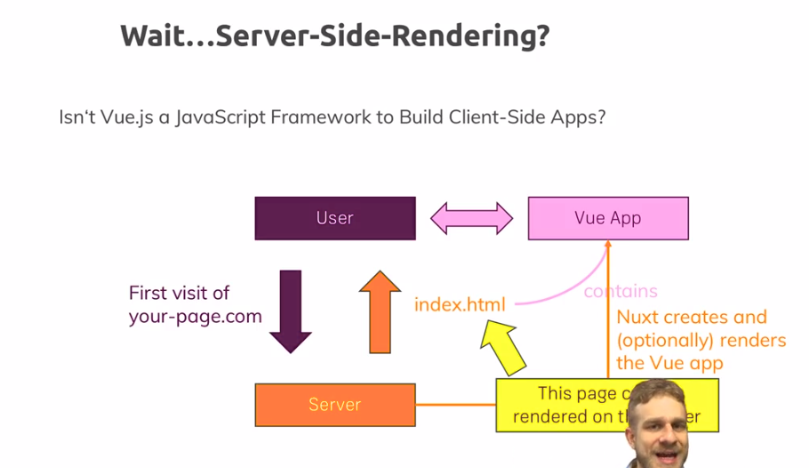

# Nuxt.js Course

**Abstract**

## Credits

## Content

[[toc]]

## What is Nuxt.js?

It makes Vue.js application easier to make. 

* Builds up on Vue.js
* Allows Creation of Universal Vue Apps (Server-side Rendering)
* Configuration via File & Folder Structure
* NOT a server-side framework

### What is Server-side Rendering?

Normally Vue.js runs on the **client-side**. Because of this fact your page will be interactive after all your *javascript* files are sent. This behaviour makes *crawlers* like the Google's only crawl the initial page(HTML), and since the initial page will be empty this approach is NOT good for **SEO**. However, we can render the initial page on the server then send it. So the crawler will crawl and the **SEO** will be preferible. And once the content loaded we will have a very fast application. 

The all page is rendered and sent. After that we can fetch data when a request comes by using APIs. This will create a better user experience since the application runs as it was a native app.

