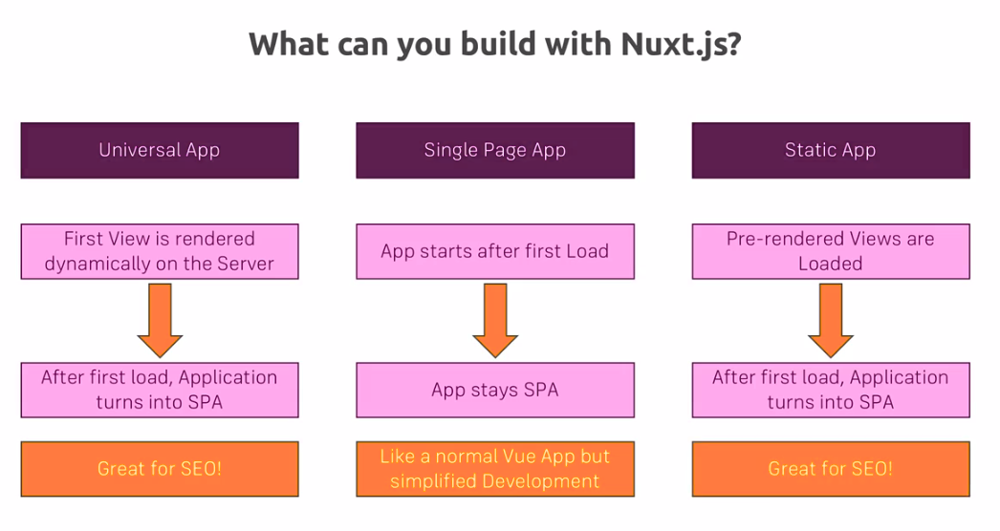

# Nuxtjs Getting Started

## Credits

## Content

[[toc]]

## Creating Nuxt App 

There is a tool to create a `Nuxt` app, you can get it from this [github repo](https://github.com/nuxt-community/create-nuxt-app).

To be able to use **Nuxt.js** we need **node.js**. Go get the [latest version](https://nodejs.org/en/) of it. Also you can install **nuxt** via **npm** with this command:

```bash
sudo npm install -g create-nuxt-app
```

Once the installation finished, navigate to the project folder and run `create-nuxt-app` command to create a **nuxt** app.

```bash
cd project_folder
create-nuxt-app folder_name
```

After run this command you will be asked to choose some configuration options.

For this simple example, I won't use any **node** *framework*. I just want to get a *pre-rendered*  **Vue app**.


For the **rendering mode**:
* If you don't want server-side rendering you can pick `Single Page App`.
* For this project I go with `Universal` option.


Navigate to the folder created by nuxt command and run:

```bash
npm run dev
```

This will run the node server with the nuxt on it. This provides a special development mode with debugging messages and so on. Go to `http://localhost:3000` to see the page.

## Folder Structure

* **assets** : for storing images and so on, which will be handled later by **webpack**, the build tool, so the images are optimized a bit.

* **components/** : is where you create ordinary *Vue* components to use your app.
* **layouts/** : master layouts which you can use as frames.
* **middleware/** : is some middleware you can add you run whenever a user visits a certain page.
* **node_modules/** : 
* **pages/** : is the heart of this folder.
* **plugins/** : to add some shared functionality in your **nuxt** app.
* **static/** : can be used to store some static assets unlike the things you store in assets files in this folder should not be handled by **webpack**.
* **store/** : can be used to add a **Vuex** store.

* And there are some config files in which the most important one, of course, `nuxt.config.js` file.

::: tip
Nuxt is all about configuring project folders and files.
:::

Files in the **pages/** folder must be `.vue` components. This components will be interpreted as routes as URLs you can visit. Behind the scenes it uses `vuerouter` but it set everything up with your router for you.

For example, when you create a new file `users.vue` into `pages/` folder, this will be automatically get it's `PATH` and when you navigate from your browser to `localhost:3000/users` you will see the `users.vue` file is rendered and displayed. There is no need for extra configuration for the `vue-router`, unless another behavior is expected.

## What can we build with Nuxt.js?



## Course Outline


## Adding and COnfiguring Buefy

After running `create-nuxt-app project_folder` command we select `Buefy` as a front-end framework. Then we are ready to use `Buefy` and `Bulma` in our project.

### Customization

To be able to customize bulma we need to install some dependencies:

```bash
install bulma font-awesome --save
npm install sass-loader node-sass --save-dev
```

1. Create `main.scss` in the `assets` folder under `styles` folder and add the customize code from Bulma:

```
assets
├── buefy.png
├── README.md
└── styles
    └── main.scss
```

```scss
// File: assets/main.scss

// 1. Import the initial variables
@import "~bulma/sass/utilities/initial-variables";

// 2. Set your own initial variables
$listiyo-red: #FF6E60;

// 3. Set the derived variables
$primary: $listiyo-red;


// 4. Import the rest of Bulma
@import "~bulma/bulma";
```

2. Update the css block in nuxt.config.js to match the example below:

```javascript
// File: nuxt.config.js

module.exports = {
  /*
  ** Global CSS
  */
  css: [
    // node.js module but we specify the pre-processor
    { src: '~assets/styles/main.scss', lang: 'scss' },
    // { src: '~bulma/bulma.sass', lang: 'sass' },
    { src: 'font-awesome/scss/font-awesome.scss', lang: 'scss' },
  ],
```