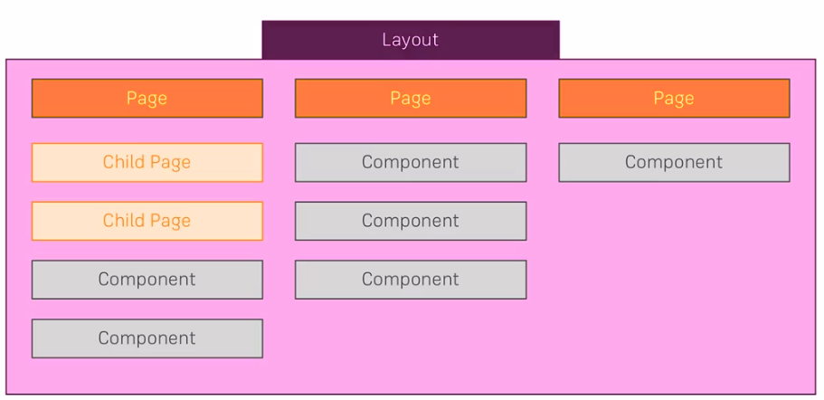
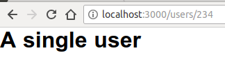
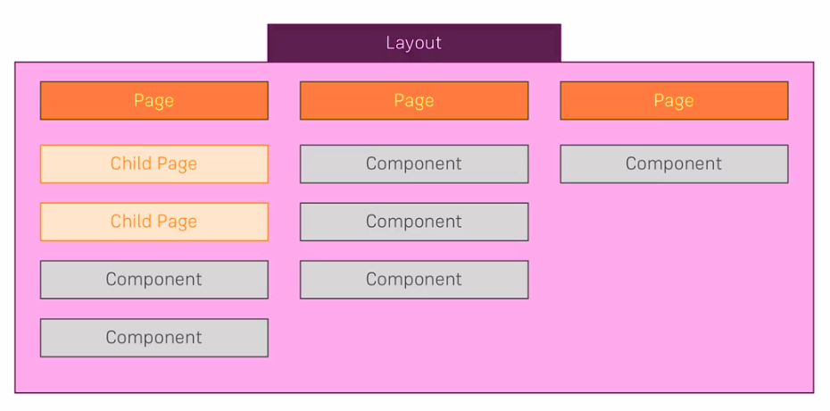

# Pages, Routes, Views'

## Credits

## Content

[[toc]]

## From Folders to Routes

What's the difference between Layouts, Pages & Components



## Creating Route with a Dynamic Path

We've seen that we can create a file inside `pages` directory and it's automatically gets routed to the PATH with the file name. The second option is creating a folder with the name you want to be routed as the PATH and then add an `index.vue` file in it. It will also have the same PATH like `your-domain/users` for example.

```
pages
├── index.vue
├── README.md
└── users
    └── index.vue
```

When we want to create a **Dynamic PATH** we need to add underscore to the beggining of the file name like so: `_id.vue`. Then I will create a template in it check from the browser if it's dynamically render my page. 

```
pages
├── index.vue
├── README.md
└── users
    ├── _id.vue
    └── index.vue
```

**_id.vue**

```html
<template>
    <h1>A single user</h1>
</template>
```

And it's rendered!



We can also access the data that is passed to the path by user. Nuxt.js uses **vue-router** behind the scenes, and since the every page we create here is a vue component we can use Vue features and parameters in a component.

```html
<template>
    <h1>A single user, with ID: {{ $route.params.id }}</h1>
</template>
```

::: tip
Since we named our file as `_id.vue` we can access it by using `$route.params.id`. If it were `_name.vue` for example I would access it by writing `$route.params.name`.
:::

This is one of the possible approaches. We can nest it into another folder like this:

```
pages
├── index.vue
├── README.md
└── users
    ├── _id
    │   └── index.vue
    └── index.vue
```

With that we have the same set up but with folder based approach.

::: warning
The name convention is important. If you nest into a folder you have to name it `index.vue`.
:::

This **folder based** approach has an advantage that we can pass other paths after the dynamic path like so:

```
pages
├── index.vue
├── README.md
└── users
    ├── _id
    │   ├── index.vue
    │   └── more-details.vue
    └── index.vue
```

Now when we can go to `localhost:3000/users/12/more-details`.

## Adding Links and Navigating Around

Let's add some `links` to pages so that we can navigate around them.

We can use normal `<a>` tags with `href` attribute.
**pages/index.vue**

```html
<template>
  <section class="container">
    <a href="/users">users</a>
  </section>
</template>
```

But this approach make a request to server and then render the page. Sometimes you want it. However, we want that the request is handled by *nuxt* (vue-router). 

By the way, in normal Vue apps we use `<n-link>`, but since we use *nuxt* we will use `<nuxt-link>` tag.

```html
<template>
  <section class="container">
    <nuxt-link to="/users">Users</nuxt-link>
  </section>
</template>
```

Sometimes you want to navigate around programatically. For example, when we want to navigate to a user's page. For this we will use `push` method that comes with `$router` object.

**users/index.vue**

```html
<template>
    <div>
        <input type="text" v-model="userId">
        <button @click="onLoadUser">Load User</button>
    </div>

</template>

<script>
export default {
    data () {
        return {
            userId: ''
        }
    },
    methods: {
        onLoadUser: function () {
            this.$router.push('/users/' + this.userId)
        }
    }
}
</script>
```

## Assingment-1: Pages & Routing

ASsignment is done. However i want to add this to my solution. I used `methods` property but I quick solution could be: 

```html
<button @click="$router.push('/products')"></button>
```

## Validating Parameters

* The difference between **pages** and **components** in `nuxtjs` project structure.

The **pages** componenets here are essentialy loaded as root pages for given URLs. And **components**, you can dumb them into these **pages** components as a reusable building blocks.

The **pages** components not just get rendered when you visit a certain URL. They also got some special properties in the Vue object. Nuxtjs understans some extra properties in these Vue objects you define as components. Vuejs will ignore these properties, however `Nuxt` will take care of them. For example, **route validation**.

Let's add a special property, `validate`. It's a method where you get some argument, let's say *data*. Let's try to print that data and return **true** for now.

**pages/users/_id/index.vue**

```html
<template>
    <h1>A single user, with ID: {{ $route.params.id }}</h1>
</template>

<script>
export default {
    validate (data) {
        console.log(data)
        return true
    }
}
</script>
```

Open up your browser console and observe the result of `validate` method.

Let's say that the only **id** we accept as a valid parameter is `1`.

```html
<script>
export default {
    validate (data) {
        return data.params.id == 1
    }
}
</script>
```

When we try to navigate to a path other than `localhost:3000/users/1`, we will see a message that says `"This page could not found"`.

We can also use some **ReGex** here to only accept numerical digits.

```html
<script>
export default {
    validate (data) {
        return /^\d+$/.test(data.params.id)
    }
}
</script>
```

## Creating Nested Routes

We've seen how to resolve pages into a single page. Now, we will see how to resolve the components into one page.

* Create a file with the same name of the folder. In this example it will be `users.vue`, and we also have `users` folder. The `users.vue` componen will be a wrapper for both the index that you fall in the `users` folder and any other nested  routes you want to load.

I will simply copy and paste what's inside in `pages/users/index.vue` to `pages/users.vue` file and then add a special component `<nuxt-child />` to wrap all the routes inside `pages/users/` folder.
This componen is provided by the `nuxtjs` and it simply marks the place where the different secions of that nested route shold be loaded.

**pages/users.vue**

```html
<template>
    <div>
        <input type="text" v-model="userId">
        <button @click="onLoadUser">Load User</button>
        <nuxt-child />
    </div>

</template>

<script>
export default {
    data () {
        return {
            userId: ''
        }
    },
    methods: {
        onLoadUser: function () {
            this.$router.push('/users/' + this.userId)
        }
    }
}
</script>
```

Visit the `localhost:3000/users/` and you will see that the `input` and `button` tags will remain at the top of the page and the rest of the content will change when you enter a valid number and hit the load button.

## Layouts, Pages & Components - Theory

When do you use which?



## Adding a New Layout

Beside pages we got the layout which provides the applications frame. In the `layouts` folder there is a `default.vue` and this name is important. If this file exists it is used as a default for all the other pages. And it should exist. Let's open it and see what's in it.

**layouts/default.vue**

```html
<template>
  <div>
    <nuxt/>
  </div>
</template>

<style>
html
{
  font-family: "Source Sans Pro", -apple-system, BlinkMacSystemFont, "Segoe UI", Roboto, "Helvetica Neue", Arial, sans-serif;
  font-size: 16px;
  word-spacing: 1px;
  -ms-text-size-adjust: 100%;
  -webkit-text-size-adjust: 100%;
  -moz-osx-font-smoothing: grayscale;
  -webkit-font-smoothing: antialiased;
  box-sizing: border-box;
}
...
</style>
```

There is a component called `<nuxt />` in it and this is a component provided by `nuxt` framework and it essentialy means this is the place where the different pages should be loaded in. Then we have `<style>` and this is no **scoped** style therefore this is the default style for our entire application. You can, of course, style different components in their own scope, but for the application wide style it's indeed recommended to use the default layout which is great for such app wide styles. 

We can add other layouts that we want to use for specific pages like `users` view. Let's create a `users.vue` file under `layouts` dir and add a header to see the difference. 

**layouts/users.vue**

```html
<template>
  <div>
      <header>
          USERS SECTION
      </header>
    <nuxt/>
  </div>
</template>
```

To use this layout instead of the default one, we go to the page where we want to use it, in this case **pages/users.vue** and there in the script section, we add another property which is understood by the `nuxt` and that special property is `layout` property. And there you simply pass a *String* with name of the layout. This will look for the `users.vue` file in the `layouts` folder and if it finds, it will use it instead of the `default` layout.

**pages/users.vue**

```html
<script>
export default {
    data () {
        return {
            userId: ''
        }
    },
    methods: {
        onLoadUser: function () {
            this.$router.push('/users/' + this.userId)
        }
    },
    layout: 'users'
}
</script>
```

## Adding a default error page

Ther is one special layout you can add to the `layouts` folder and that's the `error.vue` file. Just as `default.vue` ,`error.vue` is reserved file name. This allows you to create you own error page.

**layouts/error.vue**

```html
<template>
    <h1>An error occured, we're sorry!</h1>
</template>
```

## Working with normal components

In the `components` folder we have small, re-usable building blocks which will not be renderes as pages but as part of pages. You can user them in your pages or also in your layout. 

An example can be a `Header.vue` file.

**components/Header.vue**

```html
<template>
    <header class="header">
        <ul class="nav-items">
            <li>
                <nuxt-link to="/"></nuxt-link>
            </li>
            <li>
                <nuxt-link to="/users"></nuxt-link>
            </li>
        </ul>
    </header>
</template>

<style scoped>
.header {
    width: 100%;
    height: 60px;
    display: flex;
    justify-content: center;
    align-items: center;
}
.nav-items {
    list-style: none;
    padding: 0;
    margin: 0;
    display: flex;
    justify-content: space-around;
    align-items: center;
    width: 80%;
}

</style>
```

Now we can use this component in our pages. Let's go to `pages/index.vue` file, import the component and then use it in the `<template>` like this:

**pages/index.vue**

```html
<template>
  <section class="container">
    <h1>Home Page</h1>
  </section>
</template>

<script>
import Header from '@/components/Header'
export default {
  methods: {
    loadProducts: function () {
      this.$router.push('/products')
    }
  },
  components: {
    Header
  }
}
</script>
```
It only appears on the main page. We can use in other pages by importing it. Let's add it to `users` page also

**pages/users/index.vue**

```html
<template>
    <div>
        <Header />
        <p>Please enter an id and click the button</p>
    </div>
    
</template>

<script>
import Header from '~/components/Header.vue'
export default {
    components: {
        Header
    }
}
</script>
```

It looks valid but we need to import it and use it everytime in each page. How we can pass it globally so the code be **DRY**. Well, we used the components in our `pages` but we can also use them in `layouts`. Let's add it to `default.vue` file and to `users.vue` file.

**layouts/default.vue**

```html
<template>
  <div>
    <Header />
    <nuxt/>
  </div>
</template>

<script>
import Header from '@/components/Header.vue'
export default {
  components: {
    Header
  }
}
</script>
```

We see the `<Header />` element in every page, because now it's a part of the root layout.

::: tip
You can use a component that use other components and use them in pages.
:::

## Styling Nuxt Apps

Let's style our application a bit. We can use **scoped** and **global** styles as well as **dynamic** styles that Vuejs enables us by using *Vue directives* such as `v-bind:style` and `v-bind:class`.

When you want to add a global style you can use `layouts` without specifying `scoped`, however if you have multiple components in your `layouts` like we have in this example: `default.vue` and `users.vue`, then you may want to take a different approach. And this will be adding the style to `assets` folder.

I will create a subfolder called `styles` under `assets` folder and in there I will add `main.css` file.

We need to tell Vuejs that this file should be loaded to every document we have in our project. To do that, we go `nuxt.config.js`. There, find `css`. This indicates the path to the css file that we want to be loaded into every page.

**nuxt.config.js**

```javascript
 /*
  ** Global CSS
  */
  css: [
    '~/assets/styles/main.css'
  ],
```