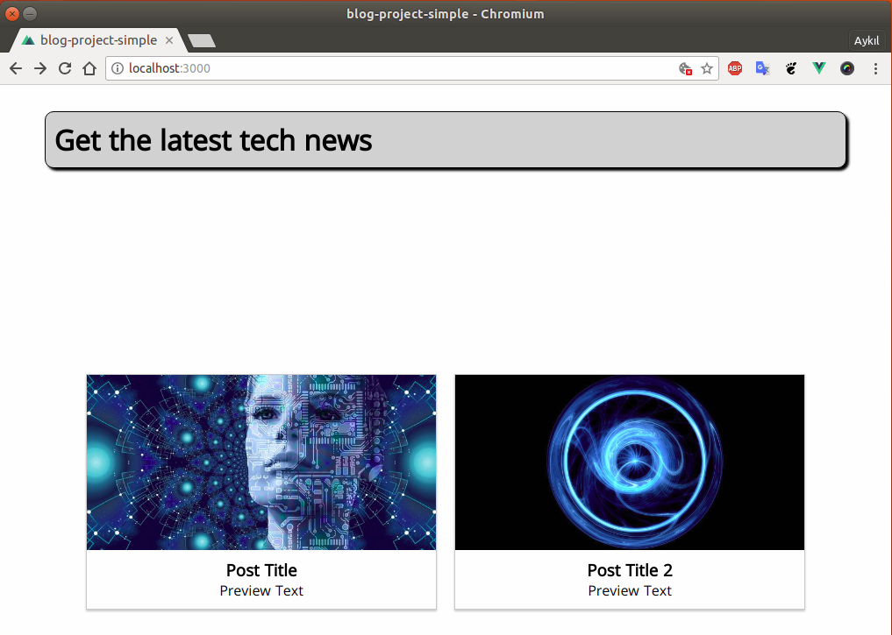
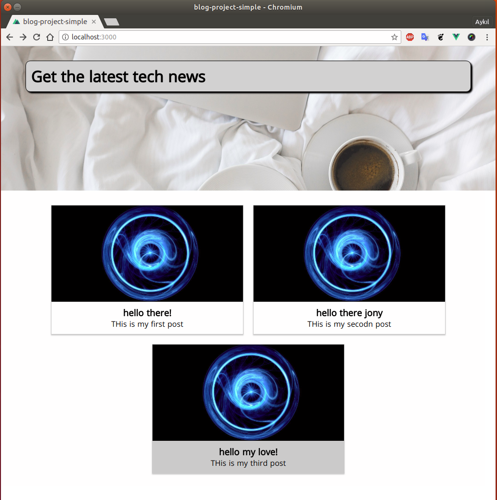

# Project 1: blog

## Credits

## Content

[[toc]]

## Creating the Main Sections(Pages)

In this project, we will use *folder based* structure.

* Under the `pages` folder I  create `posts`, `admin` and `about` folders.

* Under the `about` and `posts` folder I created I add `index.vue` files. We won't visit back the `about` pages very often I just created a simple about page.

The initial project structure is:

```
pages
├── about
│   └── index.vue
├── admin
├── index.vue
├── posts
│   ├── _id
│   │   └── index.vue
│   └── index.vue
└── README.md
```

## Adding External Fonts

Let's make some application wide styling. I go to fonts.google.com and get the link for the *Open Sans* Family. Then I will add it to my main HTML. But wait! Where is my main HTML file? There isn't one. My main HTML file is also wrapped in another file. So, we go to `nuxt.config.js` file and find there `head`. We add the following

**nuxt.config.js**

```javascript
  /*
  ** Headers of the page
  */
  head: {
    title: pkg.name,
    meta: [
      { charset: 'utf-8' },
      { name: 'viewport', content: 'width=device-width, initial-scale=1' },
      { hid: 'description', name: 'description', content: pkg.description }
    ],
    link: [
      { rel: 'icon', type: 'image/x-icon', href: '/favicon.ico' },
      { rel: 'stylesheet', href: 'https://fonts.googleapis.com/css?family=Open+Sans' }
    ]
  },
```

After that we go to `layouts/default.vue` file and remove the styling there. Instead I add:

**layouts/default.vue**

```html
<style>
html
{
  font-family: "Open Sans", -apple-system, BlinkMacSystemFont, "Segoe UI", Roboto, "Helvetica Neue", Arial, sans-serif;
  font-size: 16px;
  word-spacing: 1px;
  -ms-text-size-adjust: 100%;
  -webkit-text-size-adjust: 100%;
  -moz-osx-font-smoothing: grayscale;
  -webkit-font-smoothing: antialiased;
  box-sizing: border-box;
}
*, *:before, *:after
{
  box-sizing: border-box;
  margin: 0;
}

</style>
```

## Creating the Landing Page

Go to `pages/index.vue` and we will create a landing page.

```html
<template>
  <div class="home-page">
    <section class="intro">
      <h1>Get the latest tech news</h1>
    </section>
    <section class="featured-posts">
      <nuxt-link :to="'/posts/' + 1" class="post-preview">
        <article>
          <div class="post-thumbnail" style="background-image: url('https://i2-prod.manchestereveningnews.co.uk/incoming/article14379834.ece/ALTERNATES/s615/050318_LRR_MEN_WomenTech.jpg')"></div>
          <div class="post-content">
            <h1>Post Title</h1>
            <p>Preview Text</p>
          </div>
        </article>
      </nuxt-link>
      <nuxt-link :to="'/posts/' + 2" class="post-preview">
        <article>
          <div class="post-thumbnail" style="background-image: url('http://tapety.joe.pl/tapeta/abstrakcja/niebieskie/niebieskie-swietliste-kregi.jpg')"></div>
          <div class="post-content">
            <h1>Post Title 2</h1>
            <p>Preview Text</p>
          </div>
        </article>
      </nuxt-link>
    </section>
  </div>
</template>

<style scoped>
  .intro {
  height: 300px;
  position: relative;
  padding: 30px;
  box-sizing: border-box;
  background-position: center;
  background-size: cover;
}

.intro h1 {
  position: absolute;
  top: 10%;
  left: 5%;
  width: 90%;
  font-size: 1.5rem;
  color: black;
  background-color: rgb(211, 211, 211);
  padding: 10px;
  border-radius: 10px;
  box-shadow: 3px 3px 3px black;
  box-sizing: border-box;
  border: 1px solid black;
}

@media (min-width: 768px) {
  .intro h1 {
    font-size: 2rem;
  }
}

.featured-posts {
  display: flex;
  padding: 20px;
  box-sizing: border-box;
  flex-wrap: wrap;
  align-items: center;
  justify-content: center;
}

.post-preview {
  border: 1px solid #ccc;
  box-shadow: 0 2px 2px #ccc;
  background-color: white;
  width: 90%;
}

a {
  text-decoration: none;
  color: black;
}

@media (min-width: 850px) {
  .post-preview {
    width: 400px;
    margin: 10px;
  }
}

.post-thumbnail {
  width: 100%;
  height: 200px;
  background-position: center;
  background-size: cover;
}

.post-content {
  padding: 10px;
  text-align: center;
}

a:hover .post-content,
a:active .post-content {
  background-color: #ccc;
}
</style>
```

And at the end, we will have a landing page that looks like this:



## Splitting the Page into Components

We can see that the `pages/index.vue` file gets already quite big. So, let's split it into little re-usable components.

Let's go to components folder and create `Posts` folder and the first file will be `PostPreview.vue`.

After cutting the related parts from `pages/index.vue` and paste to `components/Posts/PostPreview.vue` I have this:

**components/Posts/PostPreview.vue**

```html
<template>
    <nuxt-link :to="'/posts/' + 1" class="post-preview">
        <article>
            <div class="post-thumbnail" style="background-image: url('https://i2-prod.manchestereveningnews.co.uk/incoming/article14379834.ece/ALTERNATES/s615/050318_LRR_MEN_WomenTech.jpg')"></div>
            <div class="post-content">
            <h1>Post Title</h1>
            <p>Preview Text</p>
            </div>
        </article>
    </nuxt-link>
</template>

<style scoped>
.post-preview {
  border: 1px solid #ccc;
  box-shadow: 0 2px 2px #ccc;
  background-color: white;
  width: 90%;
}

a {
  text-decoration: none;
  color: black;
}

@media (min-width: 850px) {
  .post-preview {
    width: 400px;
    margin: 10px;
  }
}

.post-thumbnail {
  width: 100%;
  height: 200px;
  background-position: center;
  background-size: cover;
}

.post-content {
  padding: 10px;
  text-align: center;
}

a:hover .post-content,
a:active .post-content {
  background-color: #ccc;
}
</style>
```

And my landing page now looks more cleaner:

**pages/index.vue**

```html
<template>
  <div class="home-page">
    <section class="intro">
      <h1>Get the latest tech news</h1>
    </section>
    <section class="featured-posts">
      <post-preview />
      <post-preview />
      <post-preview />
    </section>
  </div>
</template>

<script>
import PostPreview from '@/components/Posts/PostPreview'
export default {
  components: {
    PostPreview
  }
}
</script>
```

We wanna pass some data to posts. Now, I have everything hardcoded. I want to pass information related to each posts. We can do it with `props`.

**components/Posts/PostPreview.vue**

```html
<template>
    <nuxt-link :to="'/posts/' + id" class="post-preview">
        <article>
            <div class="post-thumbnail" 
            :style="{ backgroundImage: 'url(' + thumbnail +  ')'}"></div>
            <div class="post-content">
            <h1>{{ title }}</h1>
            <p>{{ previewText }}</p>
            </div>
        </article>
    </nuxt-link>
</template>

<script>
export default {
    name: 'PostPreview',
    props: {
        id: {
            type: String,
            required: true
        },
        title: {
            type: String,
            required: true
        },
        previewText: {
            type: String,
            required: true
        },
        thumbnail: {
            type: String,
            required: true
        }
    }
}
</script>
```

Then we pass the data from `pages/index.vue` like this:

**pages/index.vue**

```html
<template>
  <div class="home-page">
    <section class="intro">
      <h1>Get the latest tech news</h1>
    </section>
    <section class="featured-posts">
      <post-preview
        id="1"
        thumbnail="http://tapety.joe.pl/tapeta/abstrakcja/niebieskie/niebieskie-swietliste-kregi.jpg"
        title="hello there!"
        previewText="THis is my first post" />
        <post-preview
        id="2"
        thumbnail="http://tapety.joe.pl/tapeta/abstrakcja/niebieskie/niebieskie-swietliste-kregi.jpg"
        title="hello there jony"
        previewText="THis is my secodn post" />
        <post-preview
        id="3"
        thumbnail="http://tapety.joe.pl/tapeta/abstrakcja/niebieskie/niebieskie-swietliste-kregi.jpg"
        title="hello my love!"
        previewText="THis is my third post" />
    </section>
  </div>
</template>
```

## Adding Static Assets - The Background Image

Sometimes we want to have some static assets in our project. In this project I want to have a background image in my landing page. 

* I created a folder called `images` under `assets` folder and add an image there. And then add the image to style section in my `pages/index.vue` file.

**pages/index.vue**

```html
<style scoped>
  .intro {
  height: 300px;
  position: relative;
  padding: 30px;
  box-sizing: border-box;
  background-position: center;
  background-size: cover;
  background-image: url('~assets/images/main-page-background.jpg')
}
</style>
```

When we pass it like this, `Nuxt` will search for the image and when it finds the image it will optimize it and copy it to deployment package.

Our blog is getting a better look:



## Adding the Header Component

Now, I will add `Header` components under `components/Navigation` folder.

**components/Navigation/TheHeader.vue**

```html
<template>
<div class="header-container">
  <header class="the-header">
    <TheSideNavToggle @toggle="$emit('sidenavToggle')" />
    <div class="logo">
      <nuxt-link to="/">WD BLOG</nuxt-link>
    </div>
    <div class="spacer"></div>
    <div class="navigation-items">
      <ul class="nav-list">
        <li class="nav-item"><nuxt-link to="/posts">Blog</nuxt-link></li>
        <li class="nav-item"><nuxt-link to="/about">About</nuxt-link></li>
        <li class="nav-item"><nuxt-link to="/admin">Admin</nuxt-link></li>
      </ul>
    </div>
  </header>
</div>
</template>

<script>
import TheSideNavToggle from "@/components/Navigation/TheSideNavToggle";

export default {
  name: "TheHeader",
  components: {
    TheSideNavToggle
  }
};
</script>


<style scoped>
.header-container {
  height: 60px;
}

.the-header {
  width: 100%;
  position: fixed;
  height: 60px;
  display: flex;
  justify-content: space-around;
  align-items: center;
  background-color: black;
  z-index: 100;
  box-sizing: border-box;
  padding: 0 20px;
}

.logo {
  margin: 0 10px;
  font-size: 1.3rem;
}

.logo a {
  text-decoration: none;
  color: white;
}

.spacer {
  flex: 1;
}

.navigation-items {
  display: none;
}

@media (min-width: 768px) {
  .navigation-items {
    display: block;
  }
}

.nav-list {
  list-style: none;
  padding: 0;
  margin: 0;
  display: flex;
}

.nav-item {
  margin: 0 10px;
}

.nav-item a {
  text-decoration: none;
  color: white;
}

.nav-item a:hover,
.nav-item a:active,
.nav-item a.nuxt-link-active {
  color: red;
}
</style>
```

**components/Navigation/TheSidenav.vue**

```html
<template>
<div class="sidenav-container">
  <div
    v-if="show"
    class="sidenav-backdrop"
    @click="$emit('close')"></div>
  <transition name="slide-side">
    <div
      v-if="show"
      class="sidenav">
      <ul
        class="nav-list"
        @click="$emit('close')">
        <li class="nav-item"><nuxt-link to="/posts">Blog</nuxt-link></li>
        <li class="nav-item"><nuxt-link to="/about">About</nuxt-link></li>
        <li class="nav-item"><nuxt-link to="/admin">Admin</nuxt-link></li>
      </ul>
    </div>
  </transition>
</div>
</template>

<script>
export default {
  name: "TheSidenav",
  props: {
    show: {
      type: Boolean,
      default: false
    }
  }
};
</script>


<style scoped>
.sidenav-container {
  height: 100%;
  width: 100%;
}

.sidenav-backdrop {
  width: 100%;
  height: 100%;
  background-color: rgba(0, 0, 0, 0.7);
  z-index: 1000;
  position: fixed;
  top: 0;
  left: 0;
}

.sidenav {
  height: 100%;
  width: 300px;
  background-color: white;
  z-index: 10000;
  position: fixed;
  top: 0;
  left: 0;
  box-sizing: border-box;
  padding: 30px;
}

.slide-side-enter-active,
.slide-side-leave-active {
  transition: all 0.3s ease-out;
}
.slide-side-enter,
.slide-side-leave-to {
  transform: translateX(-100%);
}

.nav-list {
  list-style: none;
  padding: 0;
  margin: 0;
}

.nav-item {
  margin: 20px 0;
}

.nav-item a {
  text-decoration: none;
  color: black;
  font-size: 1.5rem;
}

.nav-item a:hover,
.nav-item a:active {
  color: red;
}
</style>
```

**components/Navigation/TheSideNavToggle.vue**

```html
<template>
  <div
    class="drawer-toggle"
    role="button"
    @click="$emit('toggle')">
    <div class="bar"></div>
    <div class="bar"></div>
    <div class="bar"></div>
  </div>
</template>

<style scoped>
.drawer-toggle {
  display: flex;
  flex-direction: column;
  justify-content: space-around;
  height: 50%;
  width: 35px;
  cursor: pointer;
}

@media (min-width: 768px) {
  .drawer-toggle {
    display: none;
  }
}

.drawer-toggle .bar {
  width: 90%;
  height: 2px;
  background-color: white;
}
</style>
```