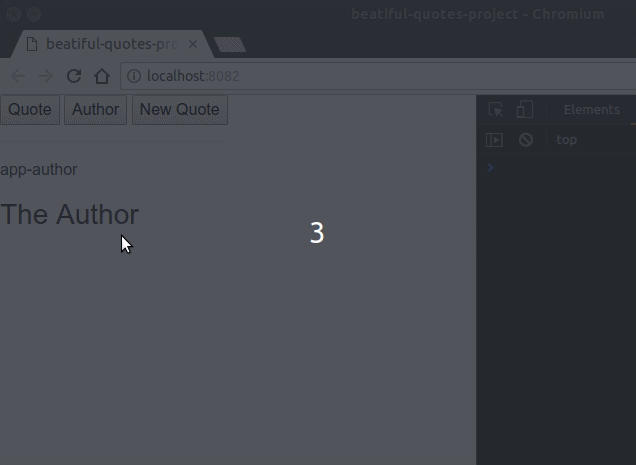

# Advanced Component Usage (Quotes Project)


## Credits

This course in on [this link](https://www.udemy.com/vuejs-2-the-complete-guide/learn/v4/t/lecture/5975154?start=0) on udemy.

## Content

[[toc]]

## Set up Module Project


* In this docs we will see how seperate commponents communicate in each other. So to say, how to pass data from one component to another. We use `webpack-simple` as a starter template.

```bash
vue init webpack-simple folder_name
```

* Add bootstrap cdn to `index.html` file.

**index.html**

```html
<link rel="stylesheet" href="https://stackpath.bootstrapcdn.com/bootstrap/4.1.1/css/bootstrap.min.css" integrity="sha384-WskhaSGFgHYWDcbwN70/dfYBj47jz9qbsMId/iRN3ewGhXQFZCSftd1LZCfmhktB" crossorigin="anonymous">
```

* Create a new vue component for the quotes

**src/components/Quote.vue**

```html
<template>
    <div>
      <p>A wonderful quote</p>
    </div>
</template>

<script>
    export default {
        name: "Quote"
    }
</script>

<style scoped>
  div {
    border: 1px solid #ccc;
    -webkit-box-shadow: 2px 2px 4px 3px #ccc;
    -moz-box-shadow: 2px 2px 4px 3px #ccc;
    box-shadow: 2px 2px 4px 3px #ccc;
    padding: 30px;
    margin: 30px auto;
    text-align: center;
    width: 100%;
  }
</style>
```

* import and add `Quote.vue` component to `App.vue` file.

**src/App.vue**

```html
<template>
  <div class="container">
    <div class="row">
      <div class="col-xs-12">
        <Quote />
      </div>
    </div>
  </div>
</template>

<script>
import Quote from "./components/Quote";
export default {
  components: {Quote}
}
</script>

<style>
  * {
    box-sizing: border-box;
  }
</style>
```

## Passing Content - The Suboptimal Solution

I want to pass some text to the `Quote` component. I can do this by using `props` property.

> Since I will pass `String` with `<app-quote>` component it's not neccesary to use colons (`:`) to bind it.

**src/App.vue**

```html
<div class="col-xs-12">

    <app-quote
        quote="A wonderful quote!"
    ></app-quote>

</div>
```

* Add `quote` to `props` in `Quote` component.

**src/components/Quote.vue**

```html
<template>
    <div>
      <p>{{ quote }}</p>
    </div>
</template>

<script>
    export default {
      props: [ 'quote' ]
    }
</script>
```

Now, it works properly, but I want to pass HTML with it and with this approach it's not possible. Though it would be nice just pass a block of HTML by enclosing it with `<app-quote>` component. Well, we can do it by using `<slot>` which is a some nice feature of Vue.js.

## Passing Content with Slots

* I will pass an HTML block within `<app-quote>` component

**src/components/Quote.vue**

```html
<template>
    <div>
      <slot></slot>
    </div>
</template>
```

* Pass HTML block.

**src/App.vue**

```html
<app-quote>
    <h2>Quote</h2>
    <p>A wonderful quote!</p>
</app-quote>
```

> Voila!

## How Slot content get compiled and styled

It's important to understand where the code we pass in `<slot>` get compiled.

For example, I want to change the styling. I can do it from `Quote.vue` file's `<style>` section like this: 

**src/components/Quote.vue**

```html
<style scoped>
    h2 {
      color: red;
    }
</style>
```

## Using Multiple Slots (Named Slots)

We can pass HTML from parent to child by using `<slot>`. However, if we want to display the passed data in different places of child component. Well, again Vue.js offers us the **named slots**.

* Give a name to slots by using *name* attribute.

**src/components/Quote.vue**

```html
<template>
    <div>
      <div class="title">
        <slot name="title"></slot>
      </div>
      <hr>
      <div class="content">
        <slot name="content"></slot>
      </div>
    </div>
</template>
```

* Refer the slot with its name by using `slot` attribute.

**src/App.vue**

```html
<app-quote>
    <h2 slot="title">Quote</h2>
    <p slot="content">A wonderful quote!</p>
</app-quote>
```

## Default Slots and Slot Defaults

Each slot that is not assigned by the `name` attr and referred by the `slot` attr will be treated as a default. For example, if I remove the `content` name and ref it wil still yield us the same result.

**src/components/Quote.vue**

```html{8}
<template>
    <div>
      <div class="title">
        <slot name="title"></slot>
      </div>
      <hr>
      <div class="content">
        <slot></slot>
      </div>
    </div>
</template>
```

**src/App.vue**

```html{3}
<app-quote>
    <h2 slot="title">Quote</h2>
    <p>A wonderful quote!</p>
</app-quote>
```


### Default display

Let's we are not sure if a third element will be passed.

* Add a `slot` with default content. This will be the default content and if an element passed to slot, it will be replaved with the upcoming content.

**src/components/Quote.vue**

```html{6}
<template>
    <div>
      <div class="title">
        <slot name="title"></slot>
        <span style="color: #ccc">
          <slot name="subtitle">The Subtitle</slot>
        </span>
      </div>
      <hr>
      <div class="content">
        <slot></slot>
      </div>
    </div>
</template>
```


> You can use this behaviour of slots with sliders for example. Just change the data you will pass into the component and you will always have the same layout with optional parameters.

## Switching Multiple Components to Dynamic Components

Let's say we have multiple components in our project. 

* Create extra components `Author.vue` and `New.vue` then put some dummy content in them

**Author.vue**

```html
<template>
  <div>
    <h3>The Author</h3>
  </div>
</template>
```

**New.vue**

```html
<template>
  <div>
    <h3>New Quote</h3>
  </div>
</template>
```

* import and register the components to `App.vue` component.


**App.vue**

```html
<script>
  import Quote from "./components/Quote";
  import Author from "./components/Author";
  import New from "./components/New";
export default {
  components: {
    'app-quote': Quote,
    'app-author': Author,
    'app-new': New
  }
}
</script>
```

Don't put the components into your template. We want to display them depending on which button is pressed.

* Add three buttons above `app-quote` component.
* Add a new `data` property `selectedComponent`.

**App.vue**

```html
<template>
  <div class="container">
    <div class="row">
      <div class="col-xs-12">
        <button @click="selectedComponent = 'app-quote'">Quote</button>
        <button @click="selectedComponent = 'app-author'">Author</button>
        <button @click="selectedComponent = 'app-new'">New Quote</button>
        <hr>
        <p>{{ selectedComponent }}</p>
        <app-quote>
          <h2 slot="title">{{ quoteTitle}}</h2>
          <p slot="content">A wonderful quote!</p>
        </app-quote>
      </div>
    </div>
  </div>
</template>

<script>
  import Quote from "./components/Quote";
  import Author from "./components/Author";
  import New from "./components/New";
export default {
  data() {
    return {
      quoteTitle: 'The Quote',
      selectedComponent: 'app-quote'
    }
  },
  components: {
    'app-quote': Quote,
    'app-author': Author,
    'app-new': New
  }
}
</script>
```

Now, we have this set up. When we hit the button `selectedComponent`' value changes.

<div>
    <video width="100%" height="100%" controls>
        <source src="../videos/advanced-components-2.webm" type="video/webm">
    Your browser does not support the video tag.
    </video>
</div>

We want that when a button is pressed the related component changes dynamically. In order to have such a behaviour we use `<component>` element. This selector is a *reserved* word just like `slot`. We can bind `<commponent>` to a property which holds the `component` which should get loaded. To bind it we use `:is` attribute then we will bind it to `selectedComponent` property.


**App.vue**

```html{10,11,12}
<template>
  <div class="container">
    <div class="row">
      <div class="col-xs-12">
        <button @click="selectedComponent = 'app-quote'">Quote</button>
        <button @click="selectedComponent = 'app-author'">Author</button>
        <button @click="selectedComponent = 'app-new'">New Quote</button>
        <hr>
        <p>{{ selectedComponent }}</p>
        <component :is="selectedComponent">
          <p>Default component</p>
        </component>
      </div>
    </div>
  </div>
</template>

<script>
  import Quote from "./components/Quote";
  import Author from "./components/Author";
  import New from "./components/New";
export default {
  data() {
    return {
      quoteTitle: 'The Quote',
      selectedComponent: 'app-quote'
    }
  },
  components: {
    'app-quote': Quote,
    'app-author': Author,
    'app-new': New
  }
}
</script>
```

<div>
    <video width="100%" height="100%" controls>
        <source src="../videos/advanced-components-4.webm" type="video/webm">
    Your browser does not support the video tag.
    </video>
</div>

### Understanding Dynamic Component Behavior

One important question when using this `Dynamic Component` approach is the component re-created or we use existing component?

Let's find out!

* Create a new button in `New.vue` component and create a new `data` property `counter` and set its initial value to 0. When the button is pressed the `counter`s value will increment.

**New.vue**

```html
<template>
  <div>
    <h3>New Quote</h3>
    <p>count is : {{ counter }}</p>
    <button @click="counter++">increment</button>
  </div>
</template>

<script>
  export default {
    data() {
      return {
        counter: 0
      }
    }
  }
</script>
```

Let's observe the behavior of this component. We want to find out whether the component's state is kept or not. 

<div>
    <video width="100%" height="100%" controls>
        <source src="../videos/advanced-components-5.webm" type="video/webm">
    Your browser does not support the video tag.
    </video>
</div>

As we see in the above video the component's state is not kept. So the component is actually destroyed and re-created. We can check this behavior with `life-cycle hooks`. 

* Add `destroyed` property and log the action.


**New.vue**

```html
<script>
  export default {
    data() {
      return {
        counter: 0
      }
    },
    destroyed() {
      console.log('destroyed')
    }
  }
</script>
```


> How we can keep this component alive?? Well, we can overwrite this behavior.

## Keeping Dynamic Components Alive

In order to make sure that the components are not destroyed we can wrap the component in `<keep-alive>` component. Within this component we can wrap the component of which the state we want to be kept alive.

**App.vue**

```html
<keep-alive>
  <component :is="selectedComponent">
    <p>Default component</p>
  </component>
</keep-alive>
```


## Dynamic Component Life-cycle Hooks

We have two life-cycle to control if a dynamic component is currently visited or we navigated away, so it is deactivated. These life-cycle hooks are called `activated` and `deactivated`.


**New.vue**

```html
<script>
  export default {
    data() {
      return {
        counter: 0
      }
    },
    destroyed() {
      console.log('destroyed')
    },
    deactivated() {
      console.log('deactivated')
    },
    activated() {
      console.log('activated')
    }
  }
</script>
```




## Assignment-8: Slots And Dynamic Components


* Create slot within the colored components. 

**App.vue**

```html
<app-blue>
  <h2>fuck the fucking fuckers!</h2>
</app-blue>
```

**Red.vue**

```html
<template>
    <div>
      <slot></slot>
    </div>
</template>
```


* Dynamically switch the components.

**App.vue**

```html
<template>

        <button class="btn btn-primary" @click="selectedComponent = 'appBlue'">Load Blue Template</button>
        <button class="btn btn-success" @click="selectedComponent = 'appGreen'">Load Green Template</button>
        <button class="btn btn-danger" @click="selectedComponent = 'appRed'">Load Red Template</button>
        <hr>
        <component :is="selectedComponent">
          <h2>fuck the fucking fuckers!</h2>
        </component>

</template>

<script>
  //omitted
  export default {
    data() {
      return {
        selectedComponent: 'appBlue'
      }
    },
    // omitted
  }
</script>
```


**Helpful Links:**

Official Docs - Slots: [http://vuejs.org/guide/components.html#Content-Distribution-with-Slots](http://vuejs.org/guide/components.html#Content-Distribution-with-Slots)
Official Docs - Dynamic Components: [http://vuejs.org/guide/components.html#Dynamic-Components](http://vuejs.org/guide/components.html#Dynamic-Components)
Official Docs - Misc: [http://vuejs.org/guide/components.html#Misc](http://vuejs.org/guide/components.html#Misc)