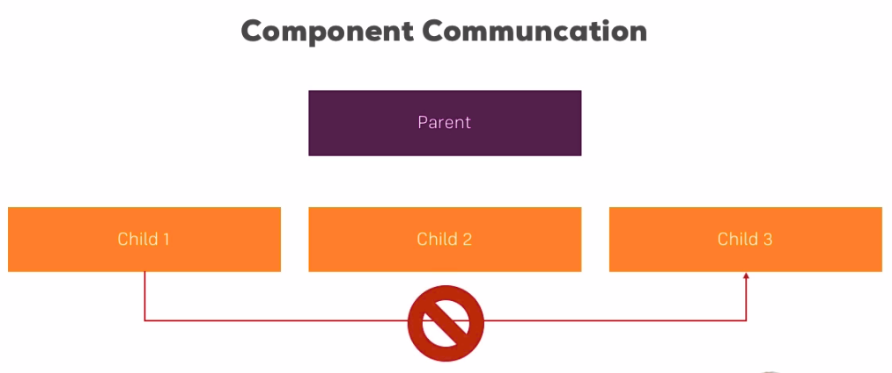
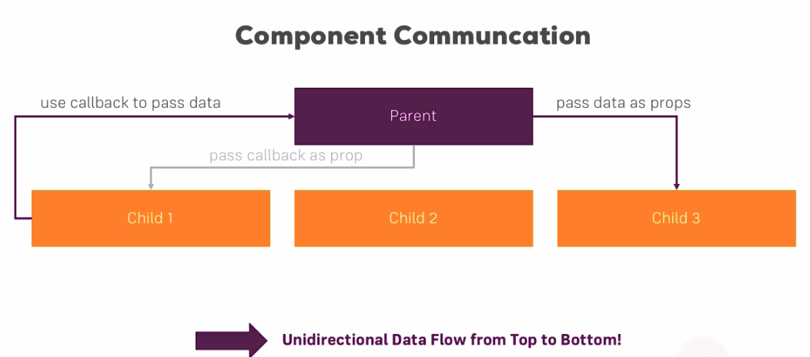

# Communicating Between Components

In this docs we will see how seperate commponents communicate in each other. So to say, how to pass data from one component to another. We use `webpack-simple` as a starter template.

```bash
vue init webpack-simple folder_name
```

In the below picture, we see our project's initial set up. We have the *parent component* with blue background; and two child components, one is red and the other is green.


## Credits

## Content

[[toc]]

## Communicating Problems

We have one parent component (`User.vue`) and two childs(`UserDetail.vue`, `UserEdit.vue`) in it. And everything is in a root component called `App.vue`. 

* I will create a `<button>` element that says `change my name` just below `I'm an awesome User!` `<p>` element. Then, I will add a click listener to the button with the `changeName` method. 

* I will create a `data` property `name` with the default value `Mayk`.

** src/components/User.vue**

```html
<template>
    <div class="component">
        <h1>The User Component</h1>
        <p>I'm an awesome User!</p>
        <button @click="changeName">Change My Name</button>
        <hr>
        <div class="row">
            <div class="col-xs-12 col-sm-6">
                <app-user-detail></app-user-detail>
            </div>
            <div class="col-xs-12 col-sm-6">
                <app-user-edit></app-user-edit>
            </div>
        </div>
    </div>
</template>

<script>
    import UserDetail from './UserDetail.vue';
    import UserEdit from './UserEdit.vue';

    export default {
        data: function() {
            return {
                username: 'Mayk'
            }
        },
        methods: {
            changeName () {
                this.username = 'Anne'
            }
        },
        components: {
            appUserDetail: UserDetail,
            appUserEdit: UserEdit
        }
    }
</script>
```

The question is, how we gonna pass the `name`'s value to the child component??

## Using props for Parent => Child communication

`props` is a property for *parent to child communication*. It's abbrevation of `properties`. It means properties set from outside, in this case from the parent component.

To tell the child component that it will recieve data from outside I will add `props` property. This happens to be an **Array** and in this Array we specify a couple of strings wherein each string we define a property which should be settable from outside.

**src/components/UserDetail**

```html
<template>
    <div class="component">
        <h3>You may view the User Details here</h3>
        <p>Many Details</p>
        <p>Username: {{ name }}</p>
    </div>
</template>

<script>
export default {
    props: ['name']
}
</script>


<style scoped>
    div {
        background-color: lightcoral;
    }
</style>

```

In this case, we will pass the `name` which has to match the property we're using in out template. This will give us access to the `name`, but how we reciece the data from outside? Well, in order to pass it we will add an attribute to `<app-user-detail>` and the attr will be `name` which refers the `name` property in `UserDetail.vue` file and its value will be `username` which is the property in `User.vue` file.

If I pass it like this:

```html
<div class="col-xs-12 col-sm-6">
    <app-user-detail name="username"></app-user-detail>
</div>
```

It will be hardcoded, however I want it to be **dynamic**. So, I need to add a semicolon, which is a shorthand for `v-bind`.

```html
<div class="col-xs-12 col-sm-6">
    <app-user-detail :name="username"></app-user-detail>
</div>
```

## Naming Props

::: warning
An important note regarding the naming of your props. We can use case sensative attribute names like `myName` only if the template supports it. In this example, we are using single file template which gets compiled to javascript during the build process. 

**src/components/User.vue**

```html
<div class="col-xs-12 col-sm-6">
    <!--This will get compiled to javascript code that's why
    we can use case sensetive attr name.-->
    <app-user-detail :myName="username"></app-user-detail>
</div>
```
:::

## Using 'props' in the Child component

In addition to use the passed data in the template, we can use it in a `methods` property as well.

**src/components/UserDetail.vue**

```html
<template>
    <div class="component">
        <h3>You may view the User Details here</h3>
        <p>Many Details</p>
        <p>Username: {{ switchName() }}</p>
    </div>
</template>

<script>
export default {
    props: ['name'],
    methods: {
        switchName() {
            return this.name.split('').reverse('').join('')
        }
    }
}
</script>
```

## Validating the Props

We build the component which uses `props` to get data from the parent. But, we need make sure that the passed data's *type* is valid. In order to validate it we will use a method in `props`. `props` can be *Object* too, if you want to pass a value in it.

**src/components/UserDetail.vue**

```html
<script>
export default {
    props: {
        name: String
    },
    ...
</script>
``` 

You can say also it accept multiple *types*.

```html
<script>
export default {
    props: {
        name: [String, Number]
    },
    ...
</script>
``` 


If you pass an invalid *type* then Vuejs will give you an error on the console, and won't compile that component.

**src/components/User.vue**

```html
<div class="row">
    <div class="col-xs-12 col-sm-6">
        <app-user-detail :name="1.4"></app-user-detail>
    </div>
...
```

You can do even more just setting the *type* of it. This can be also an *Object* in which you set the `type` key to *String*, for example; and you can also set `required` to be **true** to make sure this is a property which always a *String* and it should always be passed(avaliable). If you don't set `required` it would be valid to use your component like this and not pass this name. But specifying `required: true` you say that this component should only be avaliable if this property is passed. It's an additon when setting the `props` that make sure that your component definitly has what it needs to run optimally.

**src/components/UserDetail.vue**

```html
<script>
export default {
    props: {
        name: {
            type: String,
            required: true
        }
    },
    ...
</script>
``` 

You can also set `default` value to make sure that you have something to work with. Let's remove the `:name` attribute and try it.

**src/components/UserDetail.vue** 

```html
<script>
export default {
    props: {
        name: {
            type: String,
            default: 'Maykican'
        }
    },
    ...
</script>
``` 


::: tip
But with `required` it doesn't make sense. There is no need to specify both at the same time since the `dafault` value will be overwritten by `required`.
:::


If you pass an *Object* insted of `String` the `default`s value should be an *Object* to like so:

**src/components/UserDetail.vue** 

```html
<script>
export default {
    props: {
        name: {
            type: Object,
            default: function() {
                return {
                    name: 'Maykican'
                }
            }
        }
    },
    ...
</script>
``` 

## Using Custom Events for Child => Parent Communication

We've seen how to pass data from parent to child. Now, let's see how to use custom *events* to pass data from child to parent. So that the parent component gets informed about something or gets a new value.

* I will add a new `<button>` just below the `Username: ` and listen to click events. I will create `resetName` function to reset the name. 


**src/components/UserDetail.vue** 

```html
<template>
    <div class="component">
        <h3>You may view the User Details here</h3>
        <p>Many Details</p>
        <p>Username: {{ switchName() }}</p>
        <button @click="resetName">Reset Name</button>
    </div>
</template>

<script>
export default {
    props: {
        name: {
            type: String,
            default: 'Maykican'
        }
    },
    methods: {
        switchName() {
            return this.name.split('').reverse('').join('')
        },
        resetName() {
            this.name = 'Mayk'
        }
    }
}
</script>
``` 

We changed the name in child component. I also want to pass it to parent component so we need to inform the parent component that the name did change and to do so we need to *emit* a custom event emitting. In each Vue Instance you got access to `$emit` method, we can use it in every `Vue component` or in `Vue instance` and this allows us to emit a custom event like. On `$emit` I will specify the name of the event I want to emit. And, here is the name `nameWasReset`. As a second argument you can pass some data, and here I will pass `this.name`. This emits an event.

**src/components/UserDetail.vue** 

```html
<script>
export default {
    // omitted
    methods: {
        switchName() {
            return this.name.split('').reverse('').join('')
        },
        resetName() {
            this.name = 'Mayk'
            this.$emit('nameWasReset', this.name)
        }
    }
}
</script>
``` 

In the parent coponent `User.vue` we can listen to that like we listen to all events. On the selector of my `<app-user-detail>` component which is the component emitting the event I can add an event listener with `v-on` or with the shortcut `@` and then the name of the event: `nameWasReset`. Then I can execute some code. I can execute a method here or I can simply say `username` which is the property I'm using to store the `User` component equals `$event` (where it refers to the data which was passed from the event). Remember, I'm passing the updated name in my `nameWasReset` function.

**src/components/User.vue**

```html
<template>
    <div class="component">
        <h1>The User Component</h1>
        <p>I'm an awesome User!</p>
        <!-- Display the username on the parent  component
             so that we can see the changes -->
        <p>Name: {{ username }}</p>
        <button @click="changeName">Change My Name</button>
        <hr>
        <div class="row">
            <div class="col-xs-12 col-sm-6">
                <app-user-detail :name="username" @nameWasReset="username = $event"></app-user-detail>
            </div>
            <div class="col-xs-12 col-sm-6">
                <app-user-edit></app-user-edit>
            </div>
        </div>
    </div>
</template>
```


::: tip IMPORTANT
Keep in mind that object and arrays are **reference types** which means they only exist in memory once. The variables or properties storing them, actually only store a pointer to that place in memory. So if you pass an object or array from your parent to the child component you're actually passing the pointer to that place in memory. Hence, if you change it in the child component you're changing the object in memory which only exists once. So you're also changing it in your parent component. 
:::

Now here it would actually be helpful because I want to reset the name and I could do it from my child component and get it updated in the parent component automatically. But, often times you will need a different approach.

::: tip
it's important to keep this in mind the difference between reference types and primitive types.
:::

## Understanding Unidirectional Data Flow 

The data can pass *parent* to *child* or viceversa but can not pass from *child* to another *child*.



But we can get the data that passed to *parent* like so:




## Communicating with Callback Functions

Here I will introduce an alternative to *custom events*.

The callback method which we see on the above images is another option to pass data.

* I will create a callback method called `resetName`. 

* I will add another `prop` to the `<app-user-detail>` component called `resetFn="resetName"`.

**src/components/User.vue**

```html
<template>
...
<app-user-detail
    :name="username"
    @nameWasReset="username = $event"
    :resetFn="resetName"
></app-user-detail>
...  
</template>

<script>
...
    methods: {
        changeName () {
            this.username = 'Anne'
        },
        resetName() {
            this.name = 'Mayk'
        }
    },
...
</script>
```

* Then go to `UserDetail.vue` file and create a new props `resetFn` and make its value `Function`.
* Create a button and put this function into a `click` event listener.

**src/components/UserDetail.vue**

```html
<template>
    ...
        <button @click="resetName">Reset Name</button>
        <button @click="resetFn()">Reset Name Fn</button>
    ...
</template>

<script>
export default {
    props: {
        name: {
            type: String,
            default: 'Maykican'
        },
        resetFn: Function
    },
    ...
}
</script>
```

So that's one addition on how to communicate between parent and child. 
You can do it with props and custom event or with props and passing a callback as a prop which actually executes a method in the parent. 
But now by passing it as a prop makes it executable from the child.
 

 ## Communication between Sibling Components

 There is three different ways to do so.

 ### Method 1: Custom Events

 We can pass it by using `$emit` and custom events.

 * I go to `UserEdit.vue` file and create a `<button>` to edit the user's age. I also add a method called `

 **UserEdit.vue**

```html
<template>
    <div class="component">
        <h3>You may edit the User here</h3>
        <p>Edit me!</p>
        <p>User Age: {{ userAge }}</p>
        <button @click="editAge">Edit Age</button>
    </div>
</template>

<script>
export default {
    props: ['userAge'],
    methods: {
        editAge () {
            this.userAge = 30
            this.$emit('ageWasEdited', this.userAge)
        }
    }
}
</script>
```
 
 **User.vue**

```html
...
<div class="row">
    <div class="col-xs-12 col-sm-6">
        <app-user-detail
            :name="username"
            @nameWasReset="username = $event"
            :resetFn="resetName"
            :userAge="age"
            ></app-user-detail>
    </div>
    <div class="col-xs-12 col-sm-6">
        <app-user-edit
        :userAge="age"
        @ageWasEdited="age = $event"
        ></app-user-edit>
    </div>
</div>
...

<script>
...
    export default {
        data: function() {
            return {
                username: 'Mayk',
                age: 27
...
</script>
```

 **UserDetail.vue**

```html
<template>
...
        <p>User age: {{ userAge }}</p>
        <button @click="resetName">Reset Name</button>
        <button @click="resetFn()">Reset Name Fn</button>
    </div>
</template>

<script>
...
        resetFn: {
            type: Function
        },
        userAge: Number
...
</script>
```

### Method 2: Callback Function

The second approach can be **callback function** as we used in `resetFn`. I won't show it here since it's the identical to what we did just above.


### Method 3: Event Bus

I will create a new **Vue instance** in **main.js** file called `eventBus`.

**main.js**

```javascript
import Vue from 'vue'
import App from './App.vue'

export const eventBus = new Vue();

new Vue({
  el: '#app',
  render: h => h(App)
})
```

::: tip Important
We have to put the new Vue instance above the main one. Because the main instance is one that holds all our components. therefore, we have to treat our `eventBus` before loading all these components.
:::

I won't create any special method inside this instance, because the Vue instance already comes with some default methods that I want to use. 

* Then I go to `UserEdit.vue` file and import that instance. Here, I will use ES6 syntax to import named exports.

 **UserEdit.vue**

```html
<script>
import { eventBus } from '../main';
export default {
    props: ['userAge'],
    methods: {
        editAge () {
            this.userAge = 30
            eventBus.$emit('ageWasEdited', this.userAge)
        }
    }
}
</script>
```

* Go to `UserDetail.vue` file and add a new life-cycle hook: the `created` hook. Again, I will use ES6 syntax. I will use this hook to set up a listener to this event. This listener should keep running from the beggining this component. I use `created` because now this instance is created and register this listener.

* We will import `eventBus` in this file, too. With `$on` we will listen the data and this data is always used and the second argument here which is always a callback which should get executed when every such event occurs. I'm using iOS 6 and text with the arrow function here and this callback which will get executed automatically by Vuejs always gets the data we pass with the event passed as an argument. So we allways get the *data* here. The name is up to you.

 **UserDetail.vue**

```html
<script>
import { eventBus } from '../main';
export default {
...
    created() {
        eventBus.$on('ageWasEdited', (age) => {
            this.userAge = age;
        })
    }
}
</script>
```

Now, we pass the data not over the `User.vue` component by newly created `eventBus` Vue instance. This is how you can pass the data without routing it from the parent component. However, this method also can get messy and crowded as the application gets more complicated. As always, Vuejs has a better solution for this type of state manaegemnt called **Vuex**. For small to medium size applications there is nothing wrong to use above three methods.

## Centralizing Code in an Event Bus

It's also possible to add `methods` or other properties to `eventBus` instance.

* Put the `changeAge` method into `eventBus`.

**main.js**

```javascript
export const eventBus = new Vue({
  methods: {
    changeAge(age) {
      this.$emit('ageWasEdited', age);
    }
  }
});
```

## Assignment 7: Time to Practice - Component Communication