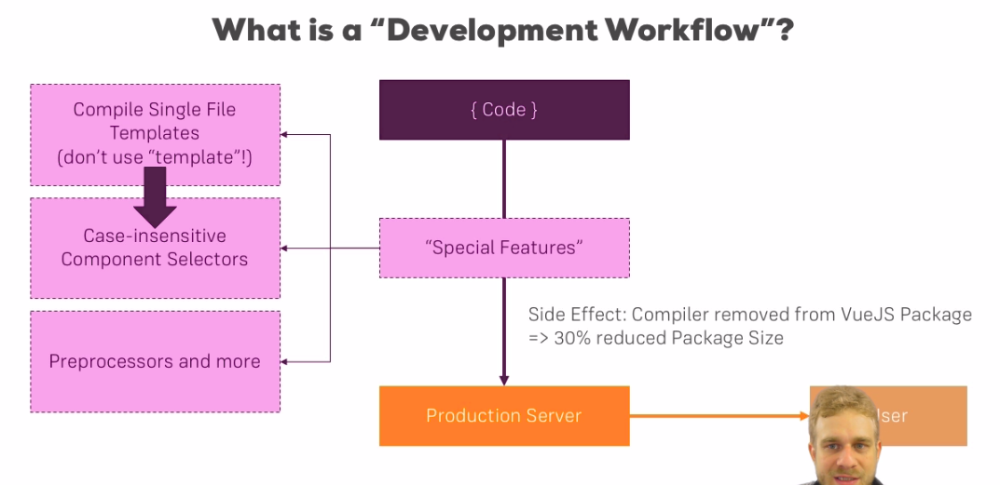
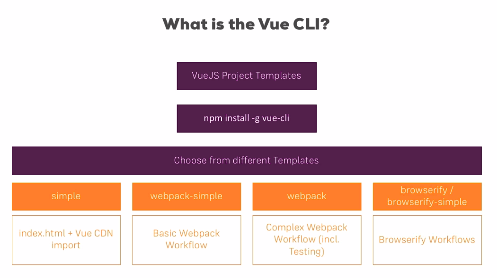
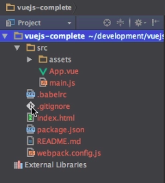
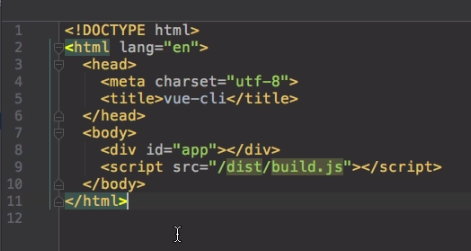

# Dev Workflow (vue-cli, webpack) 

* What is a `Dev Workflow`?

In this doc we will see how to prepare a **Development Workflow**. This is what make our workflow more productive. At first, I might seem a little bit tedious but after understanding the benefits of it you will thank to God and developers who made this possible.

## Credits

The link of this course is [on here](https://www.udemy.com/vuejs-2-the-complete-guide/learn/v4/t/lecture/5942278?start=0).

## Content

[[toc]]


## Getting Started



## Vue CLI

* What is Vue CLI?
* Template compilation



## Install Vue CLI and create a new project

1. install node
2. install vue-cli

```bash
sudo npm install -g vue-cli
```

3. Create a project by using `vue-cli`
	* `vue init <template_name> <project_name>`

```bash
vue init webpack-simple vue-cli
```

4. After creating the project, 
	* go to the project folder and run `npm install`. This will install dependecies that are declared in `package.json` file.


```bash
cd project_folder
npm install // or npm i
```

5. Run the dev server with `npm run dev` command.
	* This will start a dev server and give us an environment to work. Some of the cool features of it that it compiles the code and provide **hot reload**, which means whenever you make changes the page is automatically updated.


```bash
npm run dev
```

6. Visit the localhost and you will see default page with Vue logo and some links.

## Webpack Template Folder Structure

After creating a webpack template you will have structure like so:



**.babelrc** : this file sets up *babel*. This is a **transpiler** that allowing us writing **ES6** code. It transpiles ES6 code to ES5, so that our code can run in older browsers too.

**.gitignore** : 

**index.html** : This file is the file which actually get served. The `div` with id `app` is where Vue app enters. The last `script` element with `src` **/dist/build.js** is where *transpiled* js code will live when we run `npm run build`.



**package.json** : Manages all the dependencies.

**README.md** :

**webpack.config.js** : Responsible for everything. Knows how to manage different files and make transpilingss and compilings. 

## Understanding .Vue files

The code we write in this file get compiled to DOM and shipped with `index.html`. It reduces the file size and save us from a big hassle.

**src/index.html**

```html
paste here the html code
```

**src/main.js**

`render` functions comes with `Vue` and it renders the `App`. What we load here is our `App ` from `App.Vue` file.

```javascript
import Vue from 'vue'
import App from './App.vue'

new Vue({
	el: '#app',
	render: h => h(App)
})
```

**App.vue**

1. `.vue` files consist of three main parts:
	* `<template>`
	* `<script>`
	* `<style>`


`.vue` file compiled to javascript code then it is rendered with `render` function and passed into `index.html` file where `<div id='app'>` is.


## Building

When you want to deploy your app run `npm run build` and everything will transpiled and compiled and minified into dedicated folder.

```bash
npm run build
```

## More about ".vue" files and CLI

More info from the course provider on [this link](https://www.udemy.com/vuejs-2-the-complete-guide/learn/v4/t/lecture/5942322?start=0).

1. Using the ES6 Spread Operator (for that, you need to add `babel-preset-stage-2` as a Dependency and to your .babelrc File):

```bash
npm install --save-dev babel-preset-stage-2
```

**.babelrc**

```babel
{
  "presets": [
    ["es2015", { "modules": false }],
    ["stage-2"]
  ]
}
```

```javascript
import Vue from 'vue'
import App from './App.vue'
 
new Vue({
  el: '#app',
  ...App
});
```

2. Using `mount()` :

Also install the stage-2 preset as described above.

```javascript
import Vue from 'vue'
import App from './App.vue'
 
const vm = new Vue({
  ...App
});
 
vm.$mount('#app');
```

**Local CSS / Sass Files and CLI Templates**

The webpack-simple template doesn't support local CSS or Sass files, because no CSS loader is set up.

Use the webpack template (not webpack-simple) to get [this functionality](https://github.com/vuejs-templates/webpack)

## Debugging VueJS Projects

There are two main Tools you may use:

1. The Developer Tools in Chrome (see below)

2. The [Vue Developer Tools](https://github.com/vuejs/vue-devtools)

When working with a Project created by the CLI (using Webpack!), you can easily debug your running Application by opening your Developer Tools (see below in Chrome) and going to "Sources" there. 

You should see a "Webpack" folder which you may open to see all your files included in the project (see image below, in orange box).

You can open any file there and set breakpoints etc. to debug your running application.