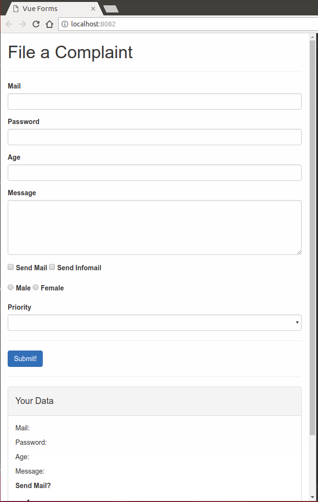
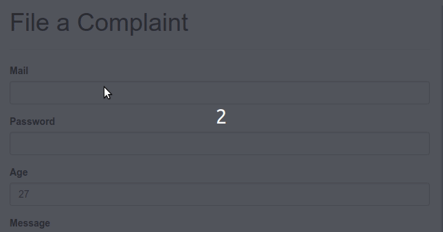
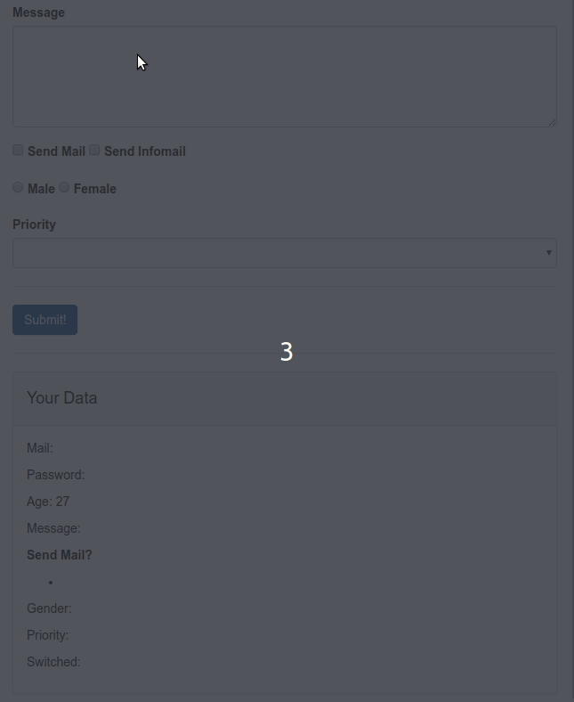
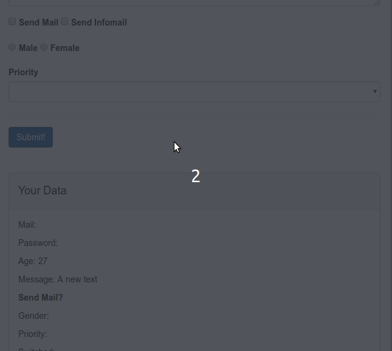
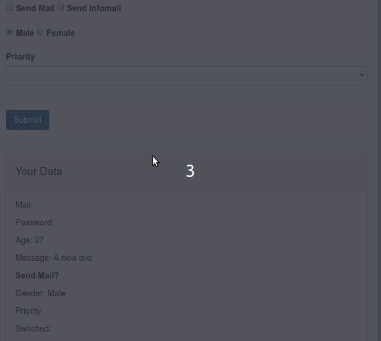
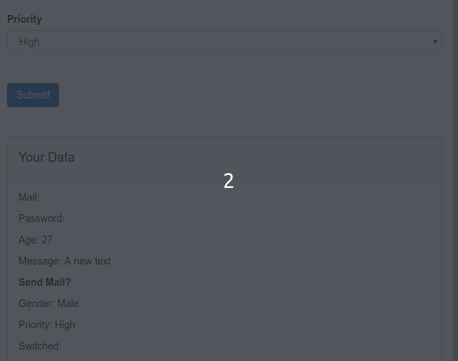

# Handling User Input with Forms

Finished project

<iframe src="https://codesandbox.io/embed/24l9vj7k7r?view=preview" style="width:100%; height:500px; border:0; border-radius: 4px; overflow:hidden;" sandbox="allow-modals allow-forms allow-popups allow-scripts allow-same-origin"></iframe>


## Credits

This course in on [this link](https://www.udemy.com/vuejs-2-the-complete-guide/learn/v4/t/lecture/5975260?start=0) on udemy.


## Content

[[toc]]

## A basic `input` Form Binding

After getting the source code from the course section I have this set up.

* Start a new webpack simple project with `vue init` command. 



* We need to bind the data in the `<input>` sections with the `data` property. Initially we use `v-model` directive.

**App.vue**

```html
<div class="form-group">
    <label for="email">Mail</label>
    <input
            type="text"
            id="email"
            class="form-control"
            v-model="email"
    >
</div>

<script>
    export default {
      data() {
        return {
          userData: {

          }
        }
      }
    }
</script>
```

## Grouping Data and Pre-Populating Inputs

Now, we will group user related data in an *Object* in the `data` property.

* create `userData` object in `data` property then populate the template with `v-model` and wit *String Interpolation*.

## Modifying User Input with Input Modifiers.

How we can modify the default behavior of `v-model` directive? Right now, it's updated with each key stroke. 

* First add `lazy` modifier to `v-model` directive. This will not listen each event but only listen `change` event. So it will be updated when we focus out of the `<input>` element or click somewhere else in the page. 

**v-model.lazy**



Other modifiers you can is might be `trim` which trims the *white-space* at the beggining and at the end; or might be `number` to force that the input convert into *Number* right away. So you can modify the behavior of the `v-model` to decide when an how it will be triggered.

## Binding `textarea` and Saving Line Breaks

The *String Interpolation* doesn't work on the `<textarea>` element. You have to use `v-model` to bind it. 

 <details>
 <br>
 <summary>
 <strong>App.vue</strong>
 </summary>

```html
...
<!-- Interpolation between <textarea>{{ test }}</textarea> doesn't work!-->
<textarea
        id="message"
        rows="5"
        class="form-control"
        v-model="message"
></textarea>
...
<!-- We have to style="white-space: pre" to keep the line breaks-->
<p style="white-space: pre">Message: {{ message }}</p>
...
<script>
    export default {
      data() {
        return {
          userData: {
            email: '',
            password: '',
            age: 27
          },
          message: 'A new text'
        }
      }
    }
</script>
```

</details>

**Result**



## Using Checkboxes and Saving Data in Arrays

Let's implement checkbox function. Here again, Vuejs helping us. To store the checkbox value first we will create new property with an *Array* and then we will bind it with `v-model`. Vue.js will automatically merge the value of checkboxes into that *Array*.

 <details>
 <br>
 <summary>
 <strong>App.vue</strong>
 </summary>

```html
<template>
...
    <div class="form-group">
        <label for="sendmail">
            <input
                    type="checkbox"
                    id="sendmail"
                    value="SendMail"
                    v-model="sendMail"
            > Send Mail
        </label>
        <label for="sendInfomail">
            <input
                    type="checkbox"
                    id="sendInfomail"
                    value="SendInfoMail"
                    v-model="sendMail"
            > Send Infomail
        </label>
    </div>


        <ul>
            <li v-for="item in sendMail">
                {{ item }}
            </li>
        </ul>
                   
...
</template>

<script>
    export default {
      data() {
        return {
          ...
          sendMail: []
        }
      }
    }
</script>
```

</details>




## Using Radio Buttons

Let's move on the `radio buttons`.

We need to make sure that we can only select one and store the value of the selected radio button in some property.

* Create a new `data` property `gender` and set its initial value to `Male`. Then bind radio buttons with `v-model`.

Vue.js will recognize that these buttons are grouped together and only one of them can be selected.

 <details>
 <br>
 <summary>
 <strong>App.vue</strong>
 </summary>

```html
<template>
... 
    <div>
        <label for="male">
            <input
                    type="radio"
                    id="male"
                    value="Male"
                    v-model="gender"
            > Male
        </label>
        <label for="female">
            <input
                    type="radio"
                    id="female"
                    value="Female"
                    v-model="gender"
            > Female
        </label>
    </div>
    ...
            <p>Gender: {{ gender }}</p>
        ...
        </div>  
...
</template>

<script>
    export default {
      data() {
        return {
          ...
          gender: 'Male'
        }
      }
    }
</script>
```

</details>



## Handling Dropdowns with `select` and `option`

We have a `<select>` tag and inside it we have `<option>` tag. We only have one option because we will assign option's value dynamically from a property. We assign the value with `:selected` attribute and we will check if the current value is `Medium` initially.

<details>
<br>
<summary>
App.vue
</summary>

```html
<template>
... 
 <select
        id="priority"
        class="form-control"
>
    <option
        :selected="priority == 'Medium'"
    >
        {{ priority }}
    </option>
</select>
...
</template>

<script>
    export default {
      data() {
        return {
          ...
          selectedPriority: 'High',
          ...
        }
      }
    }
</script>
```
</details>


 Here again, we use `v-model` to bind the `selected` value but this time on the `<select>` (parent) element. Now it's set to `High`. This is another way to set the default value. `selected` is overwritten by the `v-model`. So we can only use `:selected` if we don't use `v-model` or if we don't pre-populate the value of `v-model`. Therefore, we won't use `:selected`.

 <details>
 <br>
 <summary>
 <strong>App.vue</strong>
 </summary>

```html
<template>
... 
 <select
        id="priority"
        class="form-control"
        v-model="selectedPriority"
>
    <option
        v-for="priority in priorities"
    >
        {{ priority }}
    </option>
</select>
...
</template>

<script>
    export default {
      data() {
        return {
          ...
         priorities: ['High', 'Medium', 'Low']
          ...
        }
      }
    }
</script>
```
 </details>




## What v-model does and how to create a custom control

Let's say you want to build your own `input`.


* Create new component `Switch.vue`.

<details>
<summary>Swith.vue component</summary>
<br>

```html
<template>
  <div>
    <div
      id="on"
      :class="{active: isOn}"
      @click="isOn = true"
    >On</div>
    <div 
      id="off"
      @click="isOn = false"
      :class="{active: !isOn}" 
    >Off</div>
  </div>
</template>

<script>
export default {
  data() {
    return {
      isOn: true
    };
  }
};
</script>

<style scoped>
#on,
#off {
  width: 40px;
  height: 20px;
  background-color: lightgray;
  padding: 2px;
  display: inline-block;
  margin: 10px -2px;
  box-sizing: content-box;
  cursor: pointer;
  text-align: center;
}

#on:hover,
#on.active {
  background-color: lightgreen;
}

#off:hover,
#off.active {
  background-color: lightcoral;
}
</style>
```

</details>

<br>


## Creating a custom control (input)


