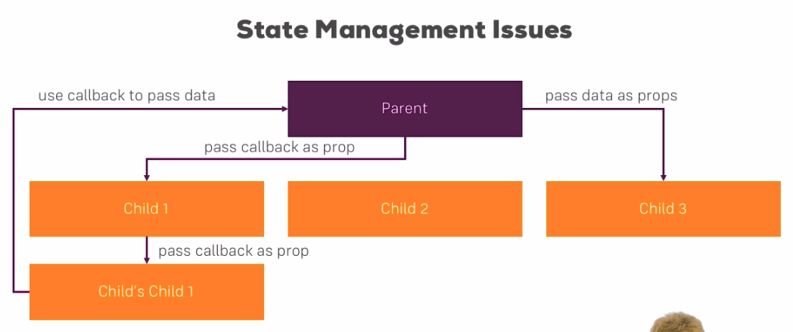
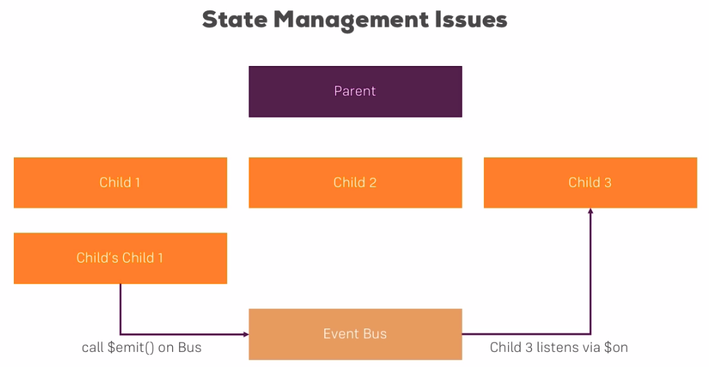
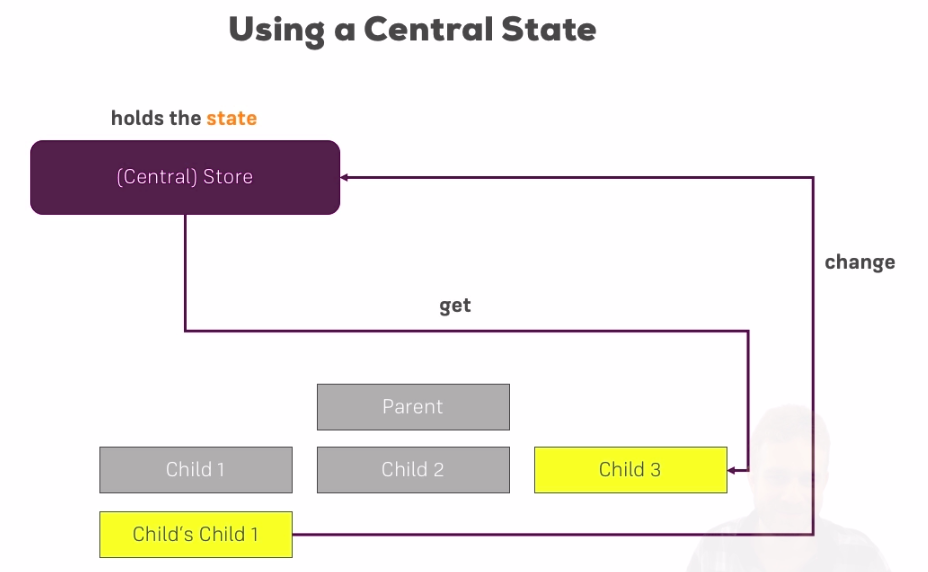
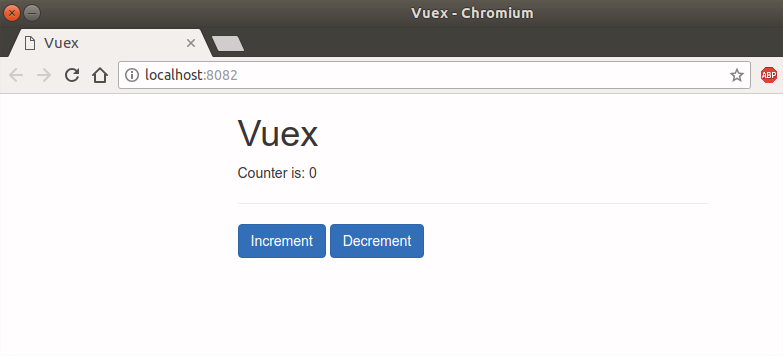
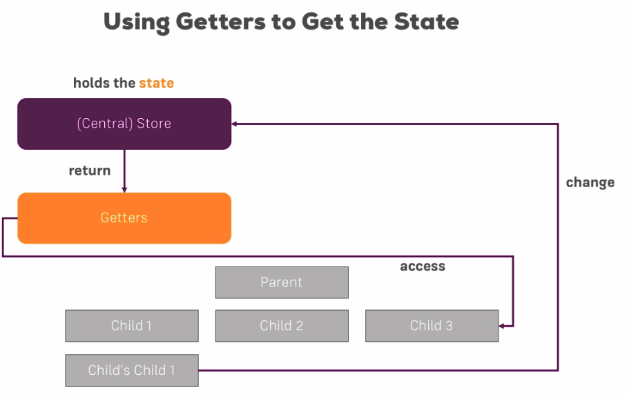
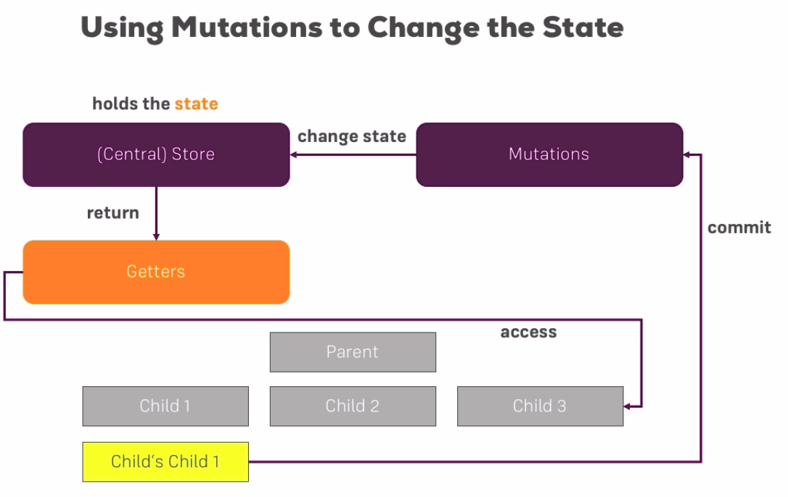
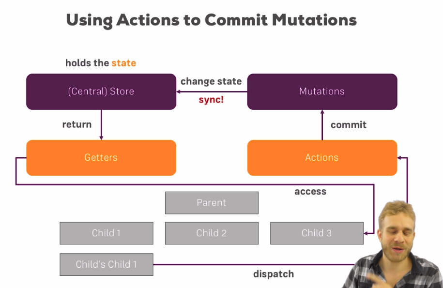

# State Manegement Vuex

[Vuex official page](https://vuex.vuejs.org/)


## Credits

This course in on [this link](https://www.udemy.com/vuejs-2-the-complete-guide/learn/v4/t/lecture/5975154?start=0) on udemy.

Here is a medium article about Vuex on [this link](https://medium.com/js-dojo/vuex-for-the-clueless-the-missing-primer-on-vues-application-data-store-33fa51ffc3af)

## Content

[[toc]]

## Why a different State Management may be needed

We've seen how we can manage the state management by using props and callback functions when passing data from parent to child and child to parent.



We can use `event bus` to enable the communication between components. It's better and shorter way to handle state management.



One bus could quickly become crowded with `$emit`s and `$on`s. In the end, there will be a lot of code in this instance. Maybe, it's not the best solution... It's also gives us another problem: changes are hard to crack. Since we will be reaching that instance from all over the project it will be hard to understand which event is listened and changed by which component of the application. Though, it's a very good tool that we can use in medium sized applications. But for the large applications it might not be the best tool.

Let's a have a look at **Vuex**. What is it? and, what it offers us when a big project set up is needed.

## Understand the "Centralized State"

It resembles to `Redux`. It's written by the Vue.js core team. Vuex has the idea of *Central Store* where the state is stored. We have one file to store the state of our application. It does not mean that some components can not have their own state. If it is not needed you don't have to store the component state with Vuex.



### Using the Centralized State

Show off time! 

* Set up the project.

In this example, I am using the course material that I downloaded from udemy course on Vuejs2.

I started a simple vue project with webpack with this command:

```bash
vue init webpack-simple .
npm i
npm run dev
```

* Project initial state:



Generally we name the folder as `store` in which we will keep the state of the application. 

* Create it to the same directory where the components folder is.

In this `store` folder create a file named `store.js`. In order to create such a store we need some helpers from the **Vuex package**. So, let's install *Vuex* via npm.

```bash
npm install --save vuex
```

Once it's finished, 

* import `Vue` and `Vuex` to `store.js` file 

Then we can tell Vue to use Vuex. It's neccesary to register this package to be able use it in Vue.

**src/store/store.js**

```javascript
import Vue from 'vue';
import Vuex from 'vuex';

Vue.use(Vuex);
```

* Create a new Vuex Store 

We can store all the state of the application in `state` property. It's a *reserved keyword*. Since, I will use this `store` outside of this file I need to export it.

**src/store/store.js**

```javascript
export const store = new Vuex.Store({
  state: {
    counter: 0
  }
})
```

Now, with the `store` exported:

* Go to `main.js` file and register it in the root Vue instance so that you can use it in the app. 

**src/main.js**

```javascript
import Vue from 'vue'
import App from './App.vue'

import { store } from './store/store';

new Vue({
  el: '#app',
  store: store,  // or you can use only 'store' since it has the same name
  render: h => h(App)
})
```

Now, I have access to store.

### Accessing the store

Go to `Counter.vue` file and instead of emitting the event with `$emit` use `$store`. This `$store` gives you access to the store. 

**src/components/Counter.vue**

```html
<template>
  <div>
    <button class="btn btn-primary" @click="increment">Increment</button>
    <button class="btn btn-primary" @click="decrement">Decrement</button>
  </div>
</template>

<script>
  export default {
    methods: {
      increment() {
        this.$store.state.counter++;
      },
      decrement() {
        this.$store.state.counter--;
      }
    }
  }
</script>

```


::: tip
Methods that start with the dolar sign ($) are not the methods we created, they come from Vue.js. In this case from a third-party package `Vuex`.
:::

* Go to `Result.vue` and instead of using `props` use `computed` property, create function called `counter` and return the state of the counter.


**src/components/Result.vue**

```html
<template>
  <p>Counter is: {{ counter }}</p>
</template>

<script>
  export default {
    computed: {
      counter() {
        return this.$store.state.counter;
      }
    }
  }
</script>
```

Whenever the `counter` in `store.js` file is changed, this `computed` property will be updated.

* Go to `App.vue` file and remove custom attributes that we used before to emit data.

**src/App.vue**

```html
<template>
    <div class="container">
        <div class="row">
            <div class="col-xs-12 col-sm-8 col-sm-offset-2 col-md-6 col-md-offset-3">
                <h1>Vuex</h1>
                <app-result></app-result>
                <hr>
                <app-counter></app-counter>
            </div>
        </div>
    </div>
</template>

<script>
    import Counter from './components/Counter.vue';
    import Result from './components/Result.vue';

    export default {
        components: {
            appCounter: Counter,
            appResult: Result,
        }
    }
</script>
```

It works as it should do. Though, it still have some issues. Next, you will see how to improve this solution.

### Why a Centralized State Alone Won't Fix It

When you want to do some calculation from more than one component, you will be repeating yourself. 

* Add a new component named `AnotherResult.vue` and inside both this file and `Result.vue` times with 2 the `counter`s value.

**src/components/AnotherResult.vue**

```html
<template>
  <p>Counter is: {{ counter }}</p>
</template>

<script>
  export default {
    computed: {
      counter() {
        return this.$store.state.counter * 2;
      }
    }
  }
</script>
```

* import this new component to `App.vue` file.

**src/App.vue**


```html
<div class="col-xs-12 col-sm-8 col-sm-offset-2 col-md-6 col-md-offset-3">
    <h1>Vuex</h1>
    <app-result></app-result>
    <app-another-result></app-another-result>
    <hr>
    <app-counter></app-counter>
</div>
```

So, it works, but we used the same piece of code in two places to make the calculation: both in `Result.vue` and `AnotherResult.vue`. It would be nice to have a centralized function. You're in luck, it does exist such a solution.

## Understanding Getters

Instead of acccessing the state directly and then perform some calculations on it, we can get that data with a `getter` make some calculations then it will be accessible from all the components that want to access the result. It will enable you to have a solid state of the truth. Also it saves you time and code. 



### Using Getters

We want to outsource the multiplyging function from the components and use it in a `getter`.

Beside `state` there is also `getters` property in `Vuex.Store`. Let's use this property to make the calculation.

the `state` is automatically passed to the functions that inside in `Vuex.Store`.

**src/store/store.js**

```javascript
import Vue from 'vue';
import Vuex from 'vuex';

Vue.use(Vuex);

export const store = new Vuex.Store({
  state: {
    counter: 0
  },
  getters: {
    doubleCounter: state => {
      return state.counter * 2;
    }
  }
})
```

Then access this `doubleCounter` function from a component.

**src/components/AnotherResult.vue**

```html
<template>
  <p>Counter is: {{ counter }}</p>
</template>

<script>
  export default {
    computed: {
      counter() {
        return this.$store.state.counter;
      }
    }
  }
</script>
```

## Mapping getters to Properties

Let's implement a new `getter` which will be counting the clicks.


**src/store/store.js**

```javascript
export const store = new Vuex.Store({
  state: {
    counter: 0
  },
  getters: {
    doubleCounter: state => {
      return state.counter * 2;
    },
    clickCounter: state => {
      return state.counter + ' clicks!';
    }
  }
})
```

**src/components/AnotherResult.vue**

```html
<template>
  <div>
    <p>Counter is: {{ counter }}</p>
    <p>Number of clicks: {{ clicks }}</p>
  </div>
</template>

<script>
  export default {
    computed: {
      counter() {
        return this.$store.getters.doubleCounter;
      },
      clicks() {
        return this.$store.getters.clickCounter;
      }
    }
  }
</script>
```

I could get a lot of getters like this which I want to use in my component. So, Vue.js offers a `mapper` function to achieve this behaviour.

Vue.js has a helper that create all the `getters` in the `computed` property. You need to import the `helper` function first.

* import `mapGetters`.

`mapGetters` method gets an *Array* as a parameter and in this *Array* we specify the functions we want to use in `getters` property. And then I can use this functions in the template.

**src/components/AnotherResult.vue**

```html
<template>
  <div>
    <p>Counter is: {{ doubleCounter }}</p>
    <p>Number of clicks: {{ clickCounter }}</p>
  </div>
</template>

<script>
  import { mapGetters } from 'vuex';
  export default {
    computed: mapGetters([
        'doubleCounter', 'clickCounter'
        // You can also pass Object and map the Getters to different Names!
        // Example:
        // mapGetters({
        //      propertyName: 'doubleCounter'
        // })
    ])
  }
</script>
```

### JavaScript spread operator

Right now, you have this `mapGetters` in your `computed` property and if you want to create a custom method in this `computed` propetry you can't. Forutanely ES6 syntax provides a `spread operator` (...) and with that you can add custon methods in `computed` property.

The `three dots` (...) tell allow use to tell javascript "please, pull out all the properties and methods in the object you have here and create seperate key-value pairs for each of them. This will allow us to add all the computed properties which get treated automatically into `computed` property and we can write our own `computed` properties.

**src/components/AnotherResult.vue**

```html
<script>
  import { mapGetters } from 'vuex';
  export default {
    computed: {
      ...mapGetters([
        'doubleCounter', 'clickCounter'
      ]),
      // ourOwnMethod() {};
    }

  }
</script>
```

::: tip
We use babel to compile ES5 to ES6 code

```json
"devDependencies": {
    "babel-core": "^6.26.0",
    "babel-loader": "^7.1.2",
    "babel-preset-env": "^1.6.0",
    "babel-preset-stage-3": "^6.24.1",
```
:::


## Understanding Mutations

We have computation in the Store but now we can't track which component changed to state of the data at what time...

The better way is to use a similar concept as with `getters` but now for *setting* the store. They are called `mutations` and they changes the state. This mutations are committed. When a component update the state, all the other components listening the state throgh `getters` will automatically recieve the updated state. 

 

 ### Using mutations

 * Go to `store.js` file and add some `mutations`. These are basically some methods we can execute. Theses functions get `state` as a parameter and instead of returning it updates the state.

 **store.js**

 ```javascript
 export const store = new Vuex.Store({
  state: {
    counter: 0
  },
  getters: {
    doubleCounter: state => {
      return state.counter * 2;
    },
    clickCounter: state => {
      return state.counter + ' clicks!';
    }
  },
  mutations: {
    increment: state => {
      state.counter++;
    },
    decrement: state => {
      state.counter--;
    }
  }
})
```

* Call these functions from `Counter.vue` file. 

You will commit and pass the function name as a *String*.

**Counter.vue**

```html
<template>
  <div>
    <button class="btn btn-primary" @click="increment">Increment</button>
    <button class="btn btn-primary" @click="decrement">Decrement</button>
  </div>
</template>

<script>
  export default {
    methods: {
      increment() {
        this.$store.commit('increment')
        // console.log(this.$store);
      },
      decrement() {
        this.$store.commit('decrement')
      }
    }
  }
</script>

```

It makes sense to use these functions from other components...

* Create a new component called `AnotherCounter.vue`

Paste the same code in `Counter.vue` file.

* Import to `App.vue` and add it as a component.

We, again repeating the code like we did in `getters` so let's use `mapMutations`. With mapping the mutations with the same name that we use in `@click` attrs will enable us to use them as it is.

**AnotherCounter.vue**

```html
<template>
  <div>
    <button class="btn btn-primary" @click="increment">Increment</button>
    <button class="btn btn-primary" @click="decrement">Decrement</button>
  </div>
</template>

<script>
  import { mapMutations } from 'vuex';
  export default {
    methods: {
      ...mapMutations([
        'increment',
        'decrement'
      ])
    }
  }
</script>
```

### Why mutations have to run synchronous

::: warning
You must not run any asynchronous task in such a mutation. 
:::

If it runs asynchronously we can track the state. But sometimes we may want to run asynchronous tasks. So, how we can do that?

### How actions improve mutations

The `mutations` has to be **synchronous** it has to update the state immediately. When we want to make asynchronous tasks we can improve `mutations` with `actions`. Action is an extra function where you may run asynchronous tasks and in this `action` which will be `dispatch`ed from the component or by the component. Then you can commit this changes via `mutations` and you only commit the muatations when asynchronous task is done. This has one major benefit, you may trigger an action and it passed to the server in `actions` and the `state` hasn't committed yet. Onlt, once this long time taking(milliseconds) asynchronous task is finished it is commited.



### Using Actions

Let's say when you hit a button you want to make a mutation after some asynchronous task is finished.

Action methods get a function and the `context` is passed automatically to this function. Then this function gives you the access to `commit` function.

 **store.js**

 ```javascript
 export const store = new Vuex.Store({
  // omitted
  actions: {
    increment: ({ commit }) => {
      commit('increment')
    },
    increment: ({ commit }) => {
      commit('decrement')
    },
    asyncIncrement: ({ commit }) => {
      setTimeout(() => {
        commit('increment')
      }, 3000)
    },
    asyncDecrement: ({ commit }) => {
      setTimeout(() => {
        commit('decrement')
      }, 3000)
    }
  }
})
```

**AnotherCounter.vue**

```html
<template>
  <div>
    <button class="btn btn-primary" @click="increment">Increment</button>
    <button class="btn btn-primary" @click="decrement">Decrement</button>
  </div>
</template>

<script>
  import { mapActions } from 'vuex';
  export default {
    methods: {
      ...mapActions([
        'increment',
        'decrement'
      ])
    }
  }
</script>
```

What `mapActions` does behind the scenes is :

```javascript
increment () {
  this.$store.dispatch('increment)
},
increment () {
  this.$store.dispatch('decrement')
}
```

We can also pass arguments with functions :

**AnotherCounter.vue**

```html{3}
<template>
  <div>
    <button class="btn btn-primary" @click="increment(100)">Increment</button>
    <button class="btn btn-primary" @click="decrement">Decrement</button>
  </div>
</template>

<script>
  export default {
    methods: {
      // pass argument 
      increment(by) {
        // dispatch the 'increment' method with the `by` argument
        this.$store.dispatch('increment', by)  
      }
    }
  }
</script>
```

Then get it as so called `payload`, you can name it whatever you like but it's a general way to name it "payload". Then we can pass it with `commit` method to `mutations`.

 **store.js**

 ```javascript{4,5,6,9,10,11}
 export const store = new Vuex.Store({
  // omitted
  mutations: {
    increment: (state, payload) => {
      // get the 'payload' from 'actions'
      state.counter += payload
    }
  }
  actions: {
    increment: ({ commit }, payload) => {
      // Pass the payload to the 'mutations'
      commit('increment', payload)  
    },
    // omitted
  }
})
```

Let's run an asyncrhonous task: 

 **AnotherCounter.vue**

 ```html
<template>
  <div>
    <button class="btn btn-primary" @click="asyncIncrement(200)">Increment</button>
    <button class="btn btn-primary" @click="asyncDecrement(50)">Decrement</button>
  </div>
</template>

<script>
  export default {
    methods: {
      // pass argument 
      asyncIncrement(by) {
        // dispatch the 'asyncIncrement' method with the `by` argument
        this.$store.dispatch('asyncIncrement', by)  
      }
    }
  }
</script>
```

Let the `asyncIncrement` method to receive a `payload`

 **store.js**

 ```javascript
 export const store = new Vuex.Store({
  // omitted
    asyncIncrement: ({ commit }, payload) => {
      setTimeout(() => {
        commit('increment', payload)
      }, 3000)
    },
    asyncDecrement: ({ commit }, payload) => {
      setTimeout(() => {
        commit('decrement', payload)
      }, 3000)
    }
  }
})
```

Let's make some fancy stuff:

* pass an object with `asyncIncrement` method, `by` and `duration`

 **AnotherCounter.vue**

 ```html
<template>
  <div>
    <button class="btn btn-primary" @click="asyncIncrement({ by: 5, duration: 2000 })">Increment</button>
    <button class="btn btn-primary" @click="asyncDecrement(50)">Decrement</button>
  </div>
</template>

<script>
  export default {
    methods: {
      // pass argument 
      asyncIncrement(options) {
        // dispatch the 'asyncIncrement' method with the `by` argument
        this.$store.dispatch('asyncIncrement', options)  
      }
    }
  }
</script>
```

Let the `asyncIncrement` method to receive a `payload`

 **store.js**

 ```javascript
 export const store = new Vuex.Store({
  // omitted
    asyncIncrement: ({ commit }, payload) => {
      setTimeout(() => {
        commit('increment', payload.by)
      }, payload.duration)
    },
    asyncDecrement: ({ commit }, payload) => {
      let by = payload.
      setTimeout(() => {
        commit('decrement', payload)
      }, 3000)
    }
  }
})
```