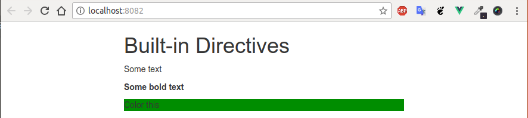
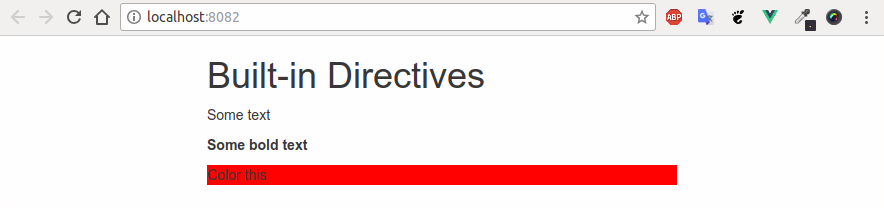
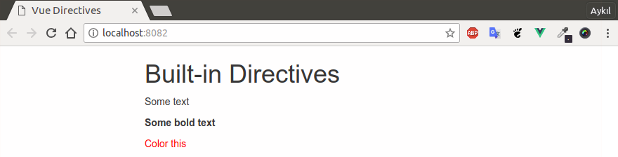
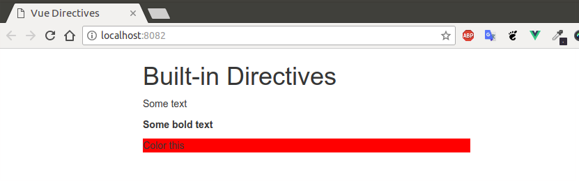
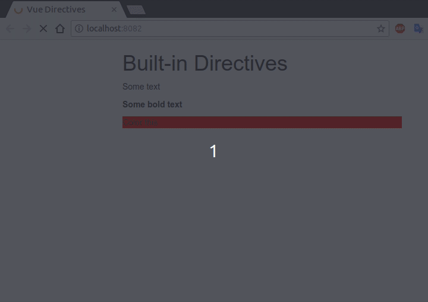
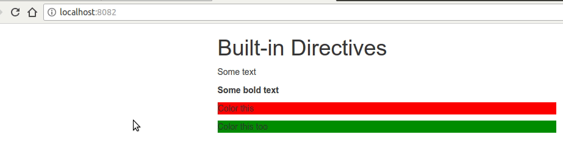
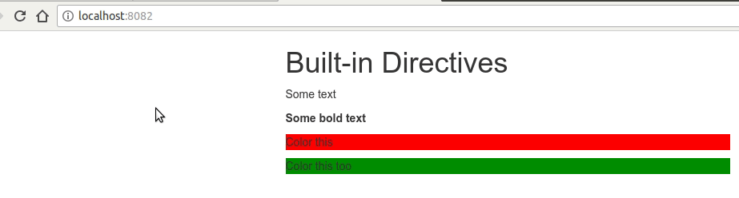
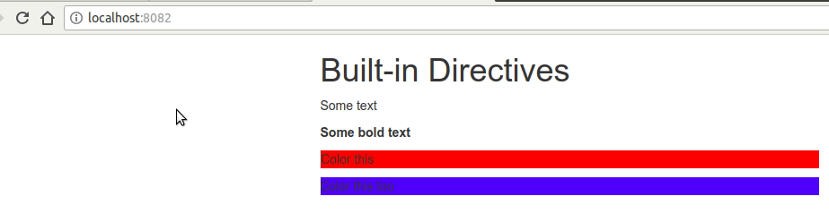
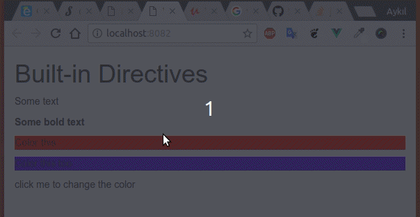
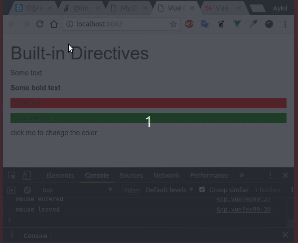

# Understanding Directives


## Credits

The link of this course is [on here](https://www.udemy.com/vuejs-2-the-complete-guide/learn/v4/t/lecture/5975408?start=0).

## Content

[[toc]]

## Understanding Directives

Beside *built-in directives* we can create our own directives when we need lower level interaction with HTML element. There are two ways to do it. 

* The first way is registering it from `main.js` file like we registered `components`.

```javascript
Vue.directive('highlight');
```

Then we can use this directive as `v-highlight`

## How directives work - Hook function

Directives have five methods that we can hook.


* First hook is the `bind(el, binding, vnode)` hook. => Once directive is attached

* The other is `inserted(el, binding, vnode) hook. => inserted in parent node

* Third one is `update(el, binding, vnode, oldVnode) => Once components is Updated (without children)

* Fourth one is `componentUpdate(el, binding, vnode, oldVnode) => Once components is updated (with children)

* The last one is `unbind(el, binding, vnode) = > One directive is removed

## Creating a simple directive

```javascript
Vue.directive('highlight', {
    bind(el, binding, vnode) {
        // 'el' is the default element selector, so we can access its 'style'
        el.style.backgroundColor = 'green'
    }
})
```

Then we can pass it with `v-` before it like a normal attribute.

```html
<h1>Built-in Directives</h1>
<p v-text="'Some text'"></p>
<p v-html="'<strong>Some bold text</strong>'"></p>

<p v-highlight>Color this</p>
</div>
```

And the result is: 



## Custon Directives

It would be nice that if the user can determine the color.

```javascript
Vue.directive('highlight', {
  bind(el, binding, vnode) {
    el.style.backgroundColor = binding.value;
  }
})
```

```html
<h1>Built-in Directives</h1>
<p v-text="'Some text'"></p>
<p v-html="'<strong>Some bold text</strong>'"></p>

<p v-highlight="'red'">Color this</p>
```




## Passing arguments to custom directives

Let's we not only want to set the backgroun-color but also want to let the user decide whether he/she want to set the background-color or the default detects color. In order to do that we need to pass an *argument*.

`arg` is another thing we can access on `binding`.

* First, run the code without passing an argument. 

In this case, the `color` of the text will be red. 

```javascript
Vue.directive('highlight', {
  bind(el, binding, vnode) {
    if (binding.arg == 'background') {
      el.style.backgroundColor = binding.value;
    } else {
      el.style.color = binding.value;
    }
  }
})
```

```html
<h1>Built-in Directives</h1>
<p v-text="'Some text'"></p>
<p v-html="'<strong>Some bold text</strong>'"></p>

<p v-highlight="'red'">Color this</p>
```



* Pass the `background` argument.

```html{4}
<h1>Built-in Directives</h1>
<p v-text="'Some text'"></p>
<p v-html="'<strong>Some bold text</strong>'"></p>
<p v-highlight:background="'red'">Color this</p>
```



## Modifying custom directives

Let's say we want to change the style delayed.

```javascript
Vue.directive('highlight', {
  bind(el, binding, vnode) {
    var delay = 0;
    // modifiers is an object and we wan to check if there is 'delayed' key here
    if (binding.modifiers['delayed']) {
      delay = 3000;
    }
    setTimeout(() => {
      if (binding.arg == 'background') {
        el.style.backgroundColor = binding.value;
      } else {
        el.style.color = binding.value;
      }
    }, delay)
  }
})
```

```html
<h1>Built-in Directives</h1>
<p v-text="'Some text'"></p>
<p v-html="'<strong>Some bold text</strong>'"></p>
<p v-highlight:background.delayed="'red'">Color this</p>
```



You can also chain `modifiers` since it's an object.

```html
<p v-highlight:background.delayed.anotherModifier="'red'">Color this</p>
```

## Registering Directives Locally

We can also create `directives` locally.

<br>
<details>

<summary>App.vue</summary>

```html
<p v-highlight:background.delayed="'red'">Color this</p>
<p v-local-highlight:background.delayed="'green'">Color this too</p>

<script>
    export default {
      directives: {
        'local-highlight': {
          bind(el, binding, vnode) {
            var delay = 0;
            // modifiers is an object and we wan to check if there is 'delayed' key here
            if (binding.modifiers['delayed']) {
              delay = 3500;
            }
            setTimeout(() => {
              if (binding.arg == 'background') {
                el.style.backgroundColor = binding.value;
              } else {
                el.style.color = binding.value;
              }
            }, delay)
          }
        }
      }
    }
</script>
```

</details>

<br>



## Using Multiple Modifiers

We will add an another `modifier` that will make the element blink by changing its color.

<br>
<details>

<summary>App.vue</summary>

```html{2}
<p v-highlight:background.delayed="'red'">Color this</p>
<p v-local-highlight:background.delayed.blink="'green'">Color this too</p>

<script>
    export default {
      directives: {
        'local-highlight': {
          bind(el, binding, vnode) {
            var delay = 0;
            // modifiers is an object and we wan to check if there is 'delayed' key here
            if (binding.modifiers['delayed']) {
              delay = 3500;
            }
            if (binding.modifiers['blink']) {
              let mainColor = binding.value;
              let secondColor = 'blue';
              let currentColor = mainColor;
              setTimeout(() => {
                setInterval(() => {
                  currentColor == secondColor
                    ? currentColor = mainColor
                    : currentColor = secondColor
                  if (binding.arg == 'background') {
                    el.style.backgroundColor = currentColor;
                  } else {
                    el.style.color = currentColor;
                  }
                }, 1000)
              }, delay)
            } else {
              setTimeout(() => {
                if (binding.arg == 'background') {
                  el.style.backgroundColor = binding.value;
                } else {
                  el.style.color = binding.value;
                }
              }, delay)
            }
          }
        }
      }
    }
</script>
```

</details>

<br>



## Passing more Complex Values to Directives

We will control both colors and the interval duration.

* Pass the argument as an *Object*

```html
<p v-local-highlight:background.delayed.blink="{ mainColor: 'green', secondColor: 'blue', delay: 500 }">Color this too</p>
```

Then we can access the values like

```javascript
let mainColor = binding.value.mainColor;
let secondColor = binding.value.secondColor;
```

<br>
<details>

<summary>App.vue</summary>

```html
<p v-highlight:background.delayed="'red'">Color this</p>
<p v-local-highlight:background.delayed.blink="{ mainColor: 'green', secondColor: 'blue', delay: 500 }">Color this too</p>


<script>
    export default {
      directives: {
        'local-highlight': {
          bind(el, binding, vnode) {
            var delay = 0;
            // modifiers is an object and we wan to check if there is 'delayed' key here
            if (binding.modifiers['delayed']) {
              delay = 3500;
            }
            if (binding.modifiers['blink']) {
              let mainColor = binding.value.mainColor;
              let secondColor = binding.value.secondColor;
              let currentColor = mainColor;
              setTimeout(() => {
                setInterval(() => {
                  currentColor == secondColor
                    ? currentColor = mainColor
                    : currentColor = secondColor
                  if (binding.arg == 'background') {
                    el.style.backgroundColor = currentColor;
                  } else {
                    el.style.color = currentColor;
                  }
                }, binding.value.delay)
              }, delay)
            } else {
              setTimeout(() => {
                if (binding.arg == 'background') {
                  el.style.backgroundColor = binding.value.mainColor;
                } else {
                  el.style.color = binding.value.mainColor;
                }
              }, delay)
            }
          }
        }
      }
    }
</script>
```

</details>

<br>




## Assignment 10: Time to Practice - Directives

### Functions in custom directives

It is possible to use functions in custom directives. You can access the function with `binding.value()`.

<br>
<details>

<summary>App.vue</summary>

```html
<p v-highlight:background.delayed="'red'">Color this</p>
<p v-local-highlight:background.delayed.blink="{ mainColor: 'green', secondColor: 'blue', delay: 500 }">Color this too</p>
<p v-myon:click="changeColor">click me to change the color</p>

<script>
    export default {
      methods: {
        changeColor() {
          return 'red'
        }
      },
      directives: {
        'myon': {
          bind(el, binding) {
            if (binding.arg == 'click') {
              el.addEventListener('click', () => {
                el.style.backgroundColor = binding.value();
              })
            }
          }
        },
        // omitted
</script>
```

</details>

<br>




**Another way to have the same logic:** 

<br>
<details>

<summary>App.vue</summary>

```javascript
export default {
  methods: {
    changeColor() {
      return "red";
    }
  },
  directives: {
    myon: {
      bind(el, binding) {
        const type = binding.arg;
        const fn = binding.value;
        el.addEventListener(type, () => {
          el.style.backgroundColor = fn();
        });
      }
    },
    // omitted
```

</details>

<br>


**Yet another good solution:**


<br>
<details>

<summary>App.vue</summary>

```html
<p
    v-myon:click="changeColor"
    v-myon:mouseenter="mouseEnter"
    v-myon:mouseleave="mouseLeave"
  >click me to change the color</p>


<script>
export default {
  methods: {
    changeColor() {
      alert('is clicked');
    },
    mouseEnter() {
      console.log('mouse entered')
    },
    mouseLeave() {
      console.log('mouse leaved')
    }
  },
  directives: {
    myon: {
      bind(el, binding) {
        const type = binding.arg;
        const fn = binding.value;
        el.addEventListener(type, fn);
      }
    },
    // omitted
```

</details>

<br>


