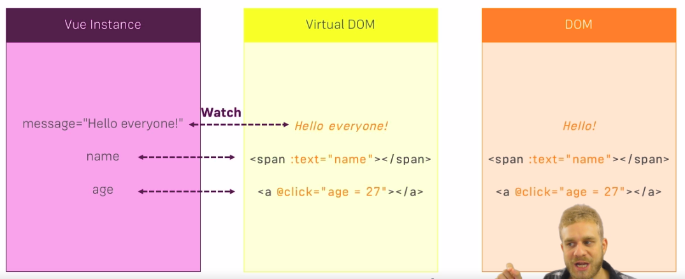
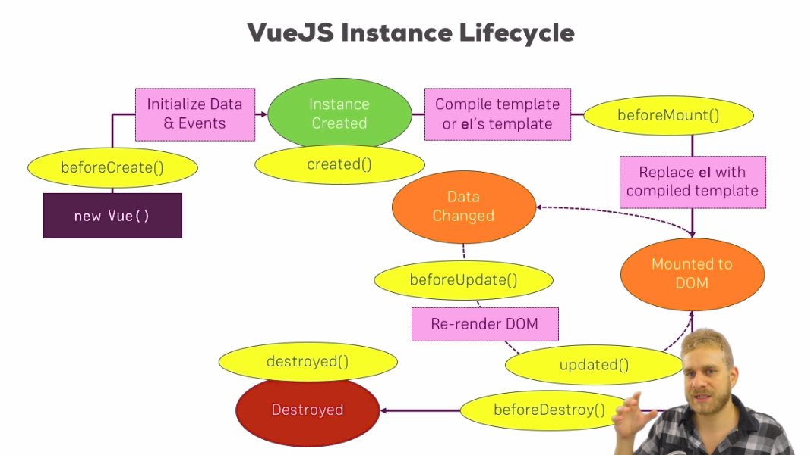

# Vue Instance


## Credits

The link of this course is [on here](https://www.udemy.com/vuejs-2-the-complete-guide/learn/v4/t/lecture/5942192?start=0).

## Content

[[toc]]

## Basics about VueJS Instance

Check [this link](https://jsfiddle.net/8bz8h970/13/).

## Using Multiple Instance

You can use multiple instances of Vue in the same file. Here it the [link to example](https://jsfiddle.net/8bz8h970/14/).

## Accessing the Vue Instance from Outside

You can access to one Vue instance from another or from outside like in [this example](https://jsfiddle.net/8bz8h970/15/).

Vuejs make these **proxies** for us and we can reach to a Vue instance and make changes from outside of the Vue instance.

## How Vuejs manages your Data and Methods

We can't add `properties` from outside. 

## A closer look at $el and $data

`$el` refers to our element `div` `app1`. This is how Vuejs keep track of our HTML elements.

`$data` is an **Object** and it holds our `data properties`. With `$data` we can access our `data properties` from outside of the instance.

```javascript
console.log(vm1.$data.title);
```

You can also first create a variable `data` for example and then pass it to Vue instance.

```javascript
var data = {
	title: 'The VUeJS Instance',
	showParagraph: false
}

var vm1 = new Vue({
	el: '#app1',
	data: data,
	...
})

console.log(vm1.data === data);
```

::: tip
Vuejs doesn't create its own enclosed world. It's normal Javascript code. It lives in the javascript code it's able to interact with the javascript code around it.
:::

## Placing $refs and Using them on your Templates

We can want to get current content of a `button`, for example. We can simple add `ref` key to HTML element. `ref` key isn't actally a HTML attribute it comes with VUejs.

```html
<button v-on:click="show" ref="myButton">Show Paragraph</button>
```
I'm able access HTML elements just like that: 

```javascript
var vm1 = new Vue({
  el: '#app1',
  data: {
    title: 'The VueJS Instance 2',
    showParagraph: false
  },
  methods: {
    show: function() {
      this.showParagraph = true;
      this.updateTitle('The VueJS Instance (Updated)');
      this.$refs.myButton.innerText = 'Test';
    },
   ...
```

Here is the [link to example](https://jsfiddle.net/8bz8h970/16/).

Let's try it with an element that is already under control of Vuejs. 

```html
<div id="app1">
  <h1 ref="heading">{{ title }}</h1>
  ...
</div>
```

```javascript
vm1.$refs.heading.innerText = 'Something';
```

::: tip Important
We are not changing the Vuejs template it only gets the object from the DOM and make some changes on it. Therefore, when Vuejs rerender the DOM it takes its old template and rerenders the template based on it. So, it overrides the change we made above. So, be aware that even though we can access HTML element with `ref` key `$refs`, it's not reactive. Because it's not in the scope of VUe instance. Therefore, your changes may be overwritten.
:::

So, use `ref` key when you want to access a *native* element in HTML. This is a easier way than using `querySelector`.

## Where to learn more about Vue API

[Official Page](https://vuejs.org/v2/api/).

## Mounting a Template

Instead of writing `el` property we can use a **built-in** VUejs methods and properties.

For example, you created the Vue instance and you've written the HTML element for which you want to use Vue instance. In such a case you can **mount** it when you create your template by using `$mount` method and as an argument pass the CSS selector `#app1`. 

```javascript
var vm1 = new Vue({
  data: {
    title: 'The VueJS Instance 2',
    showParagraph: false
  },
  ...
});

vm1.$mount('#app1');
```

I will create a new `div` with `#app3` id and also a new Vue instance. In this instance I will use `template` property. 

```html
<div id="app3">

</div>
```

```javascript
var vm3 = new Vue({
	template: '<h1>Hello!</h1>'
});

vm3.$mount("#app3");
```

After creating the template *off-screen* I can append it anywhere in the HTML.

```javascript
var vm3 = new Vue({
	template: '<h1>Hello!</h1>'
});

vm3.$mount();
document.getElementById('app3').appendChild(vm3.$el);

```

::: danger
Using templates like this has some **limitations**.
:::

## Using Components

When you want to diplay an Instance in different parts of your page.

```javascript
var vm3 = new Vue({
	el: 'hello',
	template: '<h1>Hello!</h1>'
});
```

```html
<hello></hello>
<hello></hello>
```

Above only changes the first instance, let's use a class instead.

```javascript
var vm3 = new Vue({
	el: '.hello',
	template: '<h1>Hello!</h1>'
});
```

```html
<div class="hello"></div>
<div class="hello"></div>
```

Again it only creates one element. 

But, there is a way to create component and reuse it in different places. 

```javascript
Vue.component('hello', {
	template: '<h1>Hello!</h1>'
});
```

I've, now, registered it a global component and I can use it anywhere in HTML.

```html
<div id="app2" style="margin-top: 40px">
  <h1>{{ title }}</h1>
  <button @click="onChange">Change smth in Vue 1</button>
  <hello></hello>
</div>
```

[link to example](https://jsfiddle.net/8bz8h970/18/).

## Limitations of some Templates

* You can't use  some ...

## How Vuejs updates the DOM



## Vuejs Instance Lifecycle



## The vuejs instance liffecycle in practice

Things are getting interesting. [Here is an example](https://jsfiddle.net/8bz8h970/21/).