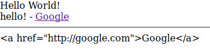
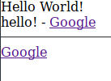

# VueJs Interaction with DOM


## Credits

The link of this course is [on here](https://www.udemy.com/vuejs-2-the-complete-guide/learn/v4/t/lecture/5940922?start=0).

## Content

[[toc]]

## Understranding VueJs Templates

Vue instance render the code first then output the result to the DOM.

### How the VueJs Template Syntax and Instance Work Together

Vue instance properties are proxied to HTML. So we can call title from html tag. We can access data properties in the Vue instance by using **Mustaches** => `{{ }}`. On the other hand, if we want to reach that data from inside the Vue instance we need to use `this` to reach to the property. In below example we reach `title` object's value from inside of Vue instance by saying `this.title`.

```html
<div id="app">
  <p>{{title}}</p>
</div>

<script>

new Vue({
	el: '#app',
  	data: {
  		title: 'Hello World!'
  }
})

</script>
```

I can reach not only to `data` property but other properties as well such as the `methods` property.

```html
<div id="app">
  <p>{{ sayHello() }}</p>
</div>


<script>
new Vue({
	el: '#app',
	data: {
		title: 'Hello World!'
	},
	methods: {
		sayHello: function() {
			return this.title
		}
 	}
})
</script>
```

::: tip Reserved Keywords
`el`, `data` and `methods` are reserved keywords in VueJs. There are several other keywords like these.
:::

## Binding Attributes (v-bind)

If we want to reach Vue instance attributes inside of an attribute of HTML tag, we can not use curly braces (mustaches). We need to use it without curly braces and then bind the data dynamically.

If we use curly braces inside an attribute like so: 

```html{2}
<div id="app">
  <p>{{ sayHello() }} - <a href="{{ link }}">Google</a></p>
</div>
```

The link won't send use to google but will try to render 
::: v-pre 
`{{ link }}`
::: 
as it is. So we need to remove those curly braces and bind the propert to `href` attribute like in below example:


```html{2}
<div id="app">
  <p>{{ sayHello() }} - <a v-bind:href="link">Google</a></p>
</div>

<script>
new Vue({
	el: '#app',
	data: {
		title: 'Hello World!',
    	link: 'http://google.com'
	},
	methods: {
		sayHello: function() {
			return this.title
		}
  }
})
</script>
```

You can find the link of this example on [here](https://jsfiddle.net/maykjony/5f2uvfdt/1/).

## Understranding and Using Directives

VueJs is shipped with built-in directives. Also, you can write your own directives. The `v-bind` directive tells VueJs to bind some data which is stored in Vue Instance.

## Disable Re-rendering (v-once)

If we want that the data is only rendered once and don't change when the value changes, we can use `v-once` directive, and make the data renderes only once.

::: warning
Keep in mind that all usages of `title` get re-renderes once the property changes.
:::


```html{2}
<div id="app">
  <h1 v-once>{{ title }}</h1>
  <p>{{ sayHello() }} - <a v-bind:href="link">Google</a></p>
</div>

<script>
new Vue({
	el: '#app',
	data: {
		title: 'Hello World!',
   		link: 'http://google.com'
	},
	methods: {
		sayHello: function() {
    		this.title = 'hello!'
			return this.title
		}
  }
})
</script>
```

Example of above snippet is on [this link](https://jsfiddle.net/maykjony/5f2uvfdt/2/).

## How to ouput raw HTML

We can store and output a whole raw HTML in a data property like this:

```html{5}
<div id="app">
  <h1 v-once>{{ title }}</h1>
  <p>{{ sayHello() }} - <a v-bind:href="link">Google</a></p>
  <hr>
  <p>{{ completeLink }}</p>
</div>

<script>
new Vue({
	el: '#app',
	data: {
		title: 'Hello World!',
	    link: 'http://google.com',
	    completeLink: '<a href="http://google.com">Google</a>'
	}
)}
</script>

```

When we insert it to html it will be rendered as a normal text.



When you want to render a **String** of HTML directly from Vue instance, Vue has a special directive called `v-html` to do that easily.

```html{5}
<div id="app">
  <h1 v-once>{{ title }}</h1>
  <p>{{ sayHello() }} - <a v-bind:href="link">Google</a></p>raw-HTML
  <hr>
  <p v-html='completeLink'></p>
</div>

<script>
new Vue({
	el: '#app',
	data: {
		title: 'Hello World!',
	    link: 'http://google.com',
	    completeLink: '<a href="http://google.com">Google</a>'
	}
)}
</script>

```

::: danger
When you render raw html by using `v-html` be careful and be sure that the code that will be renderes is **sanitized**. It makes you vulnerable to **Cross-Site Scripting Attacks**.
:::

And the ouput will be like:



Here is the [link](https://jsfiddle.net/maykjony/5f2uvfdt/3/) to the example.


## Listening to Events (v-on)

In previous examples we saw how to bind data using `v-bind` directive. Now, we will see how we listen an event by using `v-on` directive. `v-on` get an argument which will be the name of event we want to consume or listen. In the below example we will listen `click` event on a **button**, and then we will output its result by manipulating data in Vue instance, and then output its result on anouther element in our HTML.

::: tip
We can use any DOM event that exists for **button**. It could be 'mouseover', 'mouseon', 'enter' or any other default event for HTML elements.
:::

In the below example, I will create a button listen the `click` event on it. Then, I will bind this click event to a function inside my Vue instance. The function `increaseByOne` will increase the value of `count` inside data property by one. 

```html
<div id="app">
  <button v-on:click="increaseByOne">Click Me!</button>
  <p>{{ count }}</p>
</div>

<script>
new Vue({
	el: '#app',
	data: {
  		count: 0	
	},
	methods: {
		increaseByOne: function() {
			this.count++;
	}
  }
})
</script>
```

Here is the [link](https://jsfiddle.net/maykjony/5f2uvfdt/4/) to above example.

### Getting the Event data from Event Object

We can access the event data which is created automatically when the DOM is created. This `Event Object` has several properties that we can listen. For example we can see the coordinates of the mouse cursor when a button is clicked or an elemlent is hovered.

In the below example I will listen `clientX` and `clientY` values which are created inside **Event Object** automatically. I will bind the data to a function by using `v-on:mousemove` directive which will update the values of **x** and **y** which are defined in Vue instance.

```html

<div id="app">
  <button v-on:click="increaseByOne">Click Me!</button>
  <p>{{ count }}</p>
  <p v-on:mousemove="updateCoordinates">Coordinates: {{ x }} / {{ y }}</p>
</div>

<script>
new Vue({
	el: '#app',
	data: {
	  	count: 0,
	    x: 0,
	    y: 0
	},
	methods: {
		updateCoordinates: function(event) {
			this.x = event.clientX;
		 	this.y = event.clientY;
	},
		increaseByOne: function() {
			this.count++;
		}
	}
})
</script>
```

Or you can bind more than one **event** into the same html element.

```html
<div id="app">
  <button
  	v-on:mousemove="updateCoordinates"
  	v-on:click="increaseByOne"
  	>Click Me!</button>
  <p>{{ count }}</p>
  <p>Coordinates: {{ x }} / {{ y }}</p>
</div>
```

[Link](https://jsfiddle.net/maykjony/5f2uvfdt/5/) to the example.

### Passing your own arguments with Events

In the previous example we were increasing the `count` by one. Now, we will see how to pass our own arguments to a function.

```html{1,16,17,18}
<button v-on:click="increase(2)">Click Me!</button>

<script>
new Vue({
	el: '#app',
	data: {
	  	count: 0,
	    x: 0,
	    y: 0
	},
  methods: {
	  	updateCoordinates: function(event) {
	    	this.x = event.clientX;
	      	this.y = event.clientY;
    },
	    increase: function(step) {
	    	this.count += step;
	    }
  }
})</script>
```

I can also pass that automatically created `event` object with my data by simply adding `$event` as an argument. Don't forget that `$event` is a special keyword that enable VueJs to fetch the data from event and pass it to instance. 

```html{1,16}
<button v-on:click="increase(2, $event)">Click Me!</button>

<script>
new Vue({
	el: '#app',
	data: {
	  	count: 0,
	    x: 0,
	    y: 0
	},
	methods: {
		updateCoordinates: function(event) {
			this.x = event.clientX;
		  	this.y = event.clientY;
		},
		increase: function(step, event) {
			this.count += step;
		}
	}
})</script>
```

### Modifying an Event - with Event Modifier

When I don't want that a event is triggered I can modify it by using **Event Modifier**. 

There are couple of solutions to this. First, I will show how to do it without using **Event Modifier**. I will pass a **dummy** function. This will make the `updateCoordinates` function stop propagating. 

```html
<div id="app">
  <button v-on:click="increase(2, $event)">Click Me!</button>
  <p>{{ count }}</p>
  <p v-on:mousemove="updateCoordinates">Coordinates: {{ x }} / {{ y }} - <span v-on:mousemove="dummy">DEAD SPOT</span></p>
</div>

<script>
new Vue({
	el: '#app',
	data: {
	  	count: 0,
	    x: 0,
	    y: 0
	},
	methods: {
		updateCoordinates: function(event) {
			this.x = event.clientX;
	  		this.y = event.clientY;
	},
		increase: function(step, event) {
			this.count += step;
		},
		dummy: function(event) {
			event.stopPropagation();
		}
	}
})
</script>
```

Here is the [link](https://jsfiddle.net/maykjony/5f2uvfdt/6/) to this example.

There is a another solution, and this is way better and cleaner then the previous one which excludes the function `dummy`. I will use an event modifier called `stop` that stops the propagation of event.

```html{5}
<div id="app">
  <button v-on:click="increase(2, $event)">Click Me!</button>
  <p>{{ count }}</p>
  <p v-on:mousemove="updateCoordinates">Coordinates: {{ x }} / {{ y }} - 
  <span v-on:mousemove.stop="">DEAD SPOT</span></p>
</div>
```

Here is the [link](https://jsfiddle.net/maykjony/jtb734ob/1/)

::: tip
You can chain these modifiets to one another like such: `v-on:mousemove.stop.prevent`.
:::

### Listening to Keyboard Events

We not only have event modifiers but also **key modifiers**. In the example below I will listen the key event. Specifically I want to give an alert when the user releases the key. I will use `v-on:keyup` directive and modifier and I will bind it to `alertMe` function. So, when the user releases the key the `alertMe` funciton will be executed. 

```html
<div id="app">
  <input type="text" v-on:keyup="alertMe">
</div>

<script>
new Vue({
	el: '#app',
	methods: {
		alertMe: function() {
			alert('Alert!!!');
    }
	}
})
</script>
```

However, this `keyup` is too spammy so I want to modify it a little. There are couple of avaliable modifiers that is attached to `key` events. For example, I will add `enter` modifier and it will make the funciton executed only when the enter key is released.

```html
<div id="app">
  <input type="text" v-on:keyup.enter="alertMe">
</div>
```

I can also chain these modifiers one another, and more than this I can create my own modifiers. In the below example, I will chain `enter` and `space` modifiers. So the behavior of the `input` element will change. Now, when the user releases either of `enter` or `space` key the `alertMe` function will be executed.

```html
<div id="app">
  <input type="text" v-on:keyup.enter.space="alertMe">
</div>
```

## Assignment-2

Here is the [link](https://jsfiddle.net/maykjony/avtzxw6f/) to the solution. Also you can find the folder related to the **exercises** under `/docs/extras/` folder.

## Writing JavaScript Code in Templates

Simple JavaScript code can be written inside HTML templates as long as it is only one statement.

```html{3}
<div id="app">
  <button v-on:click="increaseByOne">Click Me!</button>
  <button v-on:click="count++">Click Me!</button>
  <p>{{ count }}</p>
  <p v-on:mousemove="updateCoordinates">Coordinates: {{ x }} / {{ y }}</p>
</div>
```

Also you can use statements inside **String Interpolations**.

```html
<p>{{ count * 2}}</p>
```

In addition, you can write **Ternary Expressions**.

```html
<p>{{ count * 2 > 10 ? 'Greater than 10' : 'Smaller than 10' }}</p>
```

## Using two-way-binding

`v-model` directive tells Vue to setup **two-way-data-binding**. Put inside *double quotes* the data property you want to bind.

```html
<div id="app">
  <input type="text" v-model="name">
  <p>{{ name }}</p>
</div>

<script>
new Vue({
	el: '#app',
	data: {
  		name: 'Max'
	}
})
</script>
```

Whenever I change the value of the input element the `name` data property will be updated accordingly and instantly(reactively).

Here is the [link](https://jsfiddle.net/maykjony/5f2uvfdt/7/) to the example.

## Reacting to changes with computed properties

About reactivity, we only have seen rather simple examples. We click to a button and change a text depending on the data property binded to it. When we want to change lots of property or to change the value in lots of different places, the below example can quickly go become `spaghetti`.

```html
<div id="app">
  <button v-on:click="increase">Click Me!</button>
  <p>Count: {{ count }}</p>
  <p>Result: {{ result }}</p>
</div>

<script>
new Vue({
	el: '#app',
	data: {
	  	count: 0,
	  	result: ''
	},
  methods: {
    increase: function(step, event) {
    	this.count++;
      	this.result = this.count > 5 ? 'Greater than 5' : 'Smaller than 5';
    }
  }
})
</script>
```

In order to have a maintainable code Vue offers us some solutions. We can simply remove the `methods` object and add the statement directly into template. However, in this case, how am I gonna update the value of `result`? I **can't** add a function in data properties' objects.

One way to this is to use `methods` property like so:

```html
<div id="app">
  <button v-on:click="count++">increase</button>
  <button v-on:click="count--">decrease</button>
  <p>Count: {{ count }}</p>
  <p>Result: {{ result() }}</p>
</div>

<script>
new Vue({
	el: '#app',
	data: {
  		count: 0
	},
	methods: {
		result () {
			return this.count > 5 ? 'grater than 5' : 'smaller than 5'
		}
	}
})
</script>
```

But, when I add a third button:

```html{4}
<div id="app">
  <button v-on:click="count++">increase</button>
  <button v-on:click="count--">decrease</button>
  <button v-on:click="increaseSecond++">increase second</button>
  <p>Count: {{ count }}</p>
  <p>Result: {{ result() }}</p>
</div>
```

The function `result` will be executed each time I click the `increase second` button. In small use cases I wouldn't be a big problem but in more complex situations it would definitely be a problem; for example, when we have a function that takes more time to run compared to `result` function on the above example, we can quickly have latency and we end up consuming trivial energy and resources.

So, we don't want to re-execute unnecesary functions. Thanks to god, VueJs has something to offer to overcome this problem: `computed` properties.

### A quick reminder about data properties

**el:** Connect to DOM<br>
**data:** Store data to be used<br>
**methods:** Methods of this Vue instance<br>
**computed:** Dependent Properties

Everything that is stored in `computed` property can be used just like you use a property in the `data` object. We look at the below example, we will see that both `output` and `result` react to `click` event. The difference behind the scene is the `result` function is executed each time we click any of the buttons. Since `increase second` button has nothing to with `result` function, it is trivial to re-execute it. It's a complete waste of energy.

```html
<div id="app">
 <button v-on:click="count++">increase</button>
  <button v-on:click="count--">decrease</button>
  <button v-on:click="increaseSecond++">increase second</button>
  <p>Count: {{ count }}</p>
  <p>Result: {{ result() }} | {{ output }}</p>
</div>

<script>
new Vue({
	el: '#app',
	data: {
	  	count: 0,
	    increaseSecond: 0,
	},
	computed: {
		output: function() {
			return this.count > 5 ? 'grater than 5' : 'smaller than 5';
		}
	},
	methods: {
		result: function() {
			return this.count > 5 ? 'grater than 5' : 'smaller than 5';
		}
	}
})
</script>
```

The functions in `methods` property gets called every time but VueJs doesn't know if it needs to rerun this. It doesn't know whether we use any property is binded to it has changed or not. On the other hand, `computed` property it does analyze the code and it is aware of whether changes are related or not. So, `computed` property won't execute unnecesary functions unlike `methods` property. 

On [this link](https://jsfiddle.net/maykjony/jtb734ob/2/) you can observe what happens when we click the buttons. Open the **console** of your browser and click `increase` and `decrease` buttons. On the console you will see that functions in both `computed` and `methods` property will be executed. On the other hand, when you hit the `increase second` button you will see that the `result` function will be executed even though it has nothing to do with `increaseSecond`.

So only use functions in `methods` property when you are sure that the result should be recalculated and not cached every time DOM gets updated.

## An Alternative to Computed Properties: Watching for Changes

When working on dependencies VueJs have another way of doing this: `watch` property.

### A quick reminder about data properties

**el:** Connect to DOM<br>
**data:** Store data to be used<br>
**methods:** Methods of this Vue instance<br>
**computed:** Dependent Properties<br>
**watch:** Execute code upon data changes

`watch` property allows me to do something after a data changes. VueJs automatically pass the value of the data. If you need a **synchronous** thing to run use `watch` property.

In the below example it will react to a change in data 2 seconds later. Since I will use a **callback** closure `setTimeout` I need to store my Vue instance in a variable. Then I will use it in the callback closure.

```html
<script>
// omitted
  watch: {
  	// VueJs automatically pass the value to the function
  	// so you can use that value in your fucntion like this:
  	// count: function(value) { ... }
  	count: function() {
    	var vm = this;
      	setTimeout(function() {
      		vm.count = 0;
      }, 2000)
    }
  }
</script>
```

Check the example on [this link](https://jsfiddle.net/maykjony/jtb734ob/4/).

::: tip 
`watch` property only will react to changes on data, if the initial value of data doesn't change until some point, functions in `watch` property won't react.
:::

## Saving Time with Shorthands

Until now, we were using Vue directives like so:

```html
<div id="app">
 <button v-on:click="changeLink">CLick to change the link</button>
  <a v-bind:href="link">Link</a>
</div>
```

Vue offers some shorthands. So, I can refactor my code and it will run exactly as it did before.

```html{2,3}
<div id="app">
 <button @click="changeLink">CLick to change the link</button>
  <a :href="link">Link</a>
</div>
```

You can find the example on [this link](https://jsfiddle.net/maykjony/jtb734ob/6/).

## Assignment-3

Here is the [link](https://jsfiddle.net/maykjony/jtb734ob/7/) to the solution of this exercise. Also you can find the folder related to the exercises under `/docs/extras/` folder.

## Dynamic Styling with CSS Classes

### Basics

We can attach classes to elements in your application. We can attach and detach as a react to, for example, a click or to any other interaction.

For example, let's look at below example.

```html

<style type="text/css">
.demo {
  width: 100px;
  height: 100px;
  background-color: gray;
  display: inline-block;
  margin: 10px;
}
.red {
  background-color: red;
}
.green {
  background-color: green;
}
.blue {
  background-color: blue;
}
</style>

<div id="app">
  <div class="demo"></div>
  <div class="demo"></div>
  <div class="demo"></div>
</div>

<script>
new Vue({
	el: '#app',
  data: {
  	attachRed: false
  }
})
</script>
```

In order to attach classes we need to bind a class attribute by using `:class` VueJs syntax. Behind the scenes VueJs will merge this all itno one class object. We need to pass a javascript object as an argument to `:class`. And this object should be which CSS class as a key should I attach and as a value should I attach it or not; so, **true** or **false**.

```html{5}
<div id="app">
  <div
    class="demo"
    @click="attachRed = !attachRed"
    :class="{ red: attachRed }">
   </div>
  <div class="demo"></div>
  <div class="demo"></div>
</div>
```

### Using Objects

Instead of putting objects into `:class` I can write a function in `computed` property and make desired changes from there. So, I will have a cleaner code in my HTML template.

Check [this](https://jsfiddle.net/maykjony/jtb734ob/8/) example. When I want to add more classes my HTML template gets crowded. So, in order yo have a tidier code, let's add a `computed` property and bind these classes to it.

```html
<div id="app">
  <div
    class="demo"
    @click="attachRed = !attachRed"
    :class="divClasses">
   </div>
  <div
    class="demo"
    :class="{ red: attachRed }"
    ></div>
  <div class="demo"></div>
</div>

<script>
new Vue({
	el: '#app',
  data: {
  	attachRed: false
  },
  computed: {
  	divClasses: function() {
    	return {
	      	red: this.attachRed,
	        blue: !this.attachRed
      }
    }
  }
})
</script>
```

### Using Names

Sometimes you don't want to decide if a class should be attached or not, but you want to calculate or dynamically derive which class should be attached or not.

```html{11,12,13}
<div id="app">
  <div
    class="demo"
    @click="attachRed = !attachRed"
    :class="divClasses">
   </div>
  <div
    class="demo"
    :class="{ red: attachRed }"
    ></div>
  <div class="demo" :class="color"></div>
  <hr>
  <input type="text" v-model="color">
</div>

<script>
new Vue({
	el: '#app',
  data: {
  	attachRed: false,
    color: 'green'
  },
  computed: {
  	divClasses: function() {
    	return {
	      	red: this.attachRed,
	        blue: !this.attachRed
      }
    }
  }
})
</script>
```

Above, we don't bind the classes with boolean but I directly make classes passed to `:class` attribute. 

Also, we can bind more than one classes by using arrays like in [this example](https://jsfiddle.net/maykjony/jtb734ob/9/).

```html
<div class="demo" :class="[color, { big: attachRed }]"></div>
```

### Setting Style Dynamically - Without Using CSS Classes

Here, I will show you how you can directly interact with styles attached to an element. So, you don't have to use classes necessarily. Here, I will show how to attach a style without using classes. We need to bind to `:style` directive and than enter a javascript object as key-value pairs. You have to options, you can use CSS names in single quotes => `'background-color'` or without quotes and camelCase => `backgroundColor`.

```html
<div id="app">
  <div class="demo" :style="{backgroundColor: color}"></div>
  <div class="demo" :style="{'background-color': color}"></div>
  <div class="demo"></div>
  <div class="demo"></div>
  <hr>
  <input type="text" v-model="color">
</div>

<script>
new Vue({
	el: '#app',
  data: {
    color: 'green'
  }
})
</script>
```

As before, you don't have to pass object like in the above example. Instead, you can use `computed` property and refer to it from HTML element.

```html{3}
<div id="app">
  <div class="demo" :style="{'background-color': color}"></div>
  <div class="demo" :style="myStyle"></div>
  <div class="demo"></div>
  <hr>
  <input type="text" v-model="color">
  <input type="range" v-model="width">
</div>

<script>
new Vue({
	el: '#app',
  data: {
    color: 'green',
    width: 100
  },
  computed: {
  	myStyle: function() {
    	return {
	      	backgroundColor: this.color,
	        width: this.width + 'px'
      }
    }
  }
})
</script>
```

Here is the [link](https://jsfiddle.net/maykjony/jtb734ob/11/) to example.

### Styling Elements with the Array Syntax

In addition to it, you can use arrays beside `computed` properties you can add objects.

```html
<div id="app">
  <div class="demo" :style="{'background-color': color}"></div>
  <div class="demo" :style="myStyle"></div>
  <div class="demo" :style="myStyle, {height: (width * 2) + 'px'}"></div>
  <hr>
  <input type="text" v-model="color">
  <input type="range" v-model="width">
</div>

<script>
new Vue({
	el: '#app',
  data: {
    color: 'green',
    width: 100
  },
  computed: {
  	myStyle: function() {
    	return {
	      	backgroundColor: this.color,
	        width: this.width + 'px'
      }
    }
  }
})
</script>
```

[Link](https://jsfiddle.net/maykjony/jtb734ob/12/) to the example.

::: tip
With `:class` attribute you can set the classes according to the value you created inside data properties. With `:style` attribute you can add predefined classes or as an object with key-value pair.
:::

## Assignment-4

Here is the [link](https://jsfiddle.net/maykjony/jtb734ob/13/) to the solution. Also you can find the folder related to the exercises under `/docs/extras/` folder.

### A quick reminder on differences between :class and :style

Make sure you really understand the different syntaxes you can use when binding to class and style .

`:class="{someClass: condition}"`  allows you to specify under which condition someClass should be added to this element.

`:class="someClass"`  on the other hand allows you to dynamically bind to some object working in the same way as in the first example (so you basically removed the logic from the template and put it into your JS code).

`:class="[someClass, anotherClass]"`  allows you to add multiple classes to an element. Here, someClass  CAN also be an object with the name: condition  mapping but it can also just be a class name (which then is always added, since it doesn't have a condition).

**Solution of the lecturer:**
You can find the Code [on JSFiddle](https://jsfiddle.net/smax/jhj8cqdm/).

## ASIDE

I wanted to create a curve movement with a div: on [this link](https://jsfiddle.net/maykjony/jtb734ob/15/).

Then I started to try different things, for example, `sin`, it's a very natural movement that can be found in nature; in light, sounde, vawes of oceans etc. see the example on [this link](https://jsfiddle.net/maykjony/jtb734ob/16/).

Let's only move on Y axis, [link](https://jsfiddle.net/maykjony/jtb734ob/21/)


## 