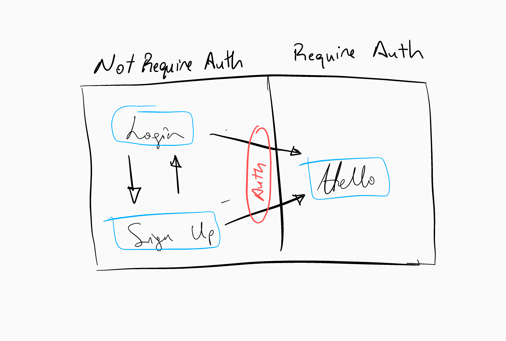
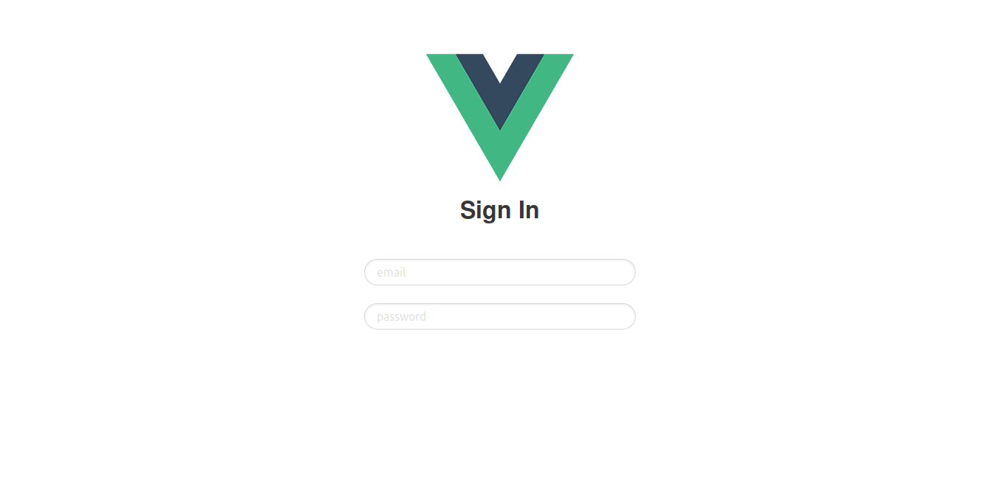
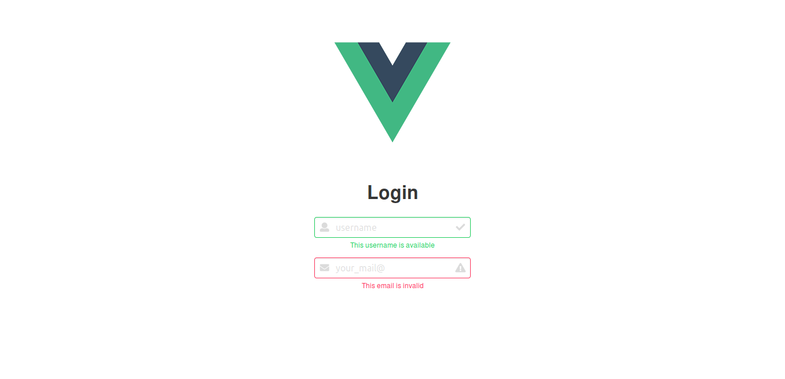

# Firebase + Vue2 Authentication System

This tutorial contains resources from
[this tutorial](https://medium.com/@anas.mammeri/vue-2-firebase-how-to-build-a-vue-app-with-firebase-authentication-system-in-15-minutes-fdce6f289c3c).

In this tutorial, we will see how to quickly build a
web application with an authentication system using Vue 2, vue-router and Firebase.

##  Initial Setup

Be sure that the Vue CLI is installed. If not run:

```bash
$ npm install -g vue-cli
```

Create a new project

```bash
$ vue init <template-name> <project-name>
```

For this project I will use webpack template.

```bash
$ vue init webpack firebase-vue-authentication
```

Make sure that **vue-router** is installed.

```bash
$ cd firebase-vue-authentication
$ npm installed
$ npm run dev
```

Now, open your browser and go to `http://localhost:8080`. You should see a page like:


## The App Structure

The app will consist of three views, two *(Login view and Sign up view)* that we can accses only without authentication, and one *(Hello* view) that we can acces only with authentication.



**Here should be an image with app architecture**

After login successfully or after a new account creation, we will be redirected to the authenticated part of the app, the Hello view.

## Login and Sign Up

Create a new Vue component called **AppLogin** under `src/components`

For the moment, the component will simply consist of a title, two input fields, a button and a small sentence in the html.

```html
<template>
  <div class="login">
    <h3>Sign In</h3>
    <!--<label for="email"></label>-->
    <input type="email" name="email" placeholder="Email"><br>
    <input type="password" placeholder="Password"><br>
    <button>Connection</button>
    <p>You don't have an account? You can create one.</p>
  </div>
</template>
<!-- omitted for brevity -->
```

Now we have the component, but how we gonna display it?

We will use **vue-router** that we have installed when we creating the vue app. 

### What is vue-router?

::: tip vue-router
vue-router is the official router for Vue.js. It deeply integrates with Vue.js core to make building Single Page Applications with Vue.js a breeze. 
Creating a Single-page Application with Vue.js + vue-router is dead simple. With Vue.js, we are already composing our application with components. When adding vue-router to the mix, all we need to do is map our components to the routes and let vue-router know where to render them.

from [vue-router documentation](https://github.com/vuejs/vue-route)
:::

Now, all we gonna do is to import **vue-router** and add **AppLogin** component to the route. We will do it 
inside `src/router/index.js` file.

```javascript{2,4,5,6,7,8}
// omitted for brevity
import AppLogin from '@/components/AppLogin'
// omitted for brevity
    {
      path: '/login',
      name: 'AppLogin',
      component: AppLogin
    }
  ]
})
```

We have that Vue logo but no problem, let's keep it there. The **App** component is the main componrnt of the app
and will be the first to be rendered. It contains an image and a html component called **router-view**

**router-view** is a component of **vue-router**:

::: tip router-view
The `<router-view>` component is a functional component that renders the matched component for the given path. Components rendered in `<router-view>` can also contain its own `<router-view>`, which will render components for nested paths.

[from vue-router documentation](https://router.vuejs.org/en/api/router-view.html)
:::

When we open `http://localhost:8080/#/login` **vue-router** will render the attached component of the path `/login`
that we defiend in `router/index.js`, inside the `<router-view>` component. 

## Add some style

In this project I will use [**bulma**](https://bulma.io/) which is an open source CSS framework.

Back in directory as the package.json file install and save **bulma** to the project like this:

```bash
$ npm install --save bulma
```

In addition, I will need to install some dev tools to properly load the styles for the application so the components know how to work with them. To do this, npm install these additional packages.

```bash
$ npm install --save-dev vue-style-loader
$ npm install --save-dev css-loader
$ npm install --save-dev sass-loader
$ npm install --save-dev node-sass
```

Now, open up App.vue file and add inside the style element this:

```html
<style lang="scss">  
@import '~bulma/bulma'
</style>  
```

Then, create a signup form in `AppLogin` component.

```html
<template>
  <div>
    <div class="container has-text-centered">
      <h2 class="title is-large">Sign In</h2>
    </div>
    <section class="section">
      <div class="container">
        <div class="columns field">
          <div class="control is-one-third column is-one-third is-offset-one-third">
            <input type="email" class="input is-rounded" id="email" placeholder="email" autofocus>
          </div>
      </div>
        <div class="field columns">
          <div class="control is-one-third column is-one-third is-offset-one-third">
            <input type="password" class="input is-rounded" id="password" placeholder="password">
          </div>
        </div>
      </div>
    </section>
  </div>
</template>
```

When we go to browser `http://localhost:8080/#/login` we should see smthg like:



After diving into bulma's now very welled designed documentation I've changed a little bit the `AppLogin` component. The above one is simpler. But
the below one has some charisma.




Here is the code to create above login page.

```html
<template>
  <div>
    <section class="section">
      <div class="container is-fluid columns is-centered">
        <div class="column is-one-quarter">
          <h1 class="title">Login</h1>
          <div class="field">
            <div class="control has-icons-left has-icons-right">
              <input class="input is-success" type="text" placeholder="username">
              <span class="icon is-small is-left">
      <i class="fas fa-user"></i>
    </span>
              <span class="icon is-small is-right">
      <i class="fas fa-check"></i>
    </span>
            </div>
            <p class="help is-success">This username is available</p>
          </div>

          <div class="field">
            <div class="control has-icons-left has-icons-right">
              <input class="input is-danger" type="email" placeholder="your_mail@">
              <span class="icon is-small is-left">
      <i class="fas fa-envelope"></i>
    </span>
              <span class="icon is-small is-right">
      <i class="fas fa-exclamation-triangle"></i>
    </span>
            </div>
            <p class="help is-danger">This email is invalid</p>
          </div>
        </div>
      </div>
    </section>
  </div>
</template>
```
